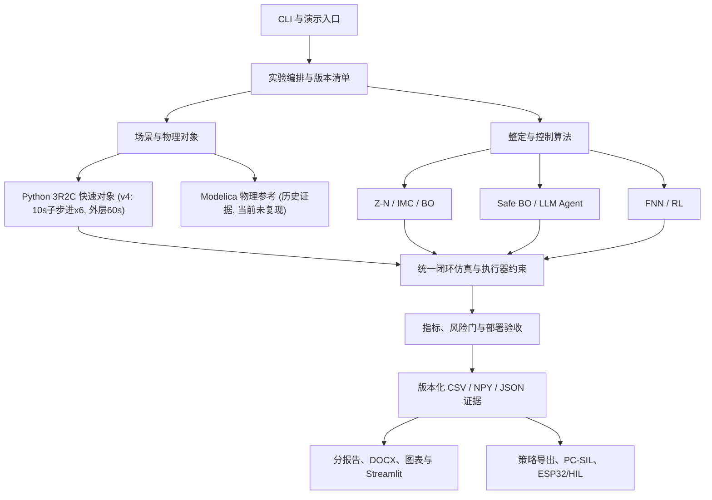

# ARCHITECTURE (v4)

唯一事实源：`experiments/manifests/v4.yaml`；产物根：`artifacts/runs/<run_id>/`。
Markdown 为源文件，DOCX/PPT/图片均为生成物。正式报告集为 `reports/分报告/00–12`（连载式教程：00 总览、01–03 入门主线、04–10 七算法、11 统一比较、12 部署验证）。

| 层级 | 核心文件 |
|---|---|
| 入口 | `main.py`、`run.py`（统一入口）、`tools/`（各实验命令行入口）、`streamlit_app.py` |
| 对象与场景 | `hvac_pid/config.py`（新增 `integration_substeps=6`）、`plant.py`（子步进积分）、`simulator.py`、`modelica/HVACAI/` |
| 控制算法 | `controllers.py`、`tuning.py`、`advanced_tuning.py`、`ai_controllers.py` |
| 安全执行 | `hvac_pid/safety.py`（`MAX_FRACTIONAL_GAIN_CHANGE=0.10`）、`actuator.py`、候选安全门、IMC 回退 |
| 时间口径 | `hvac_pid/timebase.py`：仿真 300 s / 演示 120 s / MCU 2 s+100 ms 三口径分离，禁止统一写 2 s |
| 实验评估 | `pipeline.py`、`validation.py`（OMC 经 `OPENMODELICAHOME`/`MODELICA_OMC`/PATH 定位）、`metrics.py`、`plotting.py` |
| 报告 | `reports/分报告/00–12`（源）、`reports/make_*.py`、`md2docx.py` |
| 部署 | `embedded/export_policy.py`、C++ 控制器、CRC、PC-SIL、ESP32/Modbus |

## 关键口径更正（v4）

- FNN = 5×5 零阶 TSK 基础面 + 4 项上下文残差修正；每次只激活 4 条相邻规则。
- RL 状态 = 5×5×3，动作数 = 9（相对 IMC 的绝对增益目标，非递归累乘）。
- `ScheduledPIController(max_fractional_change=0.35)` 为遗留实验路径，正式报告不使用；部署安全界为 `safety.py` 的 ±10%。
- `tools/run_advanced_tuning_benchmark.py` 文本曾误写“25% 信赖域”，已修正为 10%（实现一直是 10%）。
- `hvac_pid/report.py` 安全表曾误写 ±25%，已修正为 ±10%。
