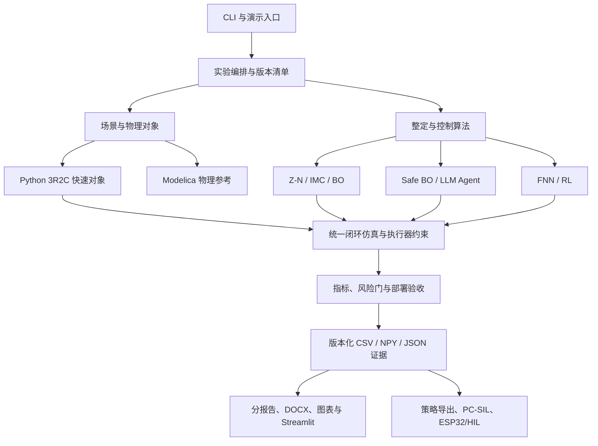

已完成对 `main` 分支、最新提交 [`2870262`](https://github.com/HlinForest/hvac-ai-pid-demo/commit/2870262d13873502b2ecea3758dec34d7a8e7446) 的只读审计。建议不要继续逐篇手工修补，而是建立一个新的、可追溯的 v4 实验批次，再由同一批数据生成全部报告。

## 当前主要问题

| 类别       | 已确认的问题                                                                                                     |
| -------- | ---------------------------------------------------------------------------------------------------------- |
| 实验批次     | 顶层有 15 个 `outputs*` 目录；正式报告同时引用 `outputs/`、`outputs_adaptive_final_v2/`、`outputs_review_v3/` 和旧 LLM matrix |
| 算法口径     | Python 默认 AI 更新周期为 300 s，嵌入式演示代码为 120 s，MCU 演示为 2 s 墙钟；报告大多统一写成 2 s                                        |
| 安全参数     | 代码默认单次增益变化 ≤10%，部分报告和 `run_advanced_tuning_benchmark.py` 仍写 25%                                            |
| LLM 实验   | 报告仍说“仅 2 次真实会话”，但 `outputs_llm_matrix_v3` 已有 18 次真实运行、5/18 部署                                              |
| 七算法比较    | v3 的 80 场景密封测试只覆盖 Z-N、IMC、BO、FNN、RL；Safe BO 和 LLM 来自其他测试集，暂时不能进行七算法统一排名                                    |
| 数值验证     | `physical_cross_validation.csv` 中“初次快速降温”最大误差为 0.150350°C，超过预设 0.15°C，实际 `passed=0`                        |
| Modelica | `outputs/` 有成功的 DASSL 结果，但 `outputs_review_v3` 标记“未运行”；同一份 v3 报告却又写“已实际运行”                                 |
| 测试与 CI   | 源码中现有 39 个 pytest 测试函数，但文档分别写 25、36、36+3；仓库实际上没有 `.github/workflows`                                       |
| 可移植性     | 多个报告脚本硬编码 `E:\HAVC`、`C:\Users\...`、`D:\modelica`；部分脚本仍读取旧矩阵                                                |
| 依赖       | `requirements.txt` 限制 NumPy `<2`，文档却称已对齐 NumPy 2.x，部分产物又是在 NumPy 2.5.1 下生成                                 |
| 仓库卫生     | 887 个文件、约 175 MB；KaTeX 和历史产物大量重复，并存在零字节 `reports/分报告/my_report/受控对象建模.docx`                                |

## 按代码还原的项目架构

| 层级    | 当前核心文件                                                                  |
| ----- | ----------------------------------------------------------------------- |
| 入口    | `main.py`、`run_*benchmark.py`、`run_embedded_demo.py`、`streamlit_app.py` |
| 对象与场景 | `hvac_pid/config.py`、`plant.py`、`simulator.py`、`modelica/HVACAI/`       |
| 控制算法  | `controllers.py`、`tuning.py`、`advanced_tuning.py`、`ai_controllers.py`   |
| 安全执行  | `actuator.py`、控制器增益限幅、候选安全门、IMC 回退                                      |
| 实验评估  | `pipeline.py`、`validation.py`、`metrics.py`、`plotting.py`                |
| 报告    | `reports/分报告/00–08`、`reports/make_*.py`、`md2docx.py`                    |
| 部署    | `embedded/export_policy.py`、C++ 控制器、CRC、PC-SIL、ESP32/Modbus             |

## 整理与修复计划

1. **建立安全工作分支和历史快照**

   * 从 `main` 创建 `codex/reconcile-experiments-v4`。
   * 给现状打只读基线标签或保存清单。
   * 在 v4 全部通过前，不覆盖或删除 v3 数据。

2. **建立唯一事实源**

   * 新增 `experiments/manifests/v4.yaml`，固定代码 SHA、依赖版本、场景、种子、算法参数及验收阈值。
   * 所有产物写入 `artifacts/runs/<run_id>/`，不得再由脚本隐式读取某个 `outputs_*`。
   * 明确定义三种时间口径：仿真时间、MCU 墙钟时间、200×演示虚拟时间。
   * Markdown 报告作为源文件，DOCX/PPT/图片均视为生成物。

3. **修复代码与可复现性**

   * 为嵌入式演示增加显式 `--artifact-dir`，移除对 `outputs_adaptive_final_v2` 的硬编码。
   * 统一并集中定义更新周期、10% 增益信任域及安全阈值。
   * 删除报告脚本中的本机绝对路径；Modelica 路径改为参数或环境变量。
   * 修复 `check_math.py`、`dump_s4_numbers.py`、图表脚本读取旧批次的问题。
   * 建立 `pyproject.toml`/锁定依赖和受支持 Python 版本。
   * 增加 GitHub Actions：pytest、Node 报告检查、路径检查、快速实验和报告一致性检查。

4. **修复未完成实验**

   * 先复现 0.150350°C 数值误差；做时间步收敛实验，再选择 RK4、精确线性离散化或合理子步进，不能简单放宽到刚好通过。
   * 数值推进改变后，将实验版本升为 v4 并重跑全部结果。
   * 重新运行 48/16/16 训练—验证—测试以及 `5×16=80` 密封场景。
   * 将 Safe BO 和 LLM Agent 接入相同场景清单，实现真正的七算法统一评价；LLM 同时报告多次运行分布与回退率。
   * OpenModelica 结果纳入同一 v4 目录并记录原始 CSV 哈希；无法复跑时明确标为“历史证据，当前未复现”。
   * 重跑策略导出、CRC、75 组 Python/C++ 对拍、PC-SIL 和 ESP32 编译。
   * 实体板 10 分钟遥测、真实 WCET、HIL 和 Modbus 写入必须保留为外部硬件门，不能用仿真补成“已完成”。

5. **重建报告**

   * 以 `reports/分报告/00–08` 为唯一正式报告集。
   * 所有数字、表格和图从 v4 manifest/CSV 自动注入，禁止手工硬编码结论。
   * 精确描述 FNN 为“5×5 零阶 TSK 基础面 + 4 项上下文残差修正”；RL 的状态是 `5×5×3`，9 是动作数。
   * 将 LLM 18 次矩阵、Safe BO 和统一密封测试分开呈现，只有相同协议的数据才排名。
   * 新增 `ARCHITECTURE.md`、`EXPERIMENTS.md`、`RESULTS.md` 和证据溯源表。
   * 重新生成并逐页检查 DOCX；删除零字节文件和 `.new/_v2` 重复版本。

6. **清理仓库并提交 PR**

   * 历史大产物先归档到 tag/Release，再从主分支移除重复输出。
   * 主分支只保留源码、报告源、轻量汇总数据和最新版可审计证据。
   * 最终通过一个 PR 提交，附“旧结论 → 新结论 → 数据来源”的变更表。

## 完成标准

* 全量 pytest、两个 Node 校验和 GitHub Actions 全绿。
* 数值交叉验证、FOPDT 验证的每一行均明确通过；Modelica 状态无自相矛盾。
* 七算法使用同一数据划分、约束、指标和密封测试口径，或明确标记不可比较。
* 每个报告数字都能定位到 `run_id + 文件 + 行/列 + git SHA`。
* 仓库中无本机绝对路径、零字节交付物、旧输出隐式依赖。
* `00_总览与阅读指引`、README、架构文档和 01–08 分报告口径完全一致。
* 实体硬件未提供时，相关项目保持“待外部验证”，不伪造完成状态。

默认执行策略是：分支 + PR、先保存历史再清理、离线 replay 可自动重跑；真实 LLM 付费调用和实体板实验只有在凭据/硬件明确可用后才执行。
