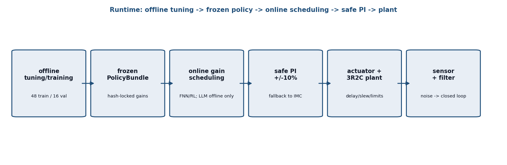
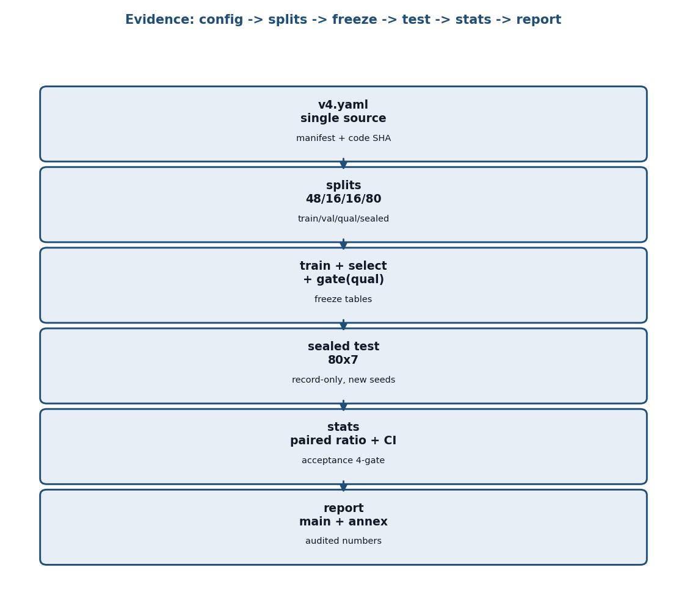
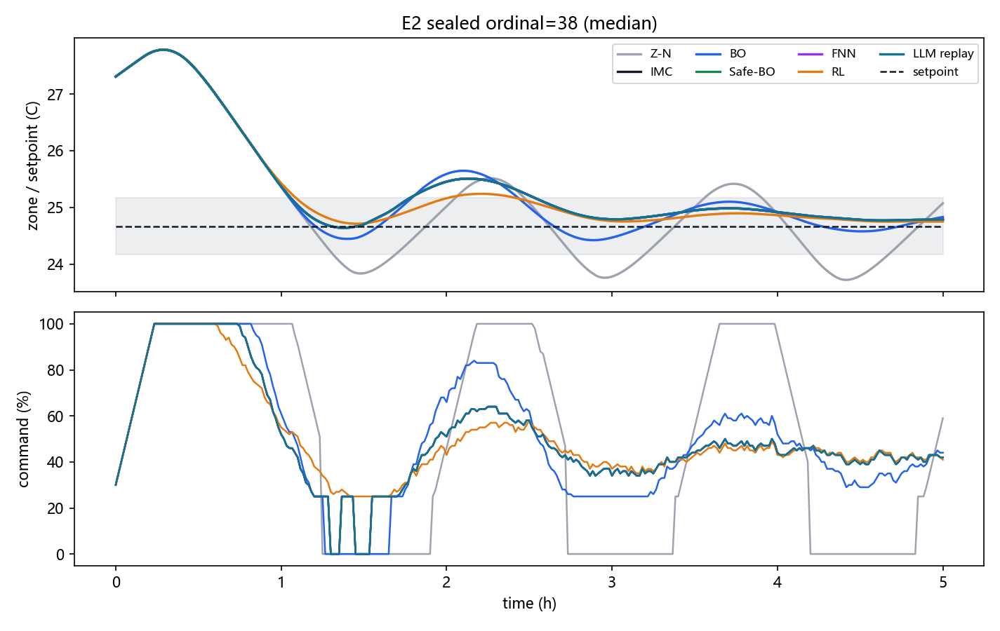
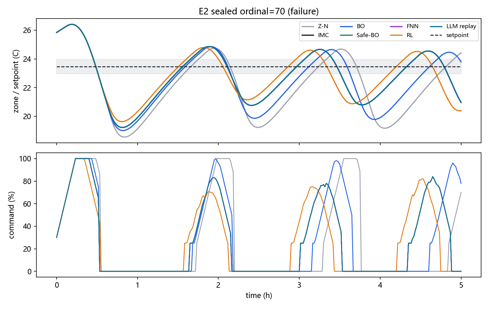

# 面向机柜空调的 PI 自动整定与增益调度：统一仿真评估及软件在环验证（提交版主报告）

> 范围声明（必读）：本报告主结论为 E2-B3 独立密封重评 + E1/E3–E5 工程验证。
> B3（`sealed-80x7-b3`）：统一重训冻结 + 部署门仅用资格集 + 密封集选择全程未见 + LLM 在完整 48 训练集冻结。
> B1（混合冻结）与 B2（部署门误用密封集）保留为历史对照，不再承担主结论。
> 各方法训练预算不同（台账见 §4 `budget_table.csv`），只有 BO/随机臂可用“同预算”措辞。
> 教程式操作步骤、分算法曲线、历史批次说明分别见附件（`reports/分报告/00–12` 为教学附件，非正文）。
> 每个数字可定位到 `EXPERIMENTS.md 登记编号 + 文件 + 行/列 + code_sha`。

## 摘要

对象为小型机柜空调单区 3R2C 热对象（执行器含延迟/惯性/ slew/量化/最小运行约束，传感器含噪声与滤波）。
工作分为离线整定/训练、冻结策略、在线增益调度、安全 PI 四段边界；LLM 不进入快速控制环，仅做离线建议。
主实验 E2-B3 将 7 种冻结策略放在同一 80 场景独立密封清单（部署门在资格集已结束，密封场景选择全程未见）、
同一噪声种子、同一六子步 v4 积分器、同一指标下评价（560 条记录）。
主统计量为逐场景配对比均值 `mean(J/J_imc)` + bootstrap 95% CI；验收为四项全过；非劣界 1.02。

主要发现：数值有界 7/7 达 80/80，但温控验收最高仅 40/80（IMC/Safe-BO/FNN/LLM 并列），Z-N 6/80。
性能上无任何方法显著优于 IMC：BO 1.0785 [1.0424,1.1146] 显著更差（原因尚未完成归因，禁止径称过拟合），
Safe-BO 与 FNN 回落到等于 IMC（前者选中基线本身，后者资格集门未通过→回退），RL 0.9801 [0.9611,1.0041] 未发现显著优势（非劣成立）。
失败归因：7 个场景全算法失败（1 容量紧张 + 6 观察窗不足）；33 个调参残余失败全部卡在扰动恢复，
无任何方法系统性挽救 IMC 失败场景——下一步优先级是解释并改善合格率，而非继续排名。
E3+ 严格对照（同初值同噪声，4 搜索种子）：GP 对同预算随机的混合池配对差 −0.0057 [−0.0373,+0.0284]（含 0），
机制贡献未经证实。E4 LLM 真实矩阵独立报告（v3 5/18 部署，v4 1/18 部署），不参与排名。
E5 软件一致性成立（PC-SIL PASS），实体三门仍待验证。

## 1 任务与评价目标

输入为区温误差（°C），输出为归一化制冷容量指令（0–1，容量比例）；Kp 单位为容量比例/°C，Ki 为容量比例/(°C·min)。
控制目标为综合目标 J 最小（IAE/ITAE/舒适越限/欠调/调节时间/动作量/输出方差/能耗加权，`hvac_pid/metrics.py:objective_from_metrics`），约束为安全信任域 ±10% 与执行器合规（slew/最小运行/启停）。
验收标准拆分为四项：bounded（数值有限且 5–45°C）、comfort_held（启动后持续 60 min 在 ±0.5°C 带）、recovery_ok（扰动/切温后 60 min 持续在带）、actuator_compliant；四项全过记 `validation_passed`。
回退执行不记通过，回退后仍未通过记 `fallback_failed`。`stable` 仅指数值有界，不得等同验收。

## 2 系统架构与对象模型

运行架构（上图）：上位机离线整定/训练 → 冻结策略（`PolicyBundle` 同目录版本锁定）→ 在线增益调度（FNN/RL 按状态查表/覆盖掩码回退 IMC；LLM 只在离线提建议）→ 安全 PI（含 ±10% 限幅与回退）→ 执行器（延迟/惯性/slew/量化/最小开停机）→ 3R2C 热对象 → 传感器（噪声/滤波）→ 闭环。

证据流程（上图）：实验配置（`experiments/manifests/v4.yaml` 唯一事实源）→ 数据划分（48 训练/16 验证/16 资格/80 密封，四向隔离 + SHA-256 泄漏检查）→ 训练/选择/资格门 → 冻结 → 独立密封评价（只打分）→ 统计（主/次分开）→ 报告（本主报告 + 附件）。

对象模型为 3R2C 单区，E1 已验证数值实现（六子步 N=6，初次降温 max 0.025154°C ≤0.15）与 FOPDT 代理精度（归一化 RMSE 11.88–11.95% ≤15%）。
时间口径：仿真监督 300 s、外层 60 s/内层 10 s×6 子步、演示 120 s、MCU 快环 100 ms + AI 环 2 s；LLM 离线秒级，不在快环时序内。

## 3 七类方法及统一接口（B3 冻结值；B1/B2 值见历史批次附件）

| 类 | 改什么 | 输入→输出 | B3 冻结（Kp/Ki） |
|---|---|---|---|
| Z-N | 一次阶跃辨识 + 经验公式 | FOPDT→固定增益（限幅后） | 1.5 / 0.08，对照基线 |
| IMC | λ 一维扫描选公式参数 | FOPDT+λ→固定增益 | 0.5180 / 0.004057，回退基准 |
| BO | GP+EI 在 log(Kp,Ki) 直接搜 | 训练 J→固定增益 | 0.6265 / 0.005896，14 评估 |
| Safe-BO | 风险约束下保守选点 | 训练 J+风险→固定增益 | 等于 IMC（选中基线本身） |
| FNN | 规则表 + 上下文系数在线调度 | 状态→Δ增益（±10%） | 资格门未通过→回退 IMC |
| RL | Q 表 + 覆盖掩码在线调度 | 状态→Δ增益，未覆盖回退 | Q 表 + 冻结掩码，门通过 |
| LLM | 离线建议 + 程序验收 gate | 工况描述→候选增益 | 完整 48 训练集仍无接受候选，等于 IMC；真实调用见 E4 |

统一接口为 `PolicyBundle`（IMC/BO/SafeBO/FNN 表+上下文/RL 表+掩码同目录冻结，缺文件报错，legacy 回退显式标记）；`run.py sealed/embedded/pipeline` 均经此加载，禁止各入口自行拼装。

## 4 实验设计与复现协议

E1 数值/FOPDT：三典型工况（初次快速降温/设定突变/持续热扰动），阈值未动，物理改为子步进后通过。
E2-B3 独立密封：四向隔离（48 训练/16 验证/16 资格/80 密封，`dataset_manifest.csv` SHA-256 防泄漏）；
部署门只用资格集（FNN 未通过→回退 IMC，RL 通过），冻结后密封集只打分；
80 场景（`acceptance_seeds=101,211,307,401,503`，噪声 `seed+700000+ordinal`，门噪声系独立）；
七算法同场景同种子同积分器同指标；测试后调参换新密封集。
训练预算台账（`sealed-80x7-b3/budget_table.csv`，每闭环 = 5 对象小时）：

| 方法 | 训练场景 | 候选评估 | 闭环仿真 | 等效对象小时 |
|---|---:|---:|---:|---:|
| Z-N 公式 | 1（标定） | 0 | 0 | 0 |
| IMC λ 扫描 | 48 | 21 | 1008 | 5040 |
| BO（7 初值 + 7 GP） | 48 | 14 | 672 | 3360 |
| Safe-BO | 48 | 4 | 192 | 960 |
| FNN 标签 + 选择 | 48 / 16 | 见备注 | 768 + 32 | 3840 + 160 |
| RL 离线步数 + 选择 | 48 | 环境步（另计） | 496（选择） | 2480 |
| 部署门（资格集） | 16 | 3/场景 | 48 | 240 |
| 密封终评 | 80 | 7 算法 | 560 | 2800 |

E3 消融：同 80 场景随机/保守对照（历史）；E3+ 严格对照：同初值同噪声，4 搜索种子，GP/随机各追加 7 评估，报告混合池配对差。
E4 LLM 矩阵：v3 矩阵 18 运行/18 真实/18 有界/5 部署；v4 矩阵 18 运行/1 部署/17 回退；报告采用率、回退后验收与成本，独立成表。
E5 对拍/SIL：75 组 Python/C++ 对拍 ~2.98e-8、CRC、PC-SIL 分频；历史 Modelica DASSL 12 h 为历史证据，当前未复现。
统计：主 `mean(obj/imc)` + bootstrap CI（2000，seed+77），非劣界 1.02（上界≤1.02），显著优要求上界<1.0；
“CI 含 1”读作“未发现显著优势”，不得径称“持平/等效”。次 `mean(obj)/mean(imc)` 仅对照。
复现：`python run.py pipeline --output <run> --seed 7` → `python run.py sealed --artifact-dir <run> --output <sealed> --protocol-label E2-B3`；
一致性 `python tools/check_results_consistency.py --sealed-dir <sealed>`；归因 `python tools/run_gp_attribution.py`；失败分析 `python tools/analyze_failures.py --sealed <sealed>`。

## 5 结果与失败分析（E2-B3；B1/B2 见历史对照附件）

主结果（`sealed-80x7-b3/sealed_80_summary.csv:2-8`，性能与验收并列）：

| 算法 | 平均 J↓ | 主配对比 [95% CI] | 验收 | 结论 |
|---|---:|---|---:|---|
| Z-N | 61.72 | 1.6509 [1.5407,1.7630] | 6/80 | 显著差 |
| IMC | 41.24 | 基准 | 40/80 | 基准；有界全过但验收仅半数 |
| BO | 45.02 | 1.0785 [1.0424,1.1146] | 33/80 | 显著差于 IMC；原因尚未完成归因 |
| Safe-BO | 41.24 | 1.0000 等于 IMC | 40/80 | 选中基线本身，无增益无损失 |
| FNN | 41.24 | 1.0000 等于 IMC | 40/80 | 资格门未通过→回退 IMC |
| RL | 39.80 | 0.9801 [0.9611,1.0041] | 39/80 | 未发现显著优势；非劣成立（上界 ≤1.02） |
| LLM replay | 41.24 | 持平 IMC | 40/80 | 完整 48 训练集仍无接受候选；非实时调用 |

同轴曲线（确定性复现，`sealed-80x7-b3/figures/`，时序与清单同目录；复现断言已通过）：

> 中位场景：七算法轨迹基本重合，IMC 与自适应方法无实质差异——与配对比结论一致。

> 失败场景：无扰动热启动，负荷比仅 0.10、窗口充足，但全部算法出现大幅欠调（IMC 4.2°C）与压缩机反复启停振荡，
> 始终无法持续在带——典型的调参残余失败（RL 略好 106.6，BO 更差 133.0，方向与总量表一致）。

失败归因（`failure_cause_summary.csv`，322 个失败点）：7 个场景全算法失败——1 个容量紧张（负荷比>0.85）+ 6 个观察窗不足（扰动结束距终点<60 min），属物理/设计边界；
IMC 系 33 个调参残余失败全部含 `recovery_ok` 未过（29 个兼 `comfort_held` 未过），负荷比 ≤0.62 且窗口 ≥1 h，
即容量与窗口均无问题——真实短板在扰动恢复控制。无任何方法系统性挽救 IMC 失败场景：
RL 挽救 #36 但新增 #25/#37（净 +1），BO 新增 7 个失败、挽救 0，Safe-BO/FNN/LLM 与 IMC 失败集完全一致。
J 方向一致：失败均值 ~55 vs 通过均值 ~27（约 2×），综合目标与四门验收无系统性冲突——不存在“J 很好但验收不过”的目标设计问题。

E3+ 严格对照（`gp_attribution.csv` 12 行 + `gp_attribution_summary.json`；同初值同噪声，4 搜索种子，经典种子 815 精确复现冻结 BO）：
混合池配对差 GP−随机 −0.0057 [−0.0373,+0.0284]（含 0），GP−初值 −0.1115 [−0.1419,−0.0791]（追加评估优于原地踏步）。
结论：**未发现 GP 相对同预算随机的优势，机制贡献未经证实**；逐种子波动大（9002 种子纯随机 0.9287 反超 GP 1.1048），单次比较不可作机制结论。
旧版“GP 机制有效”表述撤回。

历史对照一句话：B1（混合冻结）Safe-BO 保守参数曾显著优（0.9185）但归属为参数集；
B2 与 B3 同训练配置结论一致（BO 差、其余持平），B2 因部署门误用密封集降为历史，数字不再并列。

## 6 软件在环与部署边界

导出：冻结策略经 `PolicyBundle` 哈希锁定，`manifest.yaml` 随 run 冻结，`sealed_scenarios.csv` 存全字段场景清单（任意曲线可精确复现），
`code_sha` + 脏位如实记录；B3 另有裁剪前完整 147 文件 `SHA256SUMS` 索引。
B3 `policy_provenance` 中 legacy 双零，RL 掩码为冻结 `rl_covered_mask.npy`，部署门在资格集判定（FNN 回退、RL 通过）。
对拍：Python/C++ 差 ~3e-8 量级；CRC 校验；PC-SIL 按 100 ms/2 s 分频跑通（B3 run 内 `mcu_pc_sil_log.txt:PASS`）；
主机 WCET 参考 `host_wcet.csv`（HOST-ONLY）；ESP32 目标编译在本机刷新失败
（xtensa 工具链无法处理用户路径中文字符，`esp32_target_compile_attempt.log` 存证，历史 RAM/Flash 记录维持，门仍为 PENDING）。
边界：以上证明软件一致性，不证明与真实机柜对象对应，更不代替实体 10 分钟遥测、真实 WCET、HIL、Modbus 写入
（三门 `python tools/check_hardware_gates.py` 当前 3/3 PENDING，不得仿真冒充）。
LLM 边界：E2 replay 非实时调用；E4 真实矩阵链路通≠模型好用，回退率与成本单独报告。

## 7 结论与局限

分条件结论（E2-B3）：无任何方法显著优于 IMC；BO 显著差（归因未完成）；Safe-BO/FNN 等于 IMC；
RL 未发现显著优势但非劣成立；Z-N 显著差。验收最高仅 40/80——主要矛盾是扰动恢复控制与合格率，不是排名。
局限：单一种子单预算（多种子重复缺）；BO 预算仅 14 评估；实体/HIL/目标 WCET 全缺（3/3 PENDING）；
GP 机制贡献未经证实；PDF 未生成（DOCX 为准，人工逐页清单见附件交付检查）。
下一步：多种子重复与更大预算 BO；E4 真实调用矩阵失败原因与成本明细；实测辨识→遥测→HIL 逐层验收，每层追溯到同一策略版本。
历史批次（B1/B2）冻结保留，不再覆盖；新批次一律换 run_id。

## 附件

- 复现指南：`README.md` + `EXPERIMENTS.md` + `run.py --help`。
  B3 全链（约 200 s + 评价约 8 min）：
  `python run.py pipeline --output artifacts/runs/<run_id> --seed 7` →
  `python run.py sealed --artifact-dir <run_id> --output <sealed> --protocol-label E2-B3` →
  `python tools/run_gp_attribution.py / make_budget_table.py / analyze_failures.py / make_sealed_figures.py`（参数见各 `--help`）。
- 证据附件：`artifacts/runs/sealed-80x7-b3/`（B3 主：汇总/归因/预算/失败/曲线/溯源）+
  `artifacts/runs/v4-20260906-bf6bda6/`（B3 训练冻结 + `SHA256SUMS` 完整索引）+
  `sealed-80x7-v4/`（B1）+ `sealed-80x7-v4-retrain/`（B2，旧归因作废）+
  `artifacts/runs/v4-20260906-2870262/`（E1）+ `archive/outputs_review_v3/`（B1 冻结策略）+ `archive/outputs_llm_matrix_v3/`（E4）。
- 硬件门：`embedded/hardware_gates.md` + `python tools/check_hardware_gates.py --run <run>`（3/3 PENDING 为当前诚实状态）。
- 教学附件：`reports/分报告/00–12`（B3 视角下第 03 篇划分描述与第 11 篇 B1 表格为历史版本，结论以本主报告 Ch5 为准）；
  旧总报告/DOCX/PPT 归 `reports/legacy/`，唯一主报告为本文件（DOCX 见 `docs/主报告.docx`，机器核对 `tools/check_docx.py` + 下述人工清单）。
- 交付检查（人工逐页，机器无法替代）：① DOCX 逐页翻阅——分页无表格断裂、无图注分离；② 四张图可读（坐标轴/图例/在带底纹）；
  ③ Ch3/Ch5 表格数字与 CSV 逐项对过（`check_docx.py` 已做机器部分）；④ `node tests/check_interactive_html.mjs` 在 CI 烟雾 HTML 上实跑通过；
  ⑤ 公式以 katex 烟雾 + 详细文档构建为准（本主报告无行内公式 debt）。
- 实验登记：正文/图表/CSV 统一用 E1–E5（B1/B2/B3 后缀区分轮次）；`RESULTS.md` 为 E2 主结果表可定位版本。
