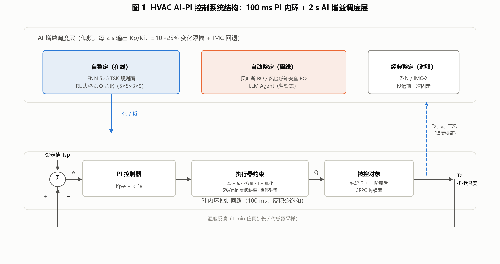

# 00 总览与阅读指引

**项目**：变频精密/机柜空调 AI-PI 自动整定演示（`hvac-ai-pid-demo`）
**拆分报告版本**：2026-09-03
**数据口径**：v3 封存验收批次（3R2C 对象、80 场景 holdout）+ 整定耗时基准 + 高级整定批次（含真实大模型调用）+ 七算法统一演示；9 篇分报告同源，完整溯源见附录 B。

---

## 1 拆分报告清单

| 编号 | 文件 | 内容 |
|---|---|---|
| 00 | 本文件 | 阅读指引、公共约定、速查表 |
| 01 | 《被控对象建模与 FOPDT 辨识》 | 3R2C 对象建模、FOPDT 公式与含义、最小二乘拟合详解、拟合效果图、参数由来 |
| 02 | 《Z-N 反应曲线法》 | 经典反应曲线公式法 |
| 03 | 《IMC-λ 内模控制》 | 内模控制（λ 扫描整定） |
| 04 | 《贝叶斯 BO 自动整定》 | 高斯过程 + 期望改进离线搜索 |
| 05 | 《风险感知安全 BO》 | 风险感知安全贝叶斯优化（RaGoOSE 式） |
| 06 | 《LLM Agent 工具调用整定》 | 大模型工具调用整定（真实 qwen-max 调用） |
| 07 | 《FNN 在线自整定》 | 5×5 TSK 模糊神经规则面 |
| 08 | 《RL 在线自整定》 | 离线表格式 Q 学习 |

建议阅读顺序：01 → 02/03（经典基线，依赖 FOPDT）→ 04/05/06（离线自动整定）→ 07/08（在线自整定）。

各分报告末尾均自带「附录 A 本篇数据溯源」，列出该篇结论所依赖的数据产物与代码位置；全套数据的总索引见本篇附录 B。

## 2 公共约定（各分报告不再重复）

- **同一被控对象**：3R2C 集中参数热模型 + 纯延迟 + 一阶执行器滞后（详见报告 01）。
- **同一控制架构**：100 ms PI 内环（条件积分抗饱和）+ 2 s AI 增益调度层；AI 只调 Kp/Ki，不直接控制压缩机；四层安全保护（节拍解耦、增益界、单次变化 ≤25%、异常回退 IMC）。

- **同一执行器约束**：最小制冷容量 25%、量化 1%、变频斜率 5 个百分点/min、最短运行 5 min / 停机 3 min、测量噪声 σ=0.04 °C + 滤波——所有算法在完全相同约束下运行。
- **同一评价指标**：综合目标 J（IAE/ITAE/舒适区/过冷/调节时间/控制变化/能耗加权，越小越好；不稳定罚 1e6）。完整公式、八项权重与实测分解见 §3。。
- **双口径耗时**：PC 墙钟时间（实测）与等效对象时间（"若把同样试验串行搬到真实设备上需要多久"，估算口径）。
- **诚信标注**：结论限于仿真与 SIL 层；安全 BO / LLM 的三标准工况与混合工况曲线为**冻结增益补跑**（标注"补跑"，与 v3 同对象、同约束、同种子）；LLM 真实调用仅 2 次会话，输出非确定性未做统计表征。

## 3 综合目标 J：怎么算、为什么"小就是好"

整套报告里所有 30 多个 J 数值（34.00、37.61、58.71 …）都来自同一份实现 `hvac_pid/metrics.py` 的 `objective_from_metrics`。它把"这组增益好不好"压成一个标量——八项代价加权求和，每一项都是"越大越差"，所以**J 越小越好**。

**八项构成与权重**（每行 = 子项名称、加权系数、越大越差时的物理解释）：

| 子项 | 权重 | 物理解释 |
|---|---:|---|
| 舒适区违规 | **10.0** | 超出 ±0.5 °C 的累计时长（°C·h） |
| 最大过冷 | 3.0 | 低于设定值的最大幅度（°C） |
| 累计误差 IAE | 2.0 | Σ‖误差‖ × 时长 |
| 时间加权误差 ITAE | 1.5 | 越晚还在偏，罚得越重 |
| 输出方差 | 0.7 | 抑制压缩机大幅波动 |
| 调节时间 | 0.35 | 首次进入 ±0.5 °C 并连续保持 60 min 的时刻 |
| 控制动作总量 | 0.08 | 抑制频繁调节 |
| 制冷能耗 | 0.015 | 单位 kWh |

**前置罚**：温度发散或跑出 5–45 °C，直接判 `stable=0`，**J = 1×10⁶**——比正常值大 3400 倍以上，确保任何不稳定方案永远垫底。

**J 的绝对值没有物理意义，只有相对比较有效**。所以报告里所有 J 的比较都必须保证口径一致（如 80 场景 holdout 的 37.61 与 16 场景验证集的 31.95 不可混比）。

**为什么这样加权就是"好"——看一组实测分解**（标称工况下三组增益的 J 来源）：

| 子项 | 保守 IMC 回退 | 安全 BO 部署 | 普通 BO 部署 |
|---|---:|---:|---:|
| 舒适区违规 × 10 | 175.3 | 17.0 | 17.5 |
| IAE × 2 | 40.1 | 5.9 | 5.6 |
| ITAE × 1.5 | 72.9 | 3.7 | 3.2 |
| 最大过冷 × 3 | 0 | 0 | 1.5 |
| 其他 4 项合计 | 1.9 | 1.0 | 1.1 |
| **J 合计** | **290.1** | **27.6** | **28.9** |
| 四工况平均 J | 320.7 | **37.0** | 49.9 |

三条权重取向能直接从这张表读出来：

1. **舒适度优先于能耗，且差距是量级性的。** 舒适区违规权重 10.0 是能耗（0.015）的 **667 倍**。保守 IMC 那组能耗最低（8.67 kWh vs 14.4 kWh）、零启停，但 J 是 290，因为**温度根本没控住**（RMSE 4.0 °C、累计 17.5 °C·h 时间在舒适带外）。"为省电牺牲控温"这条路在这套评价里走不通。
2. **后期残留误差比早期偏差更不可接受。** ITAE 把误差乘上时刻，所以启动慢一点可容忍，半小时后还稳不下来不行——保守 IMC 的 ITAE 贡献占了它 J 的四分之一。
3. **多工况适应性是关键指标，单工况看不出。** 标称工况下安全 BO 和普通 BO 只差 4.6%（27.6 vs 28.9），但放到四工况平均，**安全 BO 比普通 BO 好 26%**（37.0 vs 49.9），差距主要来自"持续外界热扰动"工况（40.3 vs 72.3）。安全 BO 的优势是**零过冷、零启停**——单工况代价小，跨工况累积就拉开了。这也是风险目标 J_risk = J̄ + 0.75σ 想在单次评估里捕捉的东西。

**还有一批量不进 J，但会否决方案**：最大斜率、斜率违规次数、低于最小容量的时间占比、启停次数、扰动恢复时间——这些是**约束**而非优化目标，通过安全裕度 q 起作用（`q ≤ 0` 才允许部署）。一旦加权进目标，就可以靠"其他项足够好"来补偿违规，那就失去了硬约束的意义。

## 4 七算法速查表

| 算法 | 类别 | 自整定? | 自动整定? | 输入 | 输出 | PC 整定耗时 | 80 场景 holdout |
|---|---|---|---|---|---|---|---|
| Z-N 反应曲线法 | 经典公式 | 否 | 否（人工公式） | FOPDT 的 K/τ/L | 固定 Kp/Ti | 0.163 s / 等效 168 h | 58.19 |
| IMC-λ | 离线自动整定 | 否 | 是（λ 扫描） | FOPDT + λ | 固定 Kp/Ti | 3.03 s / 等效 1008 h | 39.53 |
| 贝叶斯 BO | 离线自动整定 | 否 | 是（GP+EI） | 工况 + 目标 J | 固定 Kp/Ki | 1.42 s / 等效 528 h | 39.72 |
| 风险感知安全 BO | 离线自动整定 | 否 | 是（风险 GP） | 同上 + 风险项 | 固定 Kp/Ki | 1.41 s（7 次评估） | 33.58* |
| LLM Agent | 离线自动整定 | 否 | 是（工具调用） | 历史 + 指标工具 | Kp/Ki 修正决策 | 真实调用 30.4 s（监督式） | 见 06 号报告 |
| FNN 自整定 | 在线自整定 | **是** | 训练阶段自动 | e, ė（模糊化） | 在线 Kp/Ki | 训练 7.65 s / 等效 4181 h | 39.26（PASSED） |
| RL 自整定 | 在线自整定 | **是** | 训练阶段自动 | 热状态 + 容量模式 | 相对 IMC 的增益目标 | 训练 16.22 s / 等效 4018 h | **37.61（最优）** |

\* 安全 BO 的 33.58 为高级整定基准（独立留出集）上的风险目标，与 80 场景口径不同，不可直接混比。

## 5 术语约定

- **自整定（self-tuning）**：投运后控制器运行中在线修正自身参数（本项目：FNN / RL，每 2 s）。
- **自动整定（auto-tuning）**：投运前由算法在仿真/安全约束下离线完成一次参数搜索（IMC-λ / BO / 安全 BO / LLM）。
- **非自整定**：人工经验公式一次算出并冻结（Z-N）。
- **混合工况（多工况同现测试）**：12 h 复合测试——初始 28.5 °C 降温、2 h 设定值 24.5→23.8 °C 阶跃、1.5–9.5 h 人员负荷 +1100 W、5 h 开门 12 min +2600 W、外温 34±4 °C 正弦；用于回答"一次测试中多种工况同时出现时算法表现如何"。
- **补跑**：安全 BO / LLM 未参加 v3 五算法工况批跑，其工况曲线由冻结部署增益在同对象、同约束、同种子下补仿得到，不做任何训练/搜索。

## 附录

本附录列出的数据文件、代码位置与复现命令，均为**本项目代码仓库内的相对路径**，仅面向需要核对数据来源或复现结果的读者。仅阅读本套报告的读者可直接跳过——9 篇分报告的正文均已自包含，理解全部结论不依赖这些文件。

### A 数据批次与分报告的对应关系

| 数据批次（仓库内目录） | 内容 | 主要支撑 |
|---|---|---|
| `outputs_review_v3/` | v3 封存验收（最权威）：80 场景 holdout、三工况指标与时序、各算法训练历史、部署清单 | 01、03、04、07、08 |
| `outputs_tuning_benchmark/` | 整定耗时基准：耗时报告、分阶段耗时、λ 候选扫描 | 02、03、04、07 |
| `outputs_advanced_quick/` | 安全 BO / LLM 高级整定（启发式批次） | 05 |
| `outputs_advanced_bailian/` | LLM 监督整定真实调用基准（qwen-max） | 05、06 |
| `outputs_llm_agent_bailian/` | LLM Agent 独立真实调用会话 | 06 |
| `outputs_embedded_demo/` | 七算法统一演示（LLM 为真实调用） | 02、07 |

### B 全量数据溯源总表

#### B.1 数据产物索引

01～08 各篇自有的产物清单已分别列于各篇附录 A，此处不重复。

#### B.2 关键代码位置索引

| 代码位置 | 作用 | 相关报告 |
|---|---|---|
| `hvac_pid/plant.py` :: ThermalPlant3R2C | 3R2C 被控对象状态方程 | 01 |
| `hvac_pid/config.py` :: Scenario | 工况参数默认值（热容、热阻、执行器与传感器约束） | 01 |
| `hvac_pid/actuator.py` :: CompressorCommandLimiter | 执行器六条约束的统一比较层 | 01、00 §2 |
| `hvac_pid/controllers.py` :: identify_fopdt_audit | 阶跃试验与 FOPDT 有界最小二乘辨识（无随机源） | 01 |
| `hvac_pid/controllers.py` :: classical_tuning_calculation_steps | 整定计算分步审计表生成 | 01 |
| `hvac_pid/controllers.py` :: ziegler_nichols_pi | Z-N 反应曲线 PI 公式（含安全边界限幅） | 02 |
| `hvac_pid/controllers.py` :: imc_pi | IMC（SIMC）公式，保守与扫描两条路径 | 03 |
| `hvac_pid/tuning.py` :: BayesianGainTuner | 高斯过程代理 + 期望改进选点 | 04 |
| `hvac_pid/tuning.py` :: tune_global_fixed | 全局固定增益搜索入口 | 04 |
| `hvac_pid/advanced_tuning.py` :: RiskAwareSafeBOTuner | 风险目标（均值 + 0.75×标准差）与安全条件门 | 05 |
| `hvac_pid/advanced_tuning.py` :: LLMSupervisoryTuner | 监督式 LLM 整定流程与安全门 | 06 |
| `hvac_pid/advanced_tuning.py` :: OpenAICompatibleChatProposer | 百炼端点调用（本次模型 qwen-max） | 06 |
| `hvac_pid/ai_controllers.py` :: train_fnn_rule_table | FNN 规则面离线训练 | 07 |
| `hvac_pid/ai_controllers.py` :: FNNGainController | FNN 在线 2 s 查表 | 07 |
| `hvac_pid/ai_controllers.py` :: train_offline_q_policy | 离线表格式 Q 学习 | 08 |
| `hvac_pid/ai_controllers.py` :: IncrementalRLController | RL 在线 2 s 查表 | 08 |

#### B.3 复现命令

| 目的 | 命令（在项目根目录执行） |
|---|---|
| 完整主实验（48/16/16 场景） | `python main.py` |
| 冒烟实验 | `python main.py --quick` |
| 整定耗时基准 | `python run_tuning_benchmark.py` |
| 高级整定（安全 BO / LLM，启发式） | `python run_advanced_tuning_benchmark.py` |
| 高级整定（真实 qwen-max 调用） | `python run_advanced_tuning_benchmark.py --llm-provider openai-compatible --llm-model qwen-max` |
| 七算法统一演示 | `python run_embedded_demo.py` |
| 重生成分报告配图 | `python reports/make_subreport_figures.py` |
| 重生成分报告 docx | `python reports/md2docx.py 分报告/<文件名>.md` |

> 真实大模型调用需在项目根目录的 `.env` 中注入密钥；未配置时脚本自动回退到启发式 provider，可用于验证流水线，但**不能**作为 LLM 效果证据。

#### B.4 分报告配图索引

| 报告 | 配图文件（`reports/分报告/figures/`） | 内容 |
|---|---|---|
| 00 | `fig1_系统结构框图.png`、`fig_objective_breakdown.png` | 分层控制架构与信号流；综合目标 J 的权重构成与三组增益实测对比 |
| 01 | `fig_fopdt_fit_3cases.png`、`fig_fopdt_two_point_failure.png`、`fig_fopdt_fit_convergence.png`、`fig_fopdt_crossval.png` | 三工况 FOPDT 拟合对比；教材两点法失效实证（负延迟）；最小二乘拟合收敛过程；24 h 降阶交叉验证 |
| 02 | `fig_flow_zn.png`、`fig12_工况一_ZN.png`、`fig17_工况二_ZN.png`、`fig22_工况三_ZN.png`、`fig_mixed_zn.png` | 算法运行框图；三标准工况闭环响应；混合工况曲线 |
| 03 | `fig_flow_imc.png`、`fig13_工况一_IMC.png`、`fig18_工况二_IMC.png`、`fig23_工况三_IMC.png`、`fig_mixed_imc.png` | 算法运行框图；三标准工况闭环响应；混合工况曲线 |
| 04 | `fig_flow_bo.png`、`fig14_工况一_BO.png`、`fig19_工况二_BO.png`、`fig24_工况三_BO.png`、`fig_mixed_bo.png` | 算法运行框图；三标准工况闭环响应；混合工况曲线 |
| 05 | `fig_flow_safebo.png`、`fig_case1_safebo.png`、`fig_case2_safebo.png`、`fig_case3_safebo.png`、`fig_mixed_safebo.png` | 算法运行框图；三标准工况闭环响应（冻结增益补跑）；混合工况曲线 |
| 06 | `fig_flow_llm.png`、`fig_case1_llm.png`、`fig_case2_llm.png`、`fig_case3_llm.png`、`fig_mixed_llm.png` | 算法运行框图；三标准工况闭环响应（冻结增益补跑）；混合工况曲线 |
| 07 | `fig_flow_fnn.png`、`fig15_工况一_FNN.png`、`fig20_工况二_FNN.png`、`fig25_工况三_FNN.png`、`fig_mixed_fnn.png` | 算法运行框图；三标准工况闭环响应；混合工况曲线 |
| 08 | `fig_flow_rl.png`、`fig16_工况一_RL.png`、`fig21_工况二_RL.png`、`fig26_工况三_RL.png`、`fig_mixed_rl.png` | 算法运行框图；三标准工况闭环响应；混合工况曲线 |

#### B.5 版本与口径说明

| 对象 | 口径 | 是否为本报告数据源 |
|---|---|---|
| 本套 9 篇分报告（2026-09-03 版） | 3R2C 对象、80 场景 holdout、七算法 | — |
| 上表 A 节各批次 | 与本报告同源同口径 | 是 |
| `outputs/submission_package/` | **历史交付包**：2R2C 对象、6 留出工况、20 训练工况（依据为该目录 `source-notes.txt` 的自述） | **否**——数值口径与本套报告不一致，不可混用 |
| `outputs/` | 主实验产物目录 | 部分——仅 01 引用的 24 h 交叉验证时序 |

> 本表用于防止口径混用。若同时收到历史交付材料，请以本套 2026-09-03 版分报告的「3R2C + 80 场景 holdout」口径为准。
