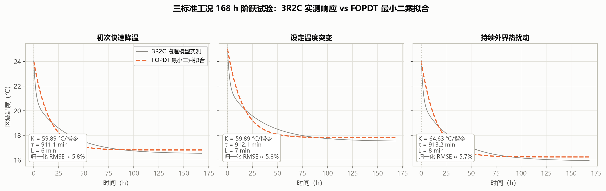
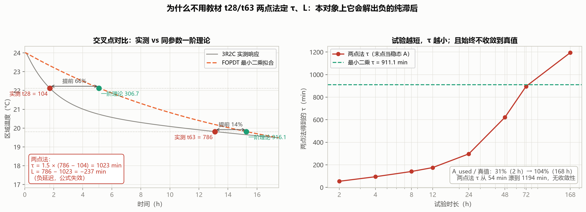
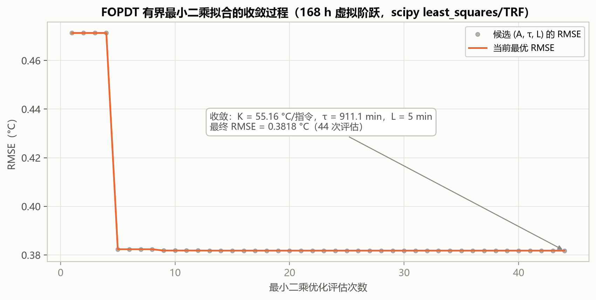
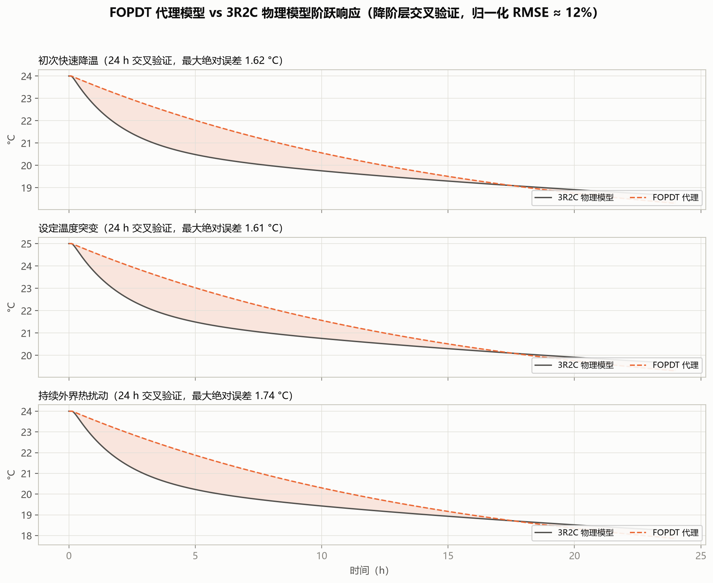

# 01 被控对象建模与 FOPDT 辨识

> **30 秒看懂**：空调房间用"两个热水袋（空气+墙体）+三条换热通道"建模；整定公式太笨看不懂二阶模型，所以先做一次 168 小时虚拟阶跃试验，把对象压缩成 3 个数（K=55.16、τ=911.1、L=5）。后面所有算法都从这 3 个数出发。想自己跑：看附录 A 的辨识程序，无随机、完全可复现。

**版本**：2026-09-03
**数据口径**：v3 封存验收批次——168 h 虚拟阶跃试验、三标准工况 FOPDT 复核、24 h 降阶交叉验证；全部数字可由封存代码确定性复现，无随机源。溯源见附录 A。
**关键结论**：被控对象用 3R2C 集中参数模型 + 纯延迟 + 一阶执行器滞后建模；整定用低阶代理为 FOPDT，标称工况 **K=55.16 °C/指令、τ=911.1 min、L=5 min**（三标准工况复核 59.89–64.63 / 911–913 / 6–8），全部经 168 h 虚拟阶跃试验的有界最小二乘拟合得到，三工况归一化 RMSE ≈ 12%。

---

## 1 速览：建模对象与辨识结果

本节只给结论。机理、试验设计、拟合过程与误差分析依次见第 2～6 节。

### 1.1 被控对象

房间/机柜温控对象用**三热阻两热容（3R2C）集中参数模型**描述，制冷指令到室温之间还串联了执行器与传感器环节——两者都不是理想增益：

| 环节 | 标称工况参数 |
|---|---|
| 热模型 | 区域空气热容 1.8×10⁶ J/K、墙体热容 1.2×10⁷ J/K；热阻 R_oz = 0.012、R_zw = 0.006、R_ow = 0.020 K/W |
| 扰动与容量 | 室外 34 °C、内部热源 900 W、制冷容量 7000 W、仿真步长 1 min |
| 执行器 | 纯延迟 5 min + 一阶惯性 4 min；最小运行容量 25%、指令量化 1%、变频斜率 ±5 个百分点/min、最短运行 5 min / 最短停机 3 min |
| 传感器 | 测量噪声 σ = 0.04 °C + 一阶滤波 τ_s = 2 min |

### 1.2 FOPDT 辨识结果

标称工况 168 h 虚拟阶跃 + 有界最小二乘拟合，得到整定用的低阶代理：

| 参数 | 数值 | 含义 |
|---|---|---|
| **K** | **55.16 °C/指令** | 制冷指令开满时稳态温降的线性外推值 |
| **τ** | **911.1 min（约 15.2 h）** | 快慢两个热容的加权时间常数 |
| **L** | **5 min** | 与执行器标称纯延迟一致 |

拟合残差 RMSE = 0.38 °C（归一化 ≈5.8%）。三标准工况复核结果：K 在 59.89～64.63、τ 在 911～913 min、L 在 6～8 min 之间，归一化 RMSE 均约 12%（详见 6.1 节）。

图 1-1：三条 168 h 阶跃响应（灰实线：3R2C 实测；橙虚线：FOPDT 拟合）。三工况拟合的 K/τ/L 分别为 59.89/911.1/6、59.89/912.1/7、64.63/913.2/8，归一化 RMSE 12.00% / 11.96% / 11.92%。

### 1.3 结果的用途与边界

- **用于**：Z-N / IMC 公式整定、备用增益计算、辨识结果交叉验证
- **不用于**：在线控制律内部——FOPDT 只是降阶代理，闭环仿真与验收始终跑全阶 3R2C
- **需谨慎**：长时开环预测（24 h 交叉验证最大绝对误差 1.6～1.7 °C），不应把 FOPDT 当数字孪生使用

## 2 被控对象详解：3R2C 热模型 + 执行器环节

### 2.1 为什么是 3R2C

**方法上是标准做法**：用电阻–电容（RC）网络的电热类比描述建筑/机柜热动态，是行业通用的集中参数建模方法。国际标准的简化逐时算法（EN ISO 52016-1，前身 ISO 13790）采用 5R1C；模型预测控制与系统辨识领域则常用 1R1C / 2R2C / 3R2C / 4R3C 这一族构型，阶数按数据与用途选取。

**阶数上选 3R2C**：室内空气与墙体各一个热容，室外–区域、区域–墙体、室外–墙体三个热阻。理由只有两条：

- **两个热容是下限**。空气对制冷指令响应快（分钟级），围护结构蓄热释放慢（小时级）；1R1C 只有单一时间常数，会把围护蓄热并入过程惯性或滞后，使 τ、L 失真。实测响应到达 28.3% 只用了 104 min，而同参数一阶模型应为 307 min（见 4.2 节），这个差距正是双时间尺度造成的。
- **再高阶不划算**。3R2C 以上（4R3C 等）精度增益很小，但待辨识参数增多、不可辨识风险与计算成本明显上升，这是灰色箱建模文献中一致的经验结论。

因此 3R2C 是“够用的最简构型”，而不是某个标准强制规定的构型。本演示用它为整定算法提供一个具备真实“快模态 + 慢长尾”的虚拟被控对象，并不追求复现某一具体机房的热工参数。

### 2.2 状态方程与符号含义

$$C_{zone} \frac{dT_{zone}}{dt} = \frac{T_{out} - T_{zone}}{R_{oz}} + \frac{T_{wall} - T_{zone}}{R_{zw}} + Q_{load} - Q_{cool}$$

$$C_{wall} \frac{dT_{wall}}{dt} = \frac{T_{zone} - T_{wall}}{R_{zw}} + \frac{T_{out} - T_{wall}}{R_{ow}}$$

| 符号 | 含义 | 标称值 | 说明 |
|---|---|---|---|
| $T_{zone}$ | 区域（室内/柜内）温度 | 控制目标 24 °C 附近 | 主状态，PI 的反馈量 |
| $T_{wall}$ | 墙体/围护等效温度 | 初始 31.5 °C | 慢状态，蓄热来源 |
| $T_{out}$ | 室外/环境进风温度 | 34 °C（标称） | 扰动输入，可有昼夜波动 |
| $C_{zone}$ | 区域空气等效热容 | 1.8×10⁶ J/K | 决定快时间常数 |
| $C_{wall}$ | 墙体等效热容 | 1.2×10⁷ J/K | 决定慢长尾（约 6.7 倍于空气） |
| $R_{oz}$ | 室外↔区域热阻 | 0.012 K/W | 外扰直入通道 |
| $R_{zw}$ | 区域↔墙体热阻 | 0.006 K/W | 蓄热耦合通道 |
| $R_{ow}$ | 室外↔墙体热阻 | 0.020 K/W | 围护传热通道 |
| $Q_{load}$ | 内部热源功率 | 900 W（标称） | 设备/人员散热，可随工况变化 |
| $Q_{cool}$ | 实际制冷功率 | = $Q_{max}\cdot cooling\_frac$ | 执行器输出 |

标称工况参数（即仿真场景配置的默认值）：$Q_{max}$=7000 W，仿真步长 1 min。热容单位 J/K、热阻 K/W、功率 W、时间 min。

### 2.3 执行器与传感器环节（不是理想增益）

制冷指令 $u\in[0,1]$ 到实际制冷功率之间串联了真实变频空调的物理/产品约束：

1. **纯延迟**：$u_{disp}(t) = u(t - L_a)$，$L_a$=5 min（标称，随工况 6/7/8 min）——压缩机启停与冷媒响应延迟；
2. **一阶惯性**：$\tau_u \frac{d\,cooling}{dt} = u_{disp} - cooling$，$\tau_u$=4 min——变频器功率爬升惯性；
3. **产品约束**：最小运行容量 25%（低于此值停机）、指令量化 1%、变频斜率 ±5 个百分点/min、最短运行 5 min / 最短停机 3 min；
4. **传感器**：测量噪声 σ=0.04 °C + 一阶滤波 $\tau_s$=2 min。

这些约束对**所有算法完全一致**，是各算法横评公平性的前提。

### 2.4 为什么需要 FOPDT 代理

3R2C 是二阶+延迟+执行器的高阶对象。经典整定公式（Z-N、IMC）需要的是一个低阶近似；AI 整定中的候选评估、基准增益（如 IMC 备用增益）也依赖一个可解释的降阶模型。一阶加纯滞后（FOPDT）是温控行业最通用的代理模型：三个参数各有明确物理含义，且一次阶跃试验即可辨识。

---

## 3 FOPDT 模型：公式与参数含义

### 3.1 传递函数

$$G(s) = \frac{\Delta T(s)}{\Delta u(s)} = -\frac{K\, e^{-Ls}}{\tau s + 1}$$

负号表示：制冷指令增大 → 温度下降（反作用对象）。

| 参数 | 名称 | 物理含义 | 对控制的意义 |
|---|---|---|---|
| $K$（°C/指令） | 过程增益 | 制冷指令从 0 开到 100%，稳态温度下降多少度 | 决定比例增益尺度：K 越大，Kp 应越小 |
| $\tau$（min） | 时间常数 | 阶跃后温度完成总降幅 63.2% 所需时间（扣除延迟后） | 决定积分时间尺度：τ 越大，响应越慢，Ti 应越大 |
| $L$（min） | 纯滞后 | 指令变化后温度开始响应前的死区时间 | 决定稳定边界：L 越大，允许的增益越低 |

### 3.2 阶跃响应形式

对幅值 $\Delta u$ 的正阶跃（加大制冷），温度从 $y_0$ 下降：

$$\hat{y}(t) = y_0 - A\left(1 - e^{-\max(t-L,\,0)/\tau}\right), \qquad A = K\cdot\Delta u$$

其中 $A$ 是总温降幅（°C）。拟合直接以 $(A, \tau, L)$ 为参数，**$K$ 不作为独立拟合参数，而由 $K=A/\Delta u$ 换算**——保证"增益"严格等于"观测温降 ÷ 观测指令步长"，不被初值设定污染。

---

## 4 阶跃辨识试验设计

### 4.1 试验流程

上述七步由本项目的辨识程序按固定顺序执行，全程无随机分支；程序名与代码位置见附录 A。下表逐步说明每步的做法与设计理由。

| 步骤 | 动作 | 标称工况数值 | 设计理由 |
|---|---|---|---|
| ① 构造恒定工况 | 固定外温、设定值、热负荷、容量（constant_copy） | $T_{out}$=34 °C, $T_{sp}$=24 °C, $Q_{load}$=900 W | 去掉昼夜波动、开门、设定值变化，避免把扰动误认为对象动态 |
| ② 求稳态工作点 | 热平衡 $Q_{bal}=(T_{out}-T_{sp})/R_{eff}+Q_{load}$，$u_0=\mathrm{clip}(Q_{bal}/Q_{max},\,0.15,\,0.70)$ | $R_{eff}$=0.0082 K/W → $u_0$=30.3% | 从"维持设定值所需的制冷量"出发，而不是随意指定工作点 |
| ③ 施加阶跃 | $u_1=u_0+\Delta u$，$\Delta u=\min(0.12,\,0.90-u_0)$ | +12 个百分点 → $u_1$=42.3% | 幅度足以压过噪声，又不离开线性区、不触底/触顶 |
| ④ 运行并记录 | 恒定工况下运行 **168 h**，1 min 步长 | 10080 个温度样本 | 墙体热容 $C_{wall}$ 大，τ≈911 min≈15 h；短试验根本看不到慢尾部 |
| ⑤ 降采样 | 每 5 min 取一点进入拟合 | 2017 个拟合点 | 降低计算量；5 min 远小于 τ，不损失动态信息 |
| ⑥ 有界最小二乘拟合 | scipy least_squares（TRF） | 详见第 5 节 | 同时拟合 A、τ、L |
| ⑦ 记录诊断量 | t28/t63 交叉点、RMSE | 实测 t28=104 min、t63=786 min | **只作校验，不用来定参**（见 3.2） |

### 4.2 为什么不用“读 t28/t63”定 τ、L

教材两点法为 τ=1.5(t63−t28)、L=t63−τ。它成立需要三个前提：响应严格是一阶单指数加纯滞后、稳态幅值 A 已知、两个交叉点都被完整观测到。本对象三条都不满足，而**主因是第一条——模型结构失配，不是试验长度**。

**实测数据说话**（标称工况 168 h 阶跃，A=6.62 °C）：

| 方法 | τ (min) | L (min) | 对应的 Z-N Kp |
|---|---|---|---|
| 有界最小二乘（本报告采用） | **911.1** | **5.0** | 1.500 |
| 两点法 t28/t63 | 1023 | **−237** | 公式失效，Kp 被限幅到 0.002 |
| 切线法（拐点最大斜率） | 261.8 | 6.3 | 0.677 |

实测交叉点是 **t28=104 min、t63=786 min**；若对象真是一阶（τ=911、L=5），理论值应为 306.7 与 916.1。也就是说 28.3% 点提前了 66%，而 63.2% 点只提前 14%——两点法正是被这个不对称扭曲，才解出负的纯滞后。关键在于：**即使试验跑满 168 h、t63 确实到达，两点法依然失效**，因为根子在模型结构，不在试验时长。

试验长度不足是叠加的第二重问题。两点法必须先知道 A，而短试验里最常见的做法就是“末点当稳态”。按该做法复算，τ 随试验长度从 2 h 的 54 min 一路漂到 168 h 的 1194 min（A_used 从真值的 31% 变到 104%），**没有收敛性**——这意味着无法靠“多测一会儿”来补救。事实上 168 h 末点温降已达 6.869 °C，超过拟合稳态 6.62 °C，且最后一小时仍以 0.0008 °C/h 在下降，“末点即稳态”在本对象上严格不成立。

因此 t28/t63 仅作事后校验记录（代码审计表中的原话），定参完全交给最小二乘：后者把 A 当作待估参数而不是给定假设、使用全部 2017 个拟合点、并把 τ>0 与 L≥L_a 写成硬约束，物理上不可能的解根本不会被输出。

图 1-2：**为什么不用教材 t28/t63 两点法。**左图为同一 168 h 阶跃响应在 28.3% 与 63.2% 两个阈值上的交叉点对比——实测值（红）远早于同参数一阶理论值（绿），且提前幅度不对称（66% vs 14%），两点法由此被扭曲出负的纯滞后（L = −237 min）。右图把试验末点当作稳态幅值 A 时，两点法得到的 τ 随试验长度从 2 h 的 54 min 一路漂到 168 h 的 1194 min（绿虚线为最小二乘真值 τ = 911.1 min），无收敛性——说明“试验长度”救不了两点法，根子在模型结构失配。

## 5 有界最小二乘拟合详解

### 5.1 优化问题

$$\theta^* = \arg\min_{\theta=(A,\,\tau,\,L)} \ \sum_{i} \left[\hat{y}(t_i;\,\theta) - y(t_i)\right]^2$$

其中 $\hat{y}$ 为 3.2 节阶跃响应式，$y(t_i)$ 为 3R2C 仿真实测温度，残差 $r_i=\hat{y}_i-y_i$。

### 5.2 求解器与数值设置

- **算法**：`scipy.optimize.least_squares`，TRF（信赖域反射）法，处理**有界**非线性最小二乘；
- **初值**：$A_0$ = 响应末 60 min 平均温降（数据驱动）；$\tau_0=\max(T_{total}/12,\ 4\tau_u,\ 2\Delta t)$=840 min；$L_0=\max(L_a,\ \Delta t)$=5 min；
- **边界**：$A\in[0.01,\ A_{upper}]$，$\tau\in[2\Delta t,\ 2\times 168\times 60]$ min，$L\in[L_0,\ \max(L_0+60,\ 2L_0)]$ min——把"时间常数必为正""延迟至少为执行器标称延迟"等先验写成硬约束；
- **收敛**：max_nfev=200，xtol=ftol=gtol=1e-10（收紧默认值，避免在平缓目标面上提前停）；
- **全程留痕**：每次残差评估的候选 $(A,\tau,L)$ 与当前最优值全部落盘为拟合历史文件，供审计与复现（文件名见附录 A）。

### 5.3 收敛过程（封存数据）

图 1-3：标称工况 168 h 虚拟阶跃的拟合收敛——约 40 次评估内最优 RMSE 从初值迅速降到 0.38 °C 附近并收敛，最终 K=55.16 °C/指令、τ=911.1 min、L=5 min。残差点列显示优化器曾试探过多个较差区域（RMSE 高达数 °C），最终被边界拉回——这正是"有界"的价值。

---

## 6 拟合效果与交叉验证

### 6.1 三标准工况 168 h 阶跃：实测 vs 拟合

三条 168 h 阶跃响应的实测与拟合对比见图 1-1。三工况拟合的 K/τ/L 分别为 59.89/911.1/6、59.89/912.1/7、64.63/913.2/8，归一化 RMSE 12.00% / 11.96% / 11.92%。

读图要点：
- **早期（0–20 h）**：拟合曲线紧贴实测，快模态（空气热容）被 τ 和 L 吸收得很好；
- **中期（20–100 h）**：实测响应略低于 FOPDT——墙体蓄热持续放热，相当于一个缓慢变化的附加扰动，这是单时间常数模型的固有结构误差；
- **长期（>100 h）**：两者重新汇合于同一稳态，说明增益 K 无偏。

### 6.2 24 h 降阶交叉验证

图 1-4：用整定好的 FOPDT 直接开环预测 24 h 阶跃响应，与 3R2C 全模型对比（阴影为误差带）。三工况最大绝对误差约 1.6–1.7 °C，归一化 RMSE ≈ 12%。误差主因是围护热容第二模态的长尾——FOPDT 用一个 τ 概括两个热容，中期必然欠拟合。

### 6.3 误差是否可接受

- 对**整定用途**：可接受。Z-N/IMC 公式对 τ、L 的灵敏度远高于对 K 的灵敏度，而三工况 τ 的散布 <0.3%、K 的散布 <8%（64.63 vs 59.89，源于工况三持续热扰动抬高了有效增益）；
- 对**长时开环预测**：需谨慎，12% 归一化 RMSE 意味着不应把 FOPDT 当数字孪生用；
- 缓解手段已内置：AI 算法的最终验收在全阶 3R2C 仿真上进行（80 场景 holdout），FOPDT 只承担"给经典公式和基准增益提供参数"的角色。

---

## 7 FOPDT 参数由来汇总

| 工况（辨识对象） | K（°C/指令） | τ（min） | L（min） | 归一化 RMSE | 用途 |
|---|---|---|---|---|---|
| 标称工况（34 °C/24 °C/900 W/7000 W，Lₐ=5） | **55.16** | **911.1** | **5** | RMSE 0.38 °C（≈5.8%） | **Z-N/IMC 整定、备用增益的唯一来源** |
| 工况一 初次快速降温（35 °C，Lₐ=6） | 59.89 | 911.1 | 6 | 12.00% | 交叉验证 |
| 工况二 设定温度突变（34 °C，Lₐ=7） | 59.89 | 912.1 | 7 | 11.96% | 交叉验证 |
| 工况三 持续外界热扰动（37±4.5 °C，Lₐ=8） | 64.63 | 913.2 | 8 | 11.92% | 交叉验证 |

参数由来链条（可逐步审计，见本项目自动生成的分步审计表，生成函数见附录 A）：

1. $u_0$：由热平衡计算（30.3%），**不依赖任何未知模型参数**——真机上应由稳定运行记录获得；
2. $\Delta u$：+12 个百分点；
3. $A$：最小二乘拟合的总温降（标称 6.62 °C）；
4. $K=A/\Delta u=6.62/0.12=55.16$ °C/指令——"指令开满，稳态再降 55 °C"（极端外推值，仅作线性尺度意义理解）；
5. $\tau$：最小二乘拟合的时间常数 911 min——由空气与墙体两个热容的加权体现；
6. $L$：拟合值 5 min，与执行器标称纯延迟 $L_a$=5 min 一致（三工况 6/7/8 与各自 $L_a$ 一致）——说明执行器延迟是总纯滞后的主成分；
7. 三工况复核的 K 上升（59.89→64.63）反映高外温下单位制冷指令的"有效降温能力"变化，τ 几乎不变——热惯性由物理热容决定，与工况无关，符合物理直觉。

---

## 8 可信度声明

- 本报告全部数字来自 v3 封存产物或可由封存代码确定性复现（该辨识程序无随机源）；
- 3R2C 本身是集中参数近似，真机还需 SIL→HIL→影子试运行（只记录、不执行）的逐步验证（见主报告第 7 章部署路线）；
- FOPDT 仅用于：Z-N/IMC 公式整定、备用增益计算、辨识结果交叉验证；**不**用于在线控制律内部。

## 附录

本附录列出的数据文件、代码位置与命令，均为**本项目代码仓库内的相对路径**，仅面向需要核对数据来源或复现结果的读者。仅阅读本报告的读者可直接跳过——理解正文全部结论所需的输入、参数与数值已在正文中给出，不依赖这些文件。

### A 本篇数据溯源

| 数据产物（仓库内路径） | 内容 | 支撑本篇何处 |
|---|---|---|
| `archive/outputs_review_v3/fopdt_fit_history.csv` | 有界最小二乘逐次评估记录 | 5.2 节全程留痕、图 1-3 |
| `archive/outputs_review_v3/classical_tuning_steps.csv` | 整定计算的分步审计表 | 第 7 节参数由来 |
| `archive/outputs_review_v3/fopdt_cross_validation.csv` | 三工况 FOPDT 复核汇总指标 | 1.2 节、6.1 节 |
| `archive/outputs_review_v3/fopdt_cross_validation_timeseries.csv` | 24 h 降阶交叉验证时序 | 6.2 节、图 1-4 |

本篇结论涉及的实现位置：

| 代码位置 | 作用 |
|---|---|
| `hvac_pid/controllers.py` :: identify_fopdt_audit | 168 h 阶跃试验与 FOPDT 有界最小二乘辨识（无随机源） |
| `hvac_pid/controllers.py` :: classical_tuning_calculation_steps | 整定计算分步审计表生成 |
| `hvac_pid/config.py` :: Scenario | 标称工况参数默认值（热容、热阻、执行器与传感器约束） |
| `hvac_pid/plant.py` :: ThermalPlant3R2C | 3R2C 被控对象状态方程 |

**复现说明**：本报告全部数字来自 v3 封存产物，或可由上述封存代码确定性复现——辨识程序无随机源，同一份配置重复运行得到逐位一致的结果。重新生成本篇配图的命令见 00 号报告附录 B.3。
