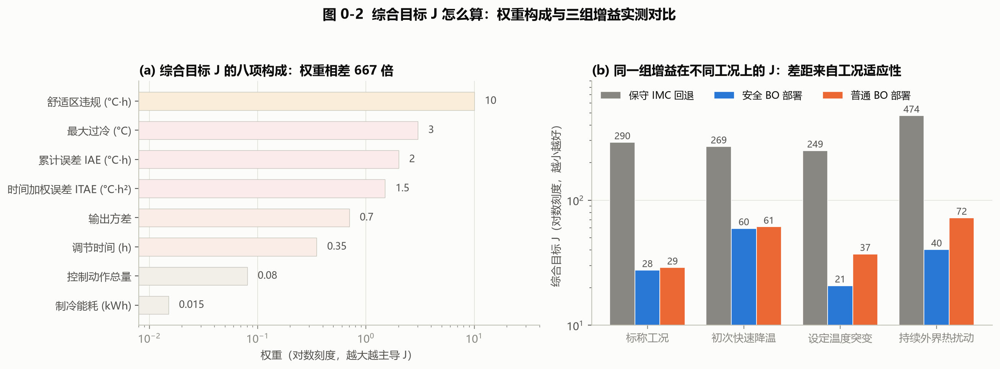

# 03 怎样比较才公平：建立我们的实验规则

> **本篇目标**：理解训练/验证/测试、评价指标、计算预算、随机种子和回退。
> **你需要**：第 01 篇（跑通过）、第 02 篇（懂对象）。
> **你会得到**：一套可执行的公平比较规则，以及"快速体验 vs 完整复现"的分界线。
> **运行方式**：本篇不训练，只学会读 manifest 和判断口径。
> **版本依据**：`experiments/manifests/v4.yaml` + `hvac_pid/metrics.py`、`safety.py`、`timebase.py`。

---

## 这次要解决什么问题

七种算法各说各好时，怎么比才公平？拿 A 的训练高分去比 B 的测试低分，或者拿不同种子、不同约束下的曲线直接排名，都是耍流氓。本篇把比较规则一次性定死，后面每一篇的结论都受它约束。

## 开始前准备什么

- 前置：第 01、02 篇。
- 读一份文件：`experiments/manifests/v4.yaml`——场景、种子、算法参数、阈值都在里面，缺字段会直接报错，没有"默认凑合"。
- 记住两个口径：**快速体验**（小场景、小预算、LLM replay，只验证流程）与**完整复现**（固定配置、完整训练、冻结后密封测试，用于复核结论）。

## 先跑一个最小实验

不用运行，打开 manifest 核对三行：

```yaml
scenarios: {train: {count: 48, seed: 41}, validation: {count: 16, seed: 5041}, test: {count: 16, seed: 10041}}
sealed_5x16: {repeats: 5, per_repeat: 16, total: 80}
```

正式划分是 48 训练 / 16 验证 / 16 测试，三向隔离（`scenario_id` + SHA-256 防泄漏）；密封测试是 5×16=80，种子 `101,211,307,401,503`。完整复现命令：

```bash
python main.py --output outputs_full
python run.py sealed --artifact-dir outputs_full --output artifacts/runs/sealed-80x7
```

## 刚才发生了什么（规则本身）

- **训练/验证/测试**：训练定参数，验证做选择（早停、选表、选 λ），测试只打分。测试后调参必须换新密封集——碰过测试集的参数不能再声称"密封"。
- **综合目标 J**（`metrics.py:objective_from_metrics`，越小越好）：舒适区违规×10.0 + 最大过冷×3.0 + IAE×2.0 + ITAE×1.5 + 输出方差×0.7 + 调节时间×0.35 + 控制动作×0.08 + 能耗×0.015；发散直接判 J=1e6。J 的绝对值没有物理意义，只有同口径相对比较有效。
- **预算与种子**：每个候选的评估次数、BO 迭代数、LLM 试验次数都是成本；种子固定（默认 7），换种子重跑看的是结论是否稳定。
- **回退**：任何智能算法掉链子就切回 IMC。发生回退不代表温度达标——回退后仍不稳定会单独记为失败（`fallback_failed`），不能把"成功回退"说成"控制成功"。

## 跟着代码走一遍

- 指标：`hvac_pid/metrics.py`——J 的八项权重与 `stable` 判定（5–45 °C 有界 + 舒适带保持 + 扰动恢复 + 执行器合规是拆开的字段）。
- 安全：`hvac_pid/safety.py`——增益界 Kp∈[0.002,1.5]、Ki∈[1e-5,0.08]，单次变化 ≤10%，风险权重 0.75。
- 策略版本：`hvac_pid/policy_bundle.py:PolicyBundle`——IMC/BO/SafeBO/FNN 表+上下文/RL 表+掩码必须同目录冻结，缺文件报错。
- 时间：`hvac_pid/timebase.py`——300 s / 120 s / 2 s 三口径分离。

## 结果应该怎么看



> **看哪里**：舒适区违规一项的权重（10.0）与其他项的量级差。
> **发生了什么**：一组能耗最低、零启停的参数，因为温度没控住，J 反而是最高的（约 290 vs 28）。
> **这说明什么**：这套评价是"舒适优先于能耗"，且差距是量级性的——为省电牺牲控温在这套规则里走不通。读后面每一篇的 J 表格时，先问"口径一致吗"，再问"差多少"。

还要分清两个统计量：主统计量为逐场景配对比均值 `mean(obj/imc)` + bootstrap 95% CI（`mean_ratio_to_imc` = `paired_ratio_mean`），次统计量 `ratio_of_means_to_imc`（两个平均数相除）仅对照。本报告以主统计量下结论，不得混用（见第 11 篇）。验收同样拆分：`stable` 仅指数值有界，温控验收需四项全过。

## 改一个参数试试看

假设"权重决定结论方向"：把舒适区权重从 10 改成 1，重算两组历史参数的 J，看排名是否翻转。如果翻转了，你就理解了为什么第 11 篇坚持"同权重、同场景才能排名"——换一把尺子，名次自然会变。

## 如何确认复现成功

- 能说出任意一篇结论的口径：对象版本 + 场景清单 + 种子 + J 权重 + 策略版本。
- 能区分三个动作：重画图（读时序）/ 重放策略（冻结参数重仿真）/ 重新训练（重新搜索，结果可能不同）。
- 真实 LLM 调用：检查轨迹和约束是否满足即可，不能承诺再次得到相同建议；replay 只复核流程。

## 这次能得出什么结论

公平比较 = 同一对象 + 同一约束 + 同一指标 + 同一密封集 + 冻结策略 + 报告分布与回退。做不到的就明确标注不可比较——这不是保守，是这套教程的交付标准。带着这把尺子，我们从第 04 篇开始看算法。

## 附录：本篇数据溯源

| 数据产物（仓库内路径） | 内容 | 支撑本篇何处 |
|---|---|---|
| `experiments/manifests/v4.yaml` | 场景/种子/阈值唯一事实源 | 全篇规则 |
| `artifacts/runs/sealed-80x7-v4/sealed_provenance.json` | 密封实验溯源 | 口径示例 |
| `hvac_pid/metrics.py` | J 公式实现 | 指标定义 |
