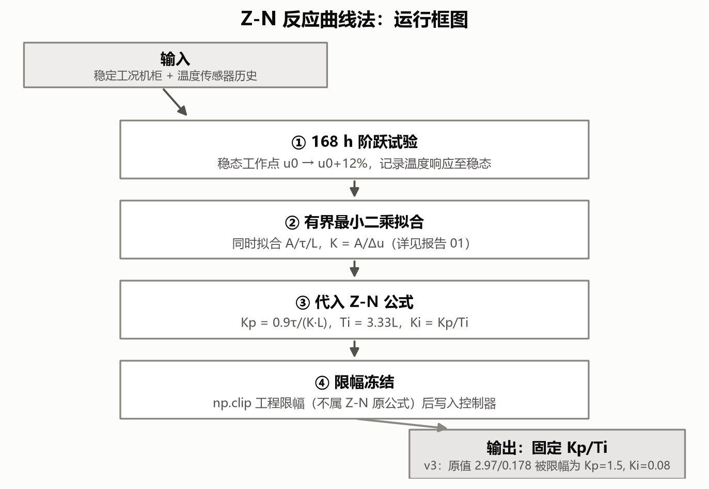
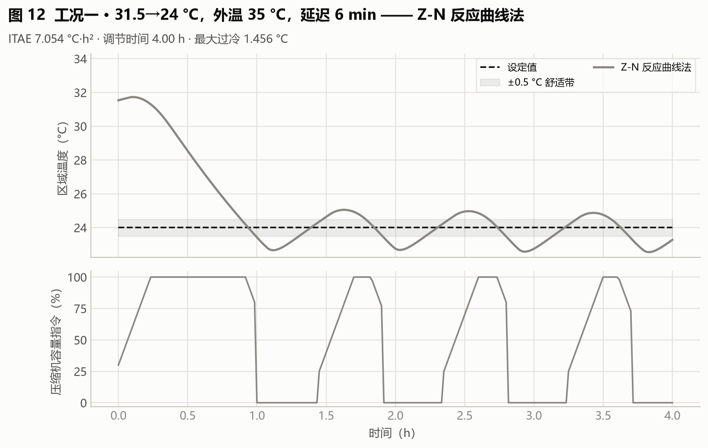
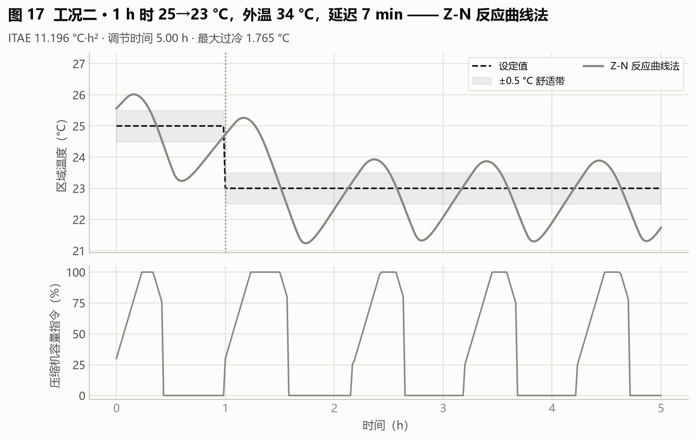
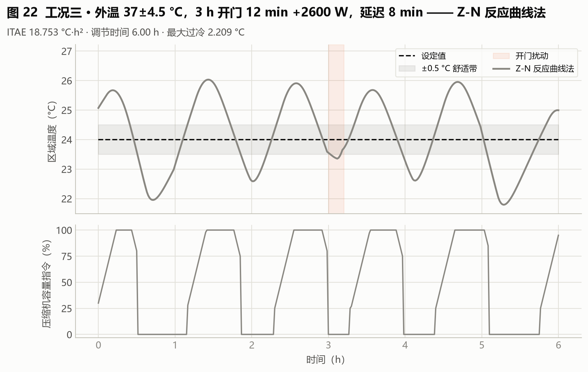
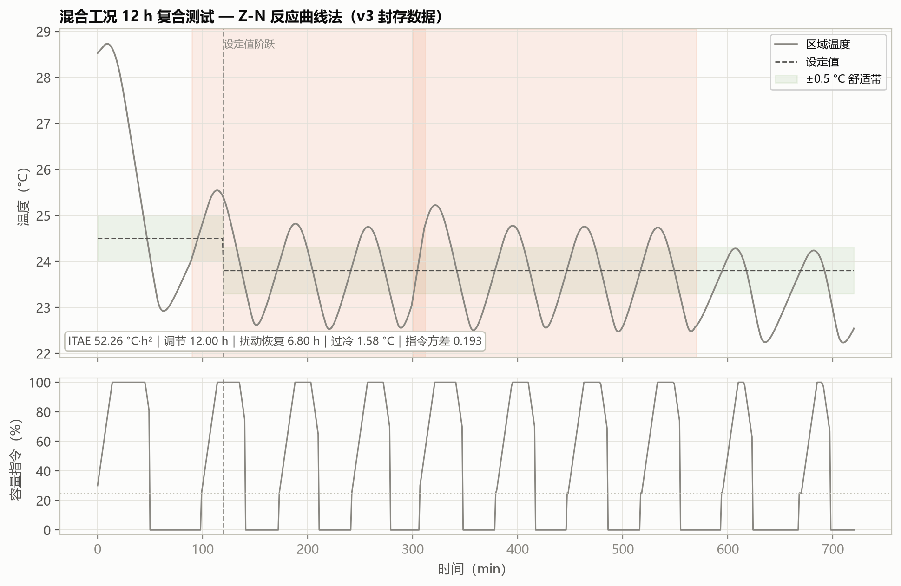

# 04 Z-N：从一次阶跃试验算出 PI 参数

> **本篇目标**：辨识 FOPDT、代入公式、观察激进参数的代价。
> **你需要**：第 02 篇的 FOPDT、第 03 篇的比较规则。
> **你会得到**：一组固定增益（Kp=1.5、Ki=0.08，限幅后）、三工况与混合工况曲线。
> **运行方式**：快速体验 `python main.py --quick`（公式代入约 0.16 秒）/ 完整复现 `python main.py`。
> **版本依据**：`experiments/manifests/v4.yaml` + 封存 `archive/outputs_review_v3/classical_tuning_history.csv`。

---

## 这次要解决什么问题

在没有 AI 之前，工程师怎么调 PI？最老的做法是：做一次阶跃试验，拟合出三个数，代入经验公式，参数就出来了，全程不到 1 秒。它是本项目的"地板线"——所有 AI 方法都要先证明比它强。

## 开始前准备什么

- 前置章节：第 02 篇（FOPDT 的 K、τ、L 从哪来）。
- 输入数据：标称 FOPDT（K=55.16 °C/指令、τ=911.1 min、L=5 min）。
- 预计资源：公式代入本身约 0.16 秒；若尚无 FOPDT，需先补 168 h 虚拟阶跃辨识。

## 先跑一个最小实验

```bash
python main.py --quick --output outputs_quick
```

读 `outputs_quick/classical_tuning_history.csv` 找到 Z-N 行：原值 Kp=2.97、Ki=0.178，限幅后 Kp=1.5、Ki=0.08。生成哪些文件 → 同上。怎样判断成功 → 增益落在界内（Kp∈[0.002,1.5]、Ki∈[1e-5,0.08]），且与手算一致。

## 刚才发生了什么

先说直觉：阶跃响应越陡、延迟越短，说明对象越"听话"，增益就可以给大一点；响应慢、延迟大，就得收敛一点。Z-N 把这个直觉写成了固定公式。

再说机制，最后接到实现（`hvac_pid/controllers.py:ziegler_nichols_pi`）：

$$K_p = \frac{0.9\,\tau}{K\,L}, \qquad T_i = 3.33\,L, \qquad K_i = \frac{K_p}{T_i}$$

- 符号与单位：K（°C/指令）、τ、L、Ti 都是 min，Ki 是 min⁻¹；输入全部来自辨识，没有搜索。
- 代码在哪里：公式后统一经公共安全边界限幅。
- 代入本例：Kp 原值 = 0.9×911.1/(55.16×5) = 2.97，Ti = 16.65 min，Ki 原值 = 0.178。**两个原值都超界**，实际采用 Kp=1.5、Ki=0.08——公式还没用就被限幅砍了一刀，这本身就说明它对本对象过于激进。
- 改变这个量会看到什么：τ 越大或 L 越小，Kp 越大，曲线越冲；本对象 τ 极大，公式必然给出激进增益。

## 跟着代码走一遍

入口 `main.py` → `pipeline.py` 的经典整定段 → `controllers.py:ziegler_nichols_pi`（公式 + 限幅）→ 密封评估。运行时与算法本身无关：部署后参数终身不变，不需要任何在线数据。

## 结果应该怎么看



> **看哪里**：数据从阶跃试验经辨识直达公式，没有搜索环。
> **发生了什么**：一次算定，限幅冻结。
> **这说明什么**：零训练、零调参、完全透明——代价是没有任何适应工况的余地。

  

> **看哪里**：降温段有无振荡、过冷幅度、容量曲线的波动。
> **发生了什么**：ITAE 7.05/11.20/18.75 均为全部算法最差，过冷 1.46–2.21 °C，指令方差 0.18–0.20 全场最大。
> **这说明什么**：限幅后的 Kp=1.5 仍然偏激进——为四分之一衰减比设计的公式，在大时间常数热对象上水土不服。



> **看哪里**：12 h 是否收敛、启停次数。
> **发生了什么**：综合目标 165.03 全场最差，12 h 未稳定，触发 9 次启停。
> **这说明什么**：多工况叠加是 Z-N 最不利的场景——单一扰动的振荡在复合扰动下被持续激发。固定激进增益无法区分"该快"和"该稳"的时刻。

## 改一个参数试试看

假设"激进是原罪"：手动把 Kp 从 1.5 降到 0.5（保持 Ki），重跑三工况，观察振荡是否消失、调节是否变慢。如果符合，说明 Z-N 的问题不在公式神秘，而在增益量级——这正是第 05 篇用 λ 把"快慢"做成旋钮的动机。

## 如何确认复现成功

文件检查：`classical_tuning_history.csv` 的 Z-N 行存在。数值容差：原值 2.97/0.178 与限幅值 1.5/0.08 逐位一致（公式无随机）。行为检查：80 场景 holdout 最差（v3 为 58.19）。常见异常：拿错 FOPDT 工况（标称 vs 复核）导致原值对不上——核对 K、τ、L 输入。

## 这次能得出什么结论

- 收益：零训练、零调参、公式透明，是合格的"地板线"。
- 代价：增益激进，固定增益对多工况叠加最敏感。
- 适用条件：只用作基线对照和教学演示，不建议直接部署。演示里这组参数没通过上线检查，实际用的是 IMC——宁可保守也不让激进参数上机，这是故意这样设计的。
- 未证明的部分：无，本篇结论完整且稳定。

## 附录：本篇数据溯源

| 数据产物（仓库内路径） | 内容 | 支撑本篇何处 |
|---|---|---|
| `archive/outputs_review_v3/case_metrics.csv` | 三工况指标 | 工况表 |
| `archive/outputs_review_v3/case_timeseries.csv` | 三工况时序 | 工况图 |
| `archive/outputs_review_v3/classical_tuning_history.csv` | 整定与限幅记录 | 公式代入 |

| 代码位置 | 作用 |
|---|---|
| `hvac_pid/controllers.py:ziegler_nichols_pi` | Z-N 公式（含限幅） |
