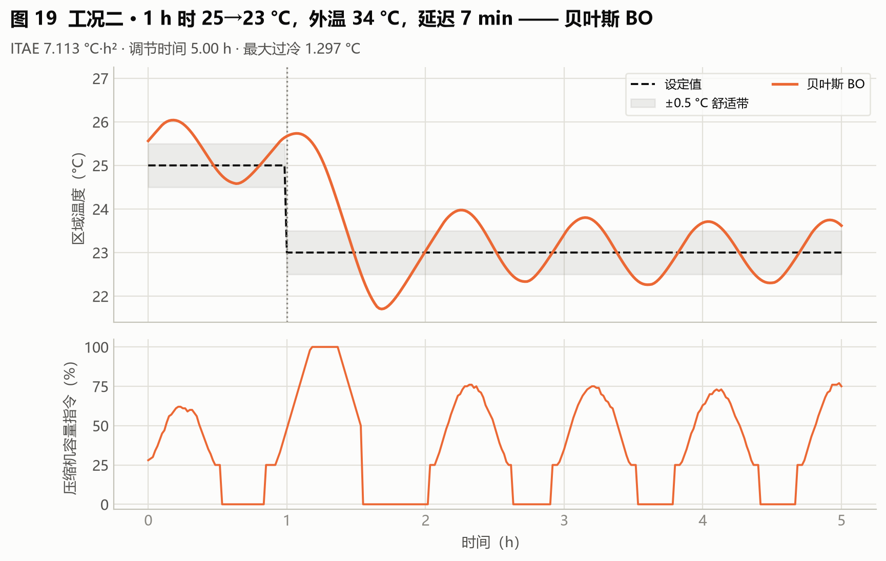
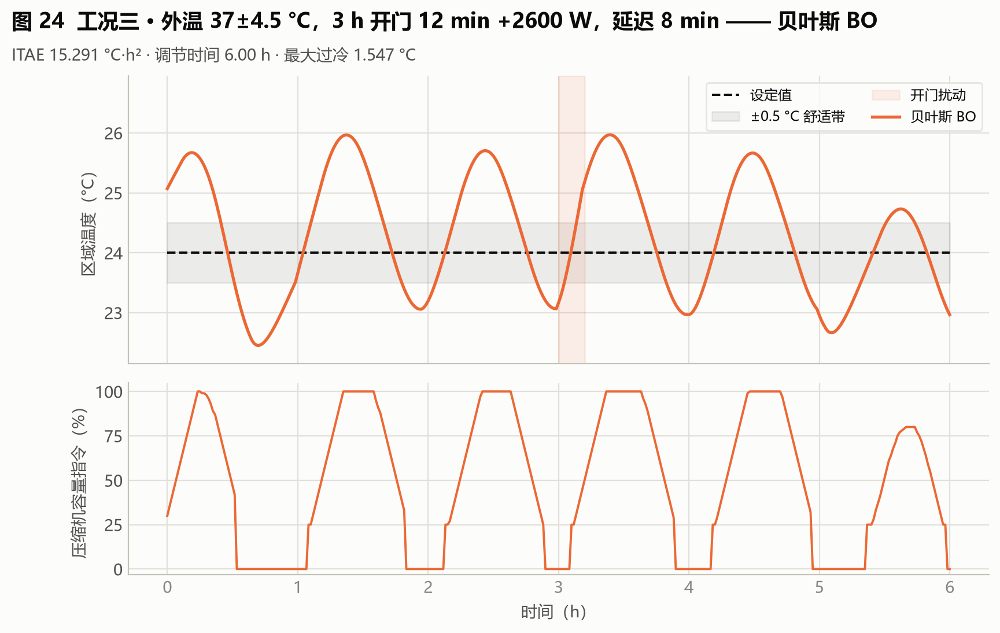

# 04 算法报告：贝叶斯 BO 自动整定

**版本**：2026-09-03
**数据口径**：v3 封存验收批次（14 次评估的贝叶斯优化搜索）+ 整定耗时基准。溯源见附录 A。
**一句话定位**：用高斯过程（GP）代理"增益→综合目标"的映射，以期望改进（EI）挑选下一个候选——用尽可能少的全闭环仿真找到全局最优固定增益。

---

## 1 算法所需数据、输入与输出

| 项 | 内容 |
|---|---|
| 所需数据 | 训练工况集（全闭环仿真环境）+ 综合目标函数 J 的定义；FOPDT 不直接进入搜索，只用于生成初始化种子（IMC/Z-N 点） |
| 输入 | 候选空间 (log Kp, log Ki)、初始样本（IMC / Z-N / 随机点）、评估预算（本次 14 次） |
| 输出 | 一组全局固定 Kp/Ki：v3 部署 **Kp=0.5355、Ki=0.0063**（14 次评估收敛，J=34.00） |
| 运行时数据需求 | 无——部署后零计算负担 |

流程：初始化样本 → 候选 (log Kp, log Ki) 全闭环仿真评估 J → Matérn-5/2 GP 拟合"增益→J"响应面 → EI 期望改进选下一个候选 → 迭代至预算耗尽 → 最优候选冻结。

## 2 能否自整定 / 能否自动整定

| 判定 | 结论 | 理由 |
|---|---|---|
| 自整定 | **否** | 搜索在投运前离线完成，部署后增益固定 |
| 自动整定 | **是** | 从初始化到选点、评估、收敛全自动，无人工调参环节 |

## 3 运行框图

## 4 BO 是怎么工作的：原理、参数更新与一次迭代全流程

### 4.1 BO 要解决什么问题

目标很朴素：找一组 (Kp, Ki)，让综合目标 J 最小。难处在于 J 是个**黑箱**——

- 没有解析表达式，无法求导，也就用不了梯度下降；
- 想知道某个 (Kp, Ki) 好不好，唯一的办法是**真刀真枪跑一次仿真**：在本项目里是一次 48 个训练工况的完整闭环仿真（PC 上约 0.1 s，真机上等价于数小时）；
- 响应面还不 smooth：J 对 Ki 的变化极其敏感（Ki 跨 4 个数量级），且存在不止一个"还不错"的区域。

所以核心矛盾是**评估太贵**。贝叶斯优化（Bayesian Optimization, BO）的做法是：不直接优化 J，而是先用一个**便宜的概率模型**去"猜"J 长什么样，再用这个猜想去决定"下一个最值得试的点"。每试一次就把真实结果喂回模型，模型变得更准，下一次选点就更聪明。

三个部件构成一个闭环：

| 部件 | 作用 | 本项目实现 |
|---|---|---|
| **代理模型** | 用已有评估点拟合"J 关于 (Kp, Ki) 的概率模型"，给出预测均值 μ(x) **和**不确定性 σ(x) | 高斯过程（GP），Matérn-5/2 核 |
| **采集函数** | 权衡"下一个点该试哪"，平衡"找已知好的区域"与"探未知区域" | 期望改进（EI），探索参数 ξ=0.01 |
| **真实评估** | 把选中的点送进仿真器，拿到真实 J，加进数据集 | 48 个训练工况的平均目标 |

### 4.2 搜索空间：为什么在"对数空间"里搜

搜索边界是 Kp ∈ [0.002, 1.5]、Ki ∈ [1e-5, 0.08]。Ki 跨越了近 4 个数量级——如果在线性空间里均匀撒点，绝大多数点会挤在 Ki 大的那一端，Ki 小的区域几乎采不到。

本项目把两个增益先取对数、再线性映射到**单位正方形 [0,1]²**：

$$u = \frac{\ln g - \ln g_{low}}{\ln g_{high} - \ln g_{low}}$$

BO 全程在 [0,1]² 这个单位空间里工作，选出的点再解码回真实的 (Kp, Ki)。这也是为什么图 4-2 里很多候选点在 Ki 方向看起来"分布得很散"——它们在对数尺度上其实是均匀的。

### 4.3 代理模型：高斯过程到底在拟合什么

GP 的假设是：J(x) 是一个随机过程的样本，任意有限个点上的函数值服从多元正态分布。这个分布的"形状"由**核函数**决定——核定义了"两个点有多相似"：

$$k(x, x') = \sigma_f^2 \, k_{\mathrm{M52}}\left(\frac{\|x - x'\|}{\ell}\right) + \sigma_n^2 \cdot \delta(x, x')$$

本项目的具体配置（`hvac_pid/tuning.py`）：

| 超参数 | 初值 | 搜索范围 | 含义 |
|---|---|---|---|
| 信号方差 σ_f² | 1.0 | [0.05, 20.0] | 响应面整体的波动幅度 |
| 长度尺度 ℓ（Kp、Ki 各一个） | 0.35 | [0.03, 3.0] | "多远算远"——值越大，认为响应面越平缓 |
| 白噪声 σ_n² | 1e-5 | — | 观测噪声 |
| ν（Matérn 参数） | 2.5 | 固定 | Matérn-5/2，比高斯核（RBF）更适合有折拐的响应面 |

拟合（fitting）= 最大化边际似然，把上面三个超参数调到最贴合当前数据。拟合完成后，对**任意** x 都能给出两个数：

- **μ(x)**：GP 认为这里 J 大概是多少；
- **σ(x)**：GP 对这个预测有多不确定——**已有点附近 σ 小，远离已有点 σ 大**。

σ 这一项是 BO 的灵魂：它让算法知道自己"哪里还不懂"。

### 4.4 采集函数：期望改进（EI）

有了 μ(x) 和 σ(x)，怎么选下一点？EI 回答的是"在这个点评估，期望能把当前最优值再降多少"：

$$I(x) = \max\left(0,\; J_{min} - \mu(x) - \xi\right)$$

$$\mathrm{EI}(x) = \left(J_{min} - \mu(x) - \xi\right)\Phi(z) + \sigma(x)\phi(z), \qquad z = \frac{J_{min} - \mu(x) - \xi}{\sigma(x)}$$

其中 Φ 和 φ 是标准正态的累积分布函数与概率密度函数，ξ = 0.01 是探索参数（本项目取得很小，整体偏"利用"）。

两项各管一头：

- **第一项**：μ(x) 越低越大——这是**利用（exploitation）**，在已知好的地方深挖；
- **第二项**：σ(x) 越大越大——这是**探索（exploration）**，去还没摸过的地方看看。

自动权衡的机制在于：μ 已经很低的区域，σ 通常也小（已经试过了）；而 μ 中等但 σ 很大的区域，第二项可能把 EI 顶上去。BO 不需要人工决定"现在该探索还是该利用"，EI 自己算。

### 4.5 一次迭代的完整流程（七步）

初始化跑完 7 个点之后，每一次迭代严格走这七步：

1. **拟合 GP**：用当前全部 n 个样本 {(xᵢ, Jᵢ)} 拟合 GP，超参数（σ_f²、ℓ、σ_n²）重新优化——**每次迭代都是完整重拟合，不是增量更新**；
2. **采样候选**：在 [0,1]² 内**重新随机采样 512 个点**（注意不是固定网格，每次迭代现采现用）；
3. **批量预测**：GP 一次性给出 512 个候选各自的 μ(x)、σ(x)；
4. **选点**：对 512 个候选计算 EI，取 EI 最大的那个；
5. **解码**：单位坐标 → 真实增益 (Kp, Ki)；
6. **真实评估**：跑 48 个训练工况的完整闭环仿真，得到真实 J；
7. **更新数据集**：把 (x_{n+1}, J_{n+1}) 加进去，n ← n+1，回到第 1 步。

预算（14 次评估）用完即停，取全程 J 最小的那组增益冻结部署。

### 4.6 全流程实例：第 5 次迭代（找到最优的那一次）

用真实数据逐步走一遍。**进入第 5 次迭代时**：已有 11 个样本，当前最优 J_min = 38.627（来自第 4 次的 Kp=0.6093、Ki=0.001754）。

| 步骤 | 真实数值 |
|---|---|
| ① 拟合 GP（11 个样本） | σ_f² = 2.0173，ℓ_Kp = 0.5706，ℓ_Ki = 1.2210，σ_n² = 5.63×10⁻⁴ |
| ② 采样候选 | 512 个 [0,1]² 内的随机点 |
| ③④ 预测并选点 | EI 最大者的预测：**μ = 37.29，σ = 3.27，EI = 2.075** |
| ⑤ 解码 | **Kp = 0.5355，Ki = 0.006345** |
| ⑥ 真实评估 | **J = 34.002** |
| ⑦ 更新 | J_min：38.627 → **34.002**（改善 4.63，这是全场最优） |

值得留意 μ = 37.29 与真实值 34.00 的差距：GP 预测这里"大概 37.3"，实际跑出来是 34.0，比预测更好。这是 GP 的常见情形——它给的是概率意义上的期望，不是精确值；而 σ = 3.27 恰好说明 GP 自己也知道"这里可能有 ±3 的出入"。EI 正是利用这个不确定性来下注的。

### 4.7 参数更新实录：7 次迭代的 GP 超参数演化

下表是 7 次迭代各自的 GP 拟合结果（用封存 CSV 的评估值复现，μ/σ/EI 与封存记录逐位一致）：

| 迭代 | 样本数 | J_min | 信号方差 σ_f² | ℓ_Kp | ℓ_Ki | 噪声 σ_n² | 选中点 (Kp, Ki) | 实测 J |
|---|---|---|---|---|---|---|---|---|
| 1 | 7 | 38.627 | 1.6641 | 0.5676 | 2.2197 | 1.00×10⁻⁵ | (0.9528, 1.0861) | 43.908 |
| 2 | 8 | 38.627 | 1.5688 | 0.4882 | 3.0000 | 1.00×10⁻⁵ | (0.6586, 0.0158) | 38.712 |
| 3 | 9 | 38.627 | 1.8038 | 0.5488 | 3.0000 | 1.00×10⁻⁵ | (0.5050, 0.0660) | 57.476 |
| 4 | 10 | 38.627 | 1.8323 | 0.6083 | 1.0512 | 1.00×10⁻⁵ | (0.7758, 0.0070) | 39.105 |
| **5** | 11 | 38.627 | 2.0173 | 0.5706 | 1.2210 | 5.63×10⁻⁴ | **(0.5355, 0.0063)** | **34.002** |
| 6 | 12 | 34.002 | 2.0745 | 0.5481 | 1.1188 | 1.97×10⁻⁴ | (1.4511, 1.0597) | 47.307 |
| 7 | 13 | 34.002 | 2.1629 | 0.5491 | 1.1804 | 4.02×10⁻⁴ | (0.4954, 0.0037) | 34.208 |

从这张表里能读出五件事，它们共同说明"训练"到底在训练什么：

1. **"训练"就是这 7 次 GP 重拟合**。BO 没有神经网络意义上的权重，它的"参数"就是这三个超参数（σ_f²、ℓ、σ_n²），每次迭代用累积数据重新优化一遍——这是标准的"无超参数梯度、靠边际似然"的拟合方式。
2. **信号方差单调上升**（1.66 → 2.16）。随着搜索摸到更差的区域（第 3 次的 57.48、第 6 次的 47.31），GP 认识到响应面的整体波动幅度比最初估计的更大，于是把 σ_f² 一路调高。
3. **ℓ_Ki 早期撞上界 3.0，后期收敛到 ≈1.1**。前 3 次只有 7–9 个样本，GP 判断"Ki 方向变化很平缓"（相关长度贴着搜索上限）；样本多了以后发现 Ki 方向同样有精细结构，长度尺度回落到 1.05–1.22 并稳定下来。**这就是"数据越多、模型越准"的量化体现。**
4. **噪声项前 4 次停在初值 1×10⁻⁵，第 5 次后升到 10⁻⁴ 量级**。原因是本项目的评估是**确定性仿真**——同一组增益重复评估得到逐位一致的结果，本没有观测噪声；后期噪声项上升，是 GP 用它来吸收"模型结构误差"（单靠 Matérn 核无法完美拟合真实响应面的那部分残差）。
5. **ℓ_Kp 全程稳定在 0.49–0.61，比 ℓ_Ki 小得多**。含义是 J 对 Kp 更敏感：Kp 方向上移动约 50–60% 的搜索范围，函数值就不再相关；而 Ki 方向要移动约 110–120% 才不相关。这个 asymmetry 与工程直觉一致——比例增益对温控响应的影响，比积分增益更"陡"。

顺带说明为什么第 6 次会选中 (1.4511, 1.0597) 这么"离谱"的点：它的 σ = 13.11 是全场最大（其余各次 σ 在 2.3–3.7 之间），EI = 4.275 也是全场最大。GP 明确知道这里**极不确定**，EI 判断"值得一试"，结果确实没有改进（J = 47.31）。这不是失误，而是探索该有的样子——**愿意为不确定性花评估预算，正是 BO 区别于贪心局部搜索的地方**。

### 4.8 搜索轨迹图

**这张图怎么看**：横轴是评估次数（1–14）；纵轴是综合目标值 J（越低越好）。橙色实线是**到当前为止的历史最优值**（best-so-far，按定义单调不升，是一条阶梯线）；灰色实心点是**初始化点**的实测目标值；橙色空心圈是 **EI 选点**的实测目标值；标注了最终最优增益 Kp=0.5355、Ki=0.006345。

**从图里能读出五件事**：

1. **历史最优值是一条单调不升的阶梯**。从 242.79（第 1 次）降到 34.00（第 12 次）共 5 级台阶。14 次评估里只有 4 次真正刷新了最优——第 2、3、4 次（初始化阶段的随机点，分别降到 81.37、48.60、38.63）和第 12 次（EI 选点，降到 34.00）。**其余 10 次评估"买的是信息，不是改进"**，这是 BO 的成本观，也是第 5 节整定耗时的来源。
2. **IMC 初始点并不是一个好起点**。第 1 次评估（Kp=0.0466、Ki=8.5×10⁻⁵）目标 242.79，比 6 个随机点中的 5 个都差（随机点目标 38.63～345.90）。原因是它来自**单个工况**的 FOPDT 辨识，与 03 号报告那条"在训练工况上扫描出来的"IMC 部署增益（0.5175 / 0.004054）不是同一条路径。
3. **EI 选点集中在低目标区，但仍保留探索性**。第 8–14 次的目标值落在 34.00～57.48 之间，明显收窄。其中第 13 次（Kp=1.4511、Ki=1.06×10⁻⁵，目标 47.31）是一次典型的探索性选点——它的 GP 预测标准差达 13.11，是全场最大的一次，EI 认为"这个区域不确定性大、值得一试"，结果确实没有改进。**愿意花预算去不确定性大的地方，正是 BO 区别于贪心局部搜索的地方。**
4. **最优值在第 12 次出现后就不再改善**。第 13、14 次的目标值 47.31、34.21 都未刷新 34.00（第 14 次只差 0.21，几乎打平），预算耗尽即冻结为部署增益。
5. **BO 与 IMC 在数值上几乎打平**。BO 最优 34.00 与 03 号报告图 3-2 中 IMC 的谷底 34.33 仅差 1%（同为"训练工况平均目标"口径）。这不是巧合：对"单组固定增益 + 本项目的综合目标函数"这个组合，IMC 公式给出的解已经非常接近全局最优。**这是一个方法论结论，而不是 BO 的失败**——它说明第 6 节三工况上 BO 与 IMC 曲线几乎重合是有原因的；BO 真正的代价与收益，要到训练工况覆盖之外（混合工况，图 4-6）才看得出来。

## 5 整定时间

| 口径 | 数值 | 性质 |
|---|---|---|
| 能得到 FOPDT 时（本项目） | **PC 1.42 s【实测】**（14 次评估，耗时报告见附录 A）；等效对象时间 528 h | 确定值 |
| 得不到 FOPDT 时 | **【估算】PC 约 1.9–2.2 s / 等效约 680–750 h**：BO 搜索本身不消费 FOPDT，失去的只是 IMC/Z-N 两个初始化种子，预计需增补 3–4 次随机初始化评估（每次评估 ≈ 5 个训练工况 × 24 h ≈ 等效 120 h，PC ≈ 0.14 s/次 × 3–4 次） | 预测值，依据：单次评估成本实测 |

## 6 三个标准工况表现

| 工况 | ITAE（°C·h²） | 调节时间（h） | 扰动恢复（h） | 最大过冷（°C） | 指令方差 | 综合目标 |
|---|---|---|---|---|---|---|
| 一 初次快速降温 | 3.666 | 2.50 | 2.50 | 0.806 | 0.092 | 62.57 |
| 二 设定温度突变 | 7.113 | 5.00 | 4.00 | 1.297 | 0.097 | 37.07 |
| 三 持续外界热扰动 | 15.291 | 6.00 | 2.80 | 1.547 | 0.150 | 71.73 |

**读图**：与 IMC 几乎重合（ITAE 差 <6%），工况三略优于 IMC（15.29 vs 15.63）；无明显振荡。BO 找到的全局最优增益恰好落在 IMC 附近——说明对"单组固定增益 + 该目标函数"，IMC 公式已接近性能极限，这是有价值的方法论结论。

## 7 混合工况（多种工况同时出现）表现

| ITAE | 调节时间 | 扰动恢复 | 最大过冷 | 指令方差 | 综合目标 | 压缩机启停 |
|---|---|---|---|---|---|---|
| 21.60 | 7.53 h | 2.33 h | 1.05 °C | 0.076 | 81.38 | 6 次 |

**表现回答**：多工况叠加时 BO 的短板暴露——其增益是按"训练工况平均目标"最优选出的，遇到训练集中权重现低的复合扰动（开门 + 设定值阶跃 + 人员负荷同时出现）时偏保守，调节时间拉长到 7.53 h、综合目标 81.38 明显差于 IMC（71.95）。**固定增益算法的混合工况表现上限由训练工况覆盖度决定**——工况没训到，就只能靠增益的鲁棒性兜底。

## 8 小结

- 优点：全自动、14 次评估即收敛、结果可复现；holdout 39.72 与 IMC 相当；
- 缺点：对训练工况覆盖敏感，混合/复合工况偏保守；输出单组固定增益；
- 落地建议：适合作为" commissioning 一次性自动整定"工具；若现场工况谱漂移大，应定期重跑或改用在线自整定（FNN/RL）。

## 附录

本附录列出的数据文件、代码位置与命令，均为**本项目代码仓库内的相对路径**，仅面向需要核对数据来源或复现结果的读者。仅阅读本报告的读者可直接跳过——理解正文全部结论所需的输入、参数与数值已在正文中给出，不依赖这些文件。

### A 本篇数据溯源

| 数据产物（仓库内路径） | 内容 | 支撑本篇何处 |
|---|---|---|
| `outputs_review_v3/global_bayesian_tuning.csv` | BO 搜索 14 次评估记录与收敛结果 | 第 1 节增益 |
| `outputs_review_v3/bayesian_search_history.csv` | BO 逐次评估的候选点与目标值历史 | 第 1 节流程、第 4 节图 4-2 |
| `outputs_review_v3/case_metrics.csv` | v3 三标准工况 × 五算法指标 | 第 6 节 |
| `outputs_review_v3/case_timeseries.csv` | 三工况逐分钟时序 | 图 4-3～4-5 |
| `outputs_tuning_benchmark/tuning_runtime_report.md` | 整定耗时基准报告 | 第 5 节 |

本篇结论涉及的实现位置：

| 代码位置 | 作用 |
|---|---|
| `hvac_pid/tuning.py` :: BayesianGainTuner | 高斯过程代理 + 期望改进选点 |
| `hvac_pid/tuning.py` :: tune_global_fixed | 全局固定增益搜索入口 |

**复现说明**：初始化种子由 IMC / Z-N 两点加随机点构成，随机点取固定种子，故搜索过程可复现。
