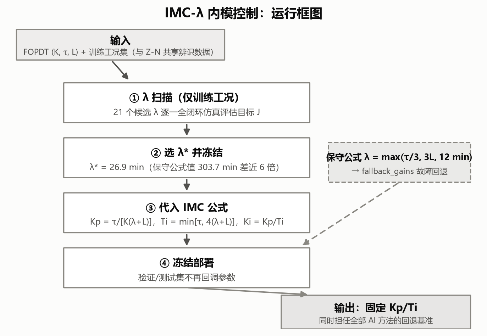
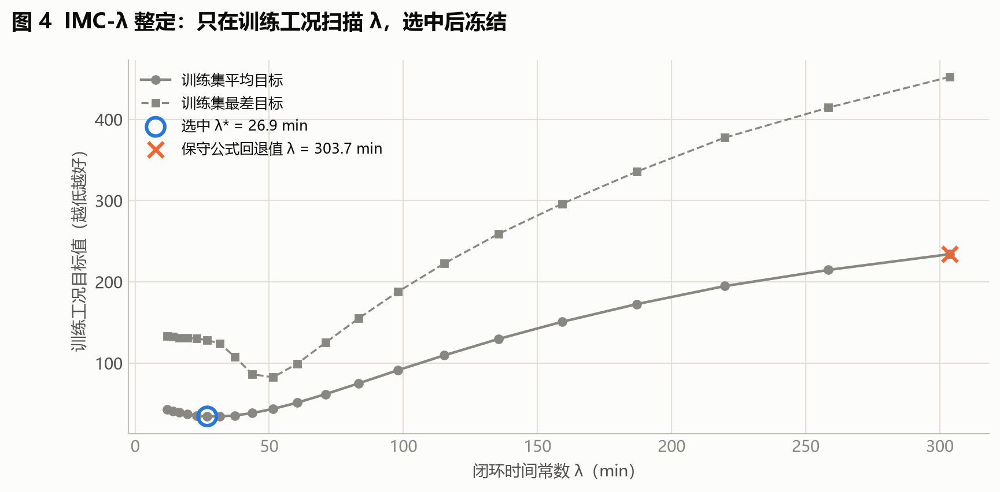
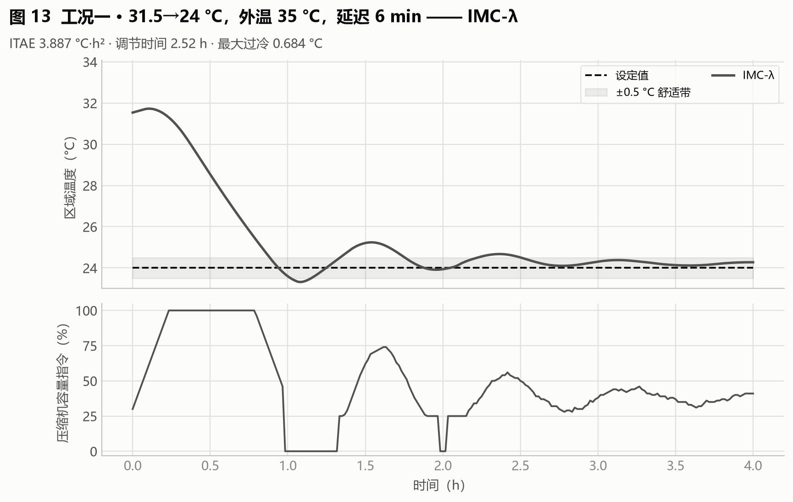
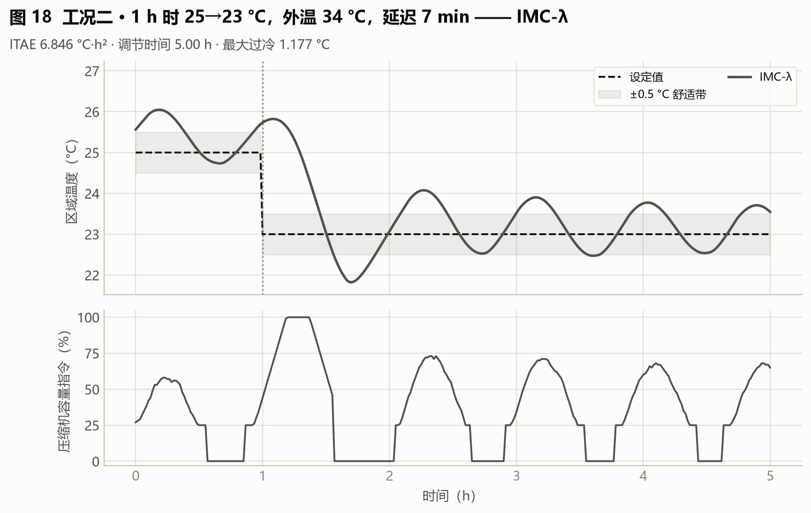
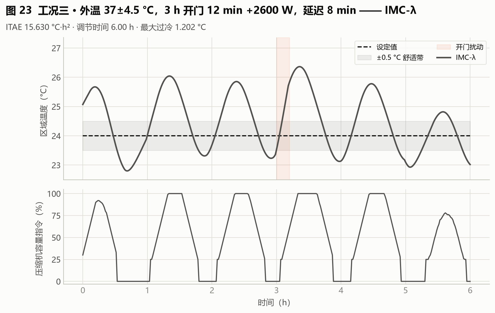
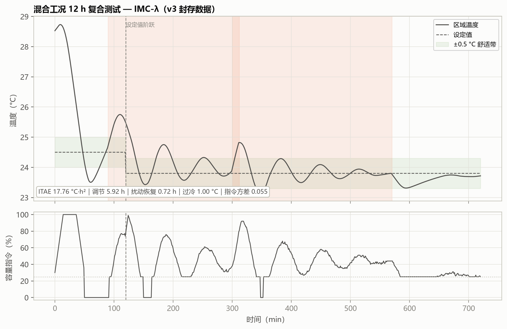

# 05 IMC：用一个 λ 调节快慢与稳健性

> **本篇目标**：扫描 λ，选择并冻结全项目的回退基线参数。
> **你需要**：第 02 篇的 FOPDT 三参数、第 03 篇的比较规则。
> **你会得到**：λ 扫描记录、冻结参数 Kp=0.5175/Ki=0.004054、三工况与混合工况曲线。
> **运行方式**：快速体验 `python main.py --quick`（约 3 秒）/ 完整复现 `python main.py`。
> **版本依据**：`experiments/manifests/v4.yaml` + 封存 `archive/outputs_review_v3/imc_lambda_tuning.csv`。

---

## 这次要解决什么问题

第 04 篇的 Z-N 有个毛病：公式算出来的增益过于激进，原值还没用就被安全边界砍了一刀。能不能保留"公式透明"的优点，同时给工程师留一个旋钮——想要快一点就拧快一点，想要稳一点就拧稳一点？IMC 就是这个旋钮，它叫 λ（期望的闭环快慢）。

## 开始前准备什么

- 前置章节：第 02 篇（FOPDT 的 K、τ、L 从哪来）、第 03 篇（训练/验证划分）。
- 输入数据：与 Z-N 共享的同一份 FOPDT 辨识数据，外加训练工况集（λ 扫描用）。
- 预计资源：21 个候选 × 训练工况全闭环仿真，PC 约 3 秒；等效对象时间约 1008 h（软件里几秒，真机上不可行——这正是仿真整定的价值）。

## 先跑一个最小实验

在哪执行 → 项目根目录。执行什么 → 冒烟流水线中的 IMC 整定：

```bash
python main.py --quick --output outputs_quick
```

读哪些输入 → 训练工况（20 个）+ FOPDT（标称 K=55.16、τ=911.1、L=5）。生成哪些文件 → `outputs_quick/imc_lambda_tuning.csv`（每个 λ 候选的训练目标）。怎样判断成功 → 该文件存在，`selected=1` 的行唯一，且 `lambda_minutes≈26.9` 附近（quick 版数值会浮动，看相对位置即可）。

## 刚才发生了什么

程序把 21 个候选 λ（12.0 → 303.7 min，对数等间距）逐一代入 IMC 公式，每组增益在训练工况上跑一轮全闭环仿真，用综合目标 J 打分，取平均目标最小者。选中的 λ*=26.9 min 代入公式得到部署增益，冻结后不再改动。整个过程没有迭代、没有学习——一次穷举，定案。

## 跟着代码走一遍

先说直觉：λ 是"你希望闭环有多快"。λ 小意味着期望响应快，公式给出的增益就大；λ 大意味着不着急，增益就小。工程师的纠结（快 vs 稳）被压缩成了一个旋钮。

再说机制：IMC 公式把对象信息（K、τ、L）和期望速度（λ）映射成 PI 参数：

$$K_p = \frac{\tau}{K(\lambda + L)}, \qquad T_i = \min\left[\tau,\ 4(\lambda + L)\right], \qquad K_i = \frac{K_p}{T_i}$$

- 符号与单位：K（°C/指令）来自辨识温降换算，τ、L、λ、Ti 都是 min，Kp 无量纲附近、Ki 是 min⁻¹。
- 哪些值来自输入：K、τ、L 来自第 02 篇的辨识；λ 是本篇唯一要选的量。
- 代码在哪里：`hvac_pid/controllers.py:imc_pi`（公式两条路径：保守公式与扫描整定明确区分）。
- 改变这个量会看到什么：λ 减半 → Kp 近乎翻倍，曲线更快更冲；λ 放大 10 倍 → 控制器几乎不出力，温度长时间偏离。

最后接到实现：一组可追溯的实际计算（标称工况 K=55.16、τ=911.1、L=5，λ*=26.9）：

- 分母：K(λ+L) = 55.16 × (26.9+5) = 55.16 × 31.9 ≈ 1759.6；
- Kp = 911.1 / 1759.6 ≈ **0.5175**（界内，无需限幅）；
- Ti = min[911.1, 4×31.9=127.6] = 127.6 min；
- Ki = 0.5175 / 127.6 ≈ **0.004054**（界内，无需限幅）。

对照保守公式路径：λ=max(911.1/3, 3×5, 12)=303.7 min，得 Kp=0.0535、Ki=5.87×10⁻⁵——相差近 6 倍。"公式默认值"与"按目标整定"的差距，就是这么大。前者只在故障时启用，后者是部署参数，两者都落在封存部署清单里，可双向核对。

## 结果应该怎么看



> **看哪里**：数据从 FOPDT 进入 λ 扫描，输出冻结增益，同时分出一条保守公式备用线。
> **发生了什么**：扫描只动 λ，不动公式结构；备用线不参与选优。
> **这说明什么**：IMC 的搜索空间被刻意限制在一维公式曲面上——这是安全设计，不是功能缺失。



> **看哪里**：实线圆点（平均目标）的 U 形谷底，虚线方点（最差目标）的位置，× 标记的保守值。
> **发生了什么**：平均目标从 λ=12 的 43.14 降到 λ*=26.9 的 34.33 再升到 303.7 的 234.01；最差目标的谷底在约 51.4 min；保守值落在最右端。
> **这说明什么**：λ 宁小勿大（偏小 +26%，偏大 ×6.8）；"平均最优"与"最坏最优"不是同一个 λ——本轮按平均选，真正优化最坏情形的是第 07 篇的安全 BO。

  

> **看哪里**：三工况温度是否全程稳定、有无振荡；容量曲线是否平滑。
> **发生了什么**：ITAE 3.89/6.85/15.63，比 Z-N 降低 17%–45%，过冷减半，无振荡。
> **这说明什么**：单组固定增益的合理上限大抵如此——与 BO/FNN 几乎打平，仅工况一略逊于 RL。



> **看哪里**：12 h 复合扰动下的调节时长、开门后恢复、启停次数。
> **发生了什么**：调节 5.92 h 偏慢，但恢复仅 0.72 h，方差 0.055，启停 3 次。
> **这说明什么**：钝而稳——不会针对当前工况加速，也绝不失控。这正是它被选为全部 AI 方法备用基准的原因。

## 改一个参数试试看

假设"λ 偏小只是偏冲、偏大等于关机"：取 λ=12 和 λ=150 各跑一次三工况，观察前者过冷是否上升、后者温度是否长时间偏离。如果符合，说明你已经会用 λ 预判行为了——这也是第 06 篇 BO 与 IMC 打平、第 07 篇安全 BO 另辟蹊径的背景。

## 如何确认复现成功

文件检查：`imc_lambda_tuning.csv` 有 21 行且唯一 `selected=1`。数值容差：λ* 在 20–35 min 区间、Kp/Ki 与公式手算一致（允许训练集规模导致的浮动，quick 版不必逐位一致）。行为检查：部署增益在界内、无需限幅（与 Z-N 对比看）。常见异常：训练工况太少导致谷底偏移——加场景，不调公式。

## 这次能得出什么结论

- 收益：公式透明、一维可解释、可复现；宽工况稳健，是合格的出厂整定与备用参数。
- 代价：固定增益无自适应，复合工况调节偏慢。
- 适用条件：工况谱适中、追求可解释与低成本的场合；任何 AI 方法的验收底线都是"不比 IMC 差"。
- 未证明的部分：λ 按平均目标选，不保证最坏工况最优；单组固定增益的天花板就在这里，要突破得换思路（第 06 篇让程序搜，第 08、09 篇让参数动起来）。

## 附录：本篇数据溯源

| 数据产物（仓库内路径） | 内容 | 支撑本篇何处 |
|---|---|---|
| `archive/outputs_review_v3/imc_lambda_tuning.csv` | 21 个 λ 候选扫描结果 | λ* 与整定 |
| `archive/outputs_review_v3/policy_manifest_v3.json` | 封存部署清单 | 增益核对 |
| `archive/outputs_review_v3/case_metrics.csv` | 三工况指标 | 工况表 |
| `archive/outputs_review_v3/case_timeseries.csv` | 三工况时序 | 工况图 |

| 代码位置 | 作用 |
|---|---|
| `hvac_pid/controllers.py:imc_pi` | IMC 公式与两条路径 |
