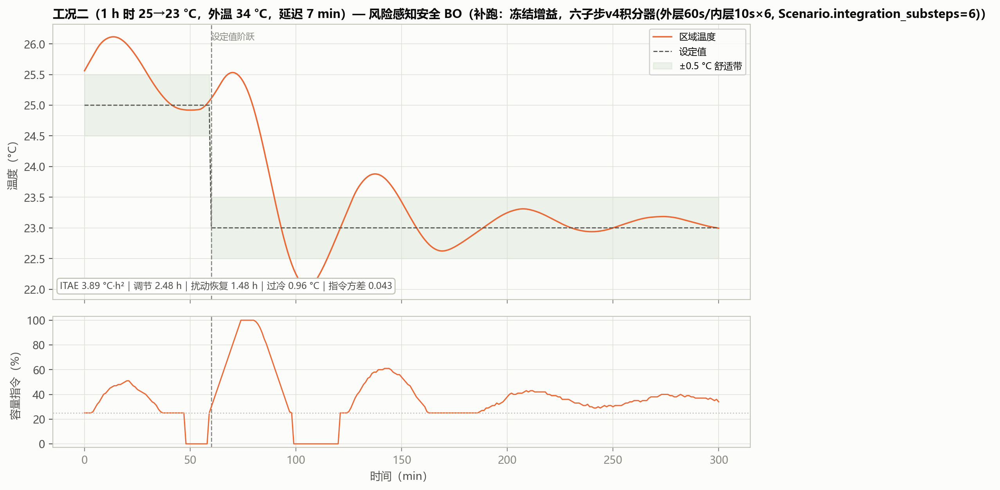
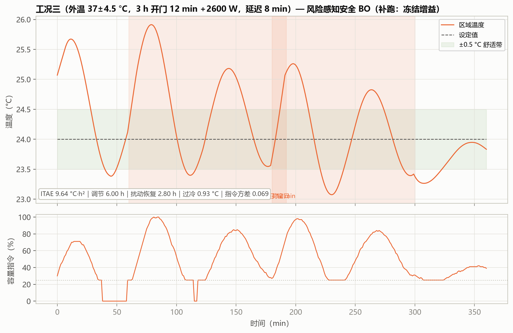

# 05 算法报告：风险感知安全 BO（RaGoOSE 式）

> **30 秒看懂**：普通 BO 只看平均分，它还看"发挥稳不稳"——每个候选多跑几次算波动，专挑"平均好、波动小"的，最后在混合工况拿了七算法最优。想自己跑：`python run.py advanced --quick --llm-provider heuristic`（约 1.4 秒，离线不花钱）。

**版本**：2026-09-03
**数据口径**：高级整定批次的安全 BO 搜索历史与耗时；三工况与混合工况曲线为**冻结增益补跑**（v3 同对象、同约束、同种子）。溯源见附录 A。
**一句话定位**：在普通 BO 上加"风险"维度——同一候选跨工况、跨噪声重复评估，用 均值+0.75×标准差 的风险目标引导搜索主动避开"平均好但波动大"的增益，并加一道安全检查。

---

## 1 算法所需数据、输入与输出

| 项 | 内容 |
|---|---|
| 所需数据 | 训练工况 + 独立留出工况集；每个候选需在多工况 × 2 个噪声种子下重复仿真（成本是普通 BO 的数倍）；FOPDT 仅用于初始化参照 |
| 输入 | 候选空间 (log Kp, log Ki)、风险目标 $J_{risk} = \bar{J} + 0.75\,\sigma_J$、安全条件集合、评估预算（7 次） |
| 输出 | 一组全局固定 Kp/Ki：**Kp=0.3838、Ki=0.004441**（留出集平均目标 33.58，该基准下优于普通 BO 37.96、IMC 36.29） |
| 运行时数据需求 | 无 |

安全检查条件（全部满足才进入候选池）：稳定性、温度斜率、最低运行频率、冷偏差 ≤4 °C、风险分 ≤1.25×IMC 基准；β=2 的 GP 置信下界参与选点。

## 2 能否自整定 / 能否自动整定

| 判定 | 结论 | 理由 |
|---|---|---|
| 自整定 | **否** | 部署后增益固定 |
| 自动整定 | **是** | 搜索、风险评估、安全检查全自动；与普通 BO 的区别是"优化什么"——不是平均性能，而是风险调整后的性能 |

## 3 运行框图

## 4 安全 BO 是怎么工作的：风险目标、安全检查与一次迭代全流程

### 4.1 为什么需要"安全"版本：普通 BO 漏掉了什么

04 号报告的普通 BO 优化的是候选在训练工况上的**平均**目标 J̄。这有个隐患：两个候选的平均值可能几乎一样，但一个在各类工况下都很稳，另一个在某些工况下会失控——只看均值，你分不出来。

安全 BO 补上了两件事：

| | 普通 BO（04 号报告） | 安全 BO（本篇） |
|---|---|---|
| 优化目标 | 平均目标 J̄ | **风险目标** J_risk = J̄ + 0.75·σ |
| 每次评估 | 每个工况跑一次 | 每个工况 × **2 个噪声种子** |
| 代理模型 | 1 个 GP（拟合 J） | **2 个 GP**（拟合 J_risk 与 q） |
| 采集函数 | 期望改进 EI | **下置信界 LCB = μ − 1.25σ** |
| 硬约束 | 无（只有增益界的隐式限制） | **安全检查**（保守上界过滤） |
| 初始化 | 1 IMC 点 + 6 随机点 | 基线 + **3 个局部乘子种子** |

一句话概括差别：普通 BO 问"平均多好"，安全 BO 问"最差能有多糟，以及会不会出事"。

### 4.2 风险目标：把"波动"直接写进优化目标

每个候选不再只跑一遍，而是在**每个工况 × 2 个独立噪声种子**下重复仿真（`config.repeats = 2`）。假若有 16 个留出工况，一次评估就是 32 次完整闭环仿真。从这 32 个目标值里算出：

- 均值 J̄：平均表现；
- 标准差 σ：跨工况、跨噪声的波动；
- **风险目标 J_risk = J̄ + 0.75·σ**（`config.risk_weight = 0.75`）。

系数 0.75 是风险偏好参数——它决定"一单位的波动折算成多少单位的目标恶化"。取 0 就退化成普通 BO，取得越大越厌恶波动。这个值需按行业风险偏好评审后固化，不是算法自己学出来的。

用本轮真实数据看它改变了什么：

| 评估 | Kp | Ki | 均值 J̄ | 标准差 σ | 最差值 | **风险目标 J_risk** |
|---|---|---|---|---|---|---|
| 第 2 次（最终部署） | 0.3838 | 0.004441 | 31.17 | **4.71** | 38.98 | **34.71** |
| 第 4 次 | 0.4318 | 0.006662 | **30.32** | 8.06 | 41.76 | 36.36 |
| 第 3 次 | 0.5757 | 0.004996 | 31.73 | 9.76 | 44.47 | 39.05 |

第 4 次的**均值最低（30.32）**，但它的标准差几乎是第 2 次的两倍（8.06 vs 4.71），最差值也高得多（41.76 vs 38.98）。按均值选会选第 4 次，按风险目标选则选第 2 次——**1.65 的差距，就是"风险口径"替你规避掉的波动**。

### 4.3 安全裕度 q：把"会不会出事"量化成一个数

风险目标解决"稳不稳"，但还有一类问题是"安不安全"——过冷、压缩机频繁启停、失稳，这些不能靠加权平均来容忍。本项目用**安全裕度 q** 把四条硬约束压缩成一个标量：

$$q = \max\left( q_{stable},\; q_{under},\; q_{slew},\; q_{submin} \right)$$

| 约束项 | 表达式 | 阈值 |
|---|---|---|
| 稳定性 q_stable | 0.5 − stable | 失稳（stable<0.5）则为正 |
| 过冷 q_under | max_undershoot_c − 2.0 | 过冷超过 **2 °C** 则为正 |
| 变频斜率 q_slew | 违规则 +0.5，否则 −0.5 | 违规次数必须 **= 0** |
| 最低容量 q_submin | 超时则 +0.5，否则 −0.5 | 低于 25% 容量的时间占比必须 **= 0** |

**q ≤ 0 判为安全，正值量化最大违规程度**。四项都取 ±0.5 而不是 0/1，是为了避免所有安全观测都恰好落在 q = 0 上——那会让 GP 学到一个退化的常数。

在此之上还叠了一条**相对风险约束**，防止灾难性退化：

$$q_{rel} = \frac{J_{risk}}{J_{risk}^{baseline}} - 1.25, \qquad q_{final} = \max(q,\; q_{rel})$$

含义是：**任何候选的风险目标不得超过基线的 1.25 倍**，哪怕它四项物理约束全部通过。基线取第 1 次评估（已知基线）的风险目标 36.742。

> **一个必须如实指出的现象**：本轮 7 次评估里，q_final 全部由 q_rel 这一项决定——四项物理约束给出的 q 恒为 −0.5（所有候选都稳定、过冷未超标、无斜率违规、无低容量运行），而 q_rel 在 −0.31～−0.06 之间，比 −0.5 大，于是 q_final = q_rel。这导致 safety_margin 与 risk_objective 的 Pearson 相关系数**恰好为 1.0000**（完全线性相关）。
>
> 换句话说：**这一轮真正起约束作用的不是物理安全检查，而是"风险不得超过基线 1.25 倍"这条相对约束**。物理安全检查从未拦下任何候选，因此它在本轮数据上没有被真正考验过——要验证它得靠专门的越界用例。

### 4.4 两个 GP 与 LCB 采集函数

每一次迭代同时维护两个 GP：

| GP | 拟合对象 | 作用 |
|---|---|---|
| **目标 GP** | 风险目标 J_risk | 预测候选的风险表现 μ(x) 与不确定性 σ(x) |
| **安全 GP** | 安全裕度 q | 预测候选的裕度 q_mean(x) 与不确定性 q_std(x) |

核函数两者相同（`hvac_pid/advanced_tuning.py`）：

$$k(x, x') = \sigma_f^2 \, k_{\mathrm{M52}}\left(\frac{\|x - x'\|}{\ell}\right) + \sigma_n^2 \, \delta(x, x')$$

初值 σ_f² = 1.0（范围 [0.05, 20.0]）、ℓ = 0.30（范围 [0.03, 3.0]，Kp/Ki 各一个）、σ_n² = 1e-4（上界放宽到 0.2，比普通 BO 的 1e-2 更宽松——因为这里是有噪声的重复仿真）。y 标准化开启，每次迭代用累积数据完整重拟合。

**采集函数不是 EI，而是下置信界（LCB）**：

$$a(x) = \mu(x) - 1.25 \cdot \sigma(x), \qquad x_{next} = \arg\min_x \; a(x)$$

取最小值是因为目标越低越好；减 1.25σ 意味着给不确定的候选一个"折扣"，越不确定越容易被选中——这是探索项。**注意这与 04 号报告不同：普通 BO 用 EI（最大化期望改进），安全 BO 用 LCB（最小化下置信界）。**

**安全过滤**（在算 LCB 之前）：

$$q_{cons}(x) = q_{mean}(x) + 2.0 \cdot q_{std}(x)$$

即：安全 GP 预测裕度时，要在均值上加 2 倍标准差（保守上界）。**只保留 q_cons ≤ 0 的候选**进入选点环节，其余一律置为 +∞，绝不会被选中。`safe_probability_beta = 2.0`。没通过的一律置为 +∞，绝不会被选中。

**保底规则**：若安全 GP 过于保守导致 512 个候选全部被过滤，则退到"围绕当前最佳安全点、半径 0.10 的附近范围"内选点；若仍无候选可用，本轮迭代直接终止。

### 4.5 一次迭代的完整流程（八步）

1. **拟合目标 GP**：用已评估点的风险目标 J_risk 拟合 μ(·)、σ(·)；
2. **拟合安全 GP**：用已评估点的安全裕度 q 拟合 q_mean(·)、q_std(·)；
3. **采样候选**：在 [0,1]² 内**重新随机采样 512 个点**（每次迭代现采现用，不是固定网格）；
4. **批量预测**：两个 GP 分别给出 512 个候选的预测；
5. **安全过滤**：计算保守上界 q_mean + 2·q_std，只保留 ≤ 0 的候选；
6. **保底**：若无一通过，退到最佳安全点周围半径 0.10 的范围；仍无则终止；
7. **LCB 选点**：在通过过滤的候选中取 μ − 1.25σ 最小者；
8. **真实评估**：2 个噪声种子 × 全部工况，算出 J̄、σ、J_risk、q，加进数据集，回到第 1 步。

### 4.6 实例：第 1 次迭代（第 5 次评估）

| 步骤 | 真实数值 |
|---|---|
| 起点 | 4 个初始点（1 基线 + 3 局部乘子种子），当前最优 J_risk = 34.707（第 2 次） |
| ①② 拟合两个 GP | σ_f² = 1.5603，ℓ_Kp = 0.0370，ℓ_Ki = 0.0774，σ_n² = 1.37×10⁻⁷（**两个 GP 数值相同**，原因见 4.7） |
| ③④ 采样与预测 | 512 个候选 |
| ⑤ 安全过滤 | 保守上界 ≤ 0 的候选：**512 / 512 全部通过** |
| ⑦ LCB 选点 | 解码得 Kp = 0.3729、Ki = 0.001936 |
| ⑧ 真实评估 | J̄ = 36.22，σ = 8.96，**J_risk = 42.94**，q = −0.0813 |

第 1 次迭代选中了一个 Ki 极小的点（0.0019，比所有初始点都小），它的风险目标 42.94 明显劣于初始种子的 34.71。注意它的 q = −0.0813 已经**非常接近 0**（其余各次在 −0.19～−0.31 之间）——LCB 把它选出来，正是因为它位于"接近安全边界、且模型还很不确定"的区域，探索项（1.25σ）把它顶了上去。结果证明那里确实不好。

### 4.7 参数更新实录：3 次迭代的两个 GP 超参数

下表用封存 CSV 的真实评估点反推拟合过程得到（X 与 y 均取自实测值）：

| 迭代 | 样本数 | 目标 GP σ_f² | 目标 GP ℓ_Kp | 目标 GP ℓ_Ki | 目标 GP 噪声 | 安全 GP σ_f² | 安全 GP ℓ_Kp | 安全 GP ℓ_Ki | 安全 GP 噪声 | 安全检查通过 |
|---|---|---|---|---|---|---|---|---|---|---|
| 1 | 4 | 1.5603 | 0.0370 | 0.0774 | 1.37×10⁻⁷ | 1.5603 | 0.0370 | 0.0774 | 1.37×10⁻⁷ | 512/512 |
| 2 | 5 | 1.5874 | 0.0722 | 0.0598 | 1.00×10⁻⁸ | 1.5874 | 0.0722 | 0.0598 | 1.00×10⁻⁸ | 499/512 |
| 3 | 6 | 1.0939 | 0.0456 | 0.0524 | 1.00×10⁻⁸ | 1.0939 | 0.0456 | 0.0524 | 1.00×10⁻⁸ | 28/512 |

从表里能读出五件事：

1. **每次迭代两个 GP 都完整重拟合**。与普通 BO 一样，安全 BO 没有增量更新式的"权重"，每次迭代都用累积数据重新优化四个超参数（σ_f²、ℓ_Kp、ℓ_Ki、σ_n²）。
2. **两个 GP 的超参数完全相同**——这不是 bug，而是数据的必然结果。如 4.3 节所述，本轮 safety_margin 与 risk_objective 的 Pearson 相关系数为 **1.0000**（完全线性相关，因为 q_final 由相对风险项决定，而相对风险项是 J_risk 的线性函数）。两个 GP 看到的"响应面形状"因此完全一样，只是纵轴缩放不同，而 `normalize_y=True` 恰好抹平了缩放差异。
3. **长度尺度极小（0.037～0.077），远小于普通 BO 的 0.49～0.61**。只有 4–6 个数据点时，GP 只能认定"相邻点之间变化剧烈"，于是把相关长度压到接近下界（0.03）。这说明**样本量是这套方法的瓶颈**——数据多了，长度尺度才会收敛到有意义的数值。
4. **噪声项贴着下界（1×10⁻⁸）**。GP 认为观测几乎无噪声。这与"每个候选都跑 2 个噪声种子"并不矛盾：噪声种子带来的是**目标值的离散**（已由 σ 计入 J_risk），而对同一组 (Kp, Ki) 的评估是可重复的确定性过程。
5. **安全检查通过率从 512 骤降到 28**。第 3 次迭代只有 28/512 的候选被判为"保守安全"。原因是新增的评估点把安全 GP 的不确定性 q_std 抬高了，保守上界 q_mean + 2σ 更容易越过 0。**安全约束在后期明显收紧**——这是设计使然：宁可缩小可选范围，也不让不确定的候选混进来。

### 4.8 诚实记录：这一轮 GP 迭代没有带来增益

3 次 GP 迭代选出的候选，风险目标分别是 **42.94、43.65、36.18**，全部劣于初始种子第 2 次的 **34.71**。最终部署的 Kp=0.3838 / Ki=0.004441 来自第 2 次评估（`selected=1`），**不是搜索出来的**。

原因有两条，都值得如实写出：

- **预算太少**：3 次迭代、7 次总评估，对二维搜索而言只是刚刚够拟合一个 GP，远不足以收敛；
- **初始种子已经很好**：初始化用的是**基线附近的乘子扰动**（×1.0、×0.80/0.80、×1.20/0.90、×0.90/1.20），刻意保留了已知控制器的尺度，不像普通 BO 那样大范围随机撒点。这让种子质量很高，但也意味着 GP 迭代的改进空间本就不大。

所以这一轮的正确解读是：**风险感知搜索证明了种子附近没有更好的点**——这是一个有价值的阴性结论，但不应被描述为"搜索找到了更优解"。若要把这个方法用于实际整定，需要显著提高迭代预算。

### 4.9 风险目标搜索图

**这张图怎么看**：横轴是评估次数（1–7）；纵轴是目标值。灰色误差棒是**平均目标 ±1σ**；橙色实心点是该候选的**风险目标** J_risk（真正用于选点的量）；灰色 × 是不安全候选（本轮 0 个）；浅橙细线是风险目标走势连线。图中标注了最优风险目标 34.71（Kp=0.3838、Ki=0.004441）。

7 次评估分三段：第 1 次是**已知基线**，第 2–4 次是**局部试探种子**（在基线附近小范围铺点以估计局部方差结构），第 5–7 次才是 GP 驱动的**风险感知 BO 迭代**。

**从图里能读出四件事**：

1. **均值最优与风险最优不是同一个点——这是整张图的核心**。第 4 次评估的平均目标最低（30.32），但标准差 8.06、最差目标 41.76；第 2 次评估平均目标 31.17（只差 0.86），标准差却只有 4.71、最差目标 38.98，标准差几乎减半。若按平均目标选会选中第 4 次（风险目标 36.36）；按风险目标选则选中第 2 次（34.71）。**图上第 2 次与第 4 次两个橙点之间 1.65 的落差，就是"风险口径"替你规避掉的波动。**
2. **风险口径能区分"平均一样好、波动差一倍"的候选**。第 2 次与第 3 次的平均目标几乎相同（31.17 vs 31.73），但标准差是 4.71 vs 9.76，风险目标随之变成 34.71 vs 39.05——相差 4.34。只看均值的普通 BO 无法做出这个区分，这就是 0.75σ 惩罚项的全部价值。
3. **三条风险目标曲线（灰误差棒）在迭代阶段明显抬高**。第 5、6 次的 J̄ 分别是 36.22、37.15，都高于初始种子的 30.3～31.7，说明 GP 迭代阶段确实在往"不确定但可能更差"的区域探索。这与 4.8 节的阴性结论一致。
4. **安全检查本轮一次都没有拦下候选**。7 个候选的 `safe` 标志全为 1，因此图中"不安全候选（被抑制）"这个系列在本轮没有任何数据点。这不代表安全检查无效，只说明这批候选都落在安全区内；安全检查的验证要靠专门的越界用例。

**选出来的增益偏保守**：Kp=0.3838 明显低于该基准上普通 BO 的 0.5882 与 IMC 基线的 0.4797。换来的回报在独立留出集上很清楚——平均目标 33.58（普通 BO 37.96、IMC 36.29），跨场景标准差 20.93（普通 BO 29.18、IMC 27.47），启停 1.125 / 0.625 次（IMC 2.0 / 1.5 次）。**牺牲平均值、压缩波动**，这正是第 7 节"混合工况七算法最优（58.71）"的直接机理。

## 5 整定时间

| 口径 | 数值 | 性质 |
|---|---|---|
| 能得到 FOPDT 时（本项目） | **PC 1.41 s【实测】**（7 次评估，每次含跨场景 ×2 重复仿真；百炼批次复测 0.91 s）；等效对象时间约 700–900 h | 确定值 |
| 得不到 FOPDT 时 | **【估算】PC 约 1.7–2.0 s / 等效约 900–1100 h**：风险 GP 需要比普通 BO 更多的初始样本来可靠估计方差结构，预计增补 2–3 次评估；另需 168 h 辨识建立备用基准 IMC（安全检查以 1.25×IMC 为参照，失去该参照时须以保守固定增益替代） | 预测值，依据：单次评估成本与高级基准日志 |

## 6 三个标准工况表现（补跑：冻结增益）

补跑说明：安全 BO 未参加 v3 五算法批跑；以下曲线用封存部署增益（0.3838/0.004441）在 v3 同对象、同约束、同种子下补仿，标题标注"补跑"。

| 工况 | ITAE（°C·h²） | 调节时间（h） | 扰动恢复（h） | 最大过冷（°C） | 指令方差 | 综合目标 |
|---|---|---|---|---|---|---|
| 一 初次快速降温 | **3.421** | **1.77** | **1.77** | **0.200** | 0.063 | 59.26 |
| 二 设定温度突变 | **3.143** | **2.37** | **1.37** | 0.879 | **0.034** | **21.85** |
| 三 持续外界热扰动 | **9.640** | 6.00 | 2.80 | 0.926 | **0.069** | **43.89** |

（粗体：在七算法中该工况该项最优或并列最优）

**读图**：风险导向选出的保守增益在三工况表现亮眼——工况二 ITAE 3.14，仅为 BO（7.11）的 44%、IMC（6.85）的 46%；工况三 ITAE 9.64，远优于全部 v3 五算法（最佳 RL 15.21）；指令方差全程最小。原因：其增益在"跨工况最坏情形"口径下整定，对持续热扰动这类训练外的困难工况留有更多裕度。

## 7 混合工况（多种工况同时出现）表现（补跑：冻结增益）

| ITAE | 调节时间 | 扰动恢复 | 最大过冷 | 指令方差 | 综合目标 | 启停 |
|---|---|---|---|---|---|---|
| **14.01** | **2.33 h** | **0.20 h** | 0.62 °C | **0.034** | **58.71（七算法最优）** | 0 次 |

**表现回答**：多工况叠加恰好是安全 BO 的设计目标场景——复合扰动下它取得七算法最优综合目标（58.71，优于 RL 67.32），恢复时间 0.2 h、指令方差 0.034 均为全场最佳，且全程零启停。机理：风险目标惩罚的正是"平均好但个别工况差"的候选，选出的增益在工况叠加时天然留有安全裕度。**诚实的边界**：该增益在高级整定基准（独立于本工况族的留出集）上整定，与本报告三工况/混合工况不同族——结论应理解为"风险导向整定的泛化能力证据"，而非"在本工况族上必然最优"。

## 8 小结

- 优点：以可量化的风险口径换取了跨工况、跨场景的稳健性；混合工况七算法最优；安全检查全程有记录、可审计；
- 缺点：评估成本是普通 BO 的数倍（每候选多次重复仿真）；固定增益、无在线自适应；
- 落地建议：适合对安全敏感、工况谱宽且调试窗口有限的场合；"均值+系数×标准差"的风险口径系数（0.75）应按行业风险偏好评审后固化。

## 附录

本附录列出的数据文件、代码位置与命令，均为**本项目代码仓库内的相对路径**，仅面向需要核对数据来源或复现结果的读者。仅阅读本报告的读者可直接跳过——理解正文全部结论所需的输入、参数与数值已在正文中给出，不依赖这些文件。

### A 本篇数据溯源

| 数据产物（仓库内路径） | 内容 | 支撑本篇何处 |
|---|---|---|
| `archive/outputs_advanced_quick/safe_bo_history.csv` | 安全 BO 7 次评估的风险目标搜索历史 | 第 1 节、第 5 节 、第 4 节图 5-2 |
| `archive/outputs_advanced_quick/advanced_holdout_summary.csv` | 高级整定基准（独立留出集）汇总 | 第 6 节 |
| `archive/outputs_advanced_bailian/tuning_wall_time.csv` | 百炼批次墙钟耗时记录 | 第 5 节 |
| `分报告/data/supplement_metrics.json` | 冻结增益补跑的三工况 / 混合工况指标 | 第 6、7 节 |

本篇结论涉及的实现位置：

| 代码位置 | 作用 |
|---|---|
| `hvac_pid/advanced_tuning.py` :: RiskAwareSafeBOTuner | 风险目标（均值 + 0.75×标准差）与安全检查判定 |

**复现说明**：本算法未参加 v3 五算法工况批跑，三工况与混合工况曲线为**冻结部署增益的补跑**（v3 同对象、同约束、同种子），不做任何训练或搜索；补跑指标存放于上表最后一行产物。
