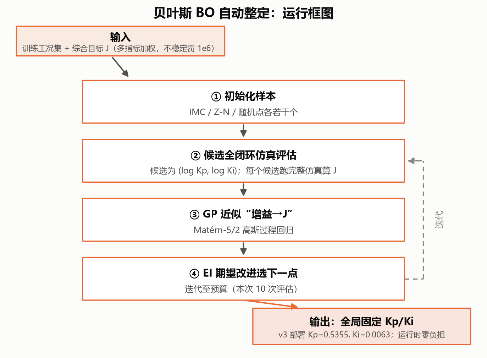
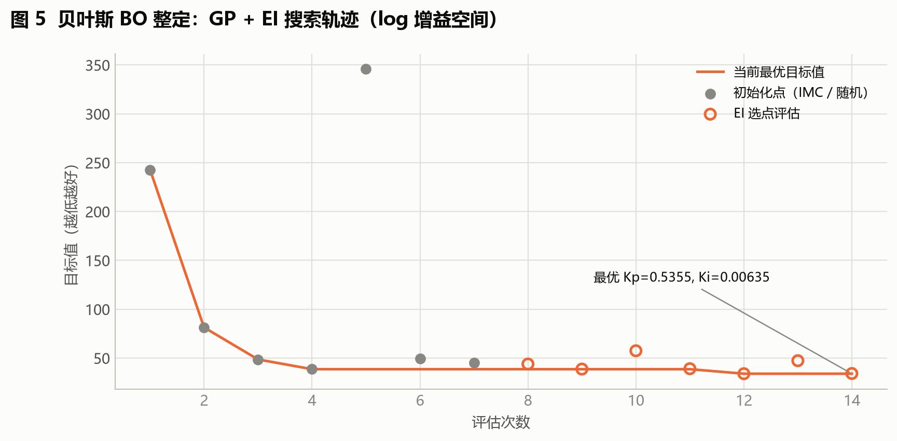
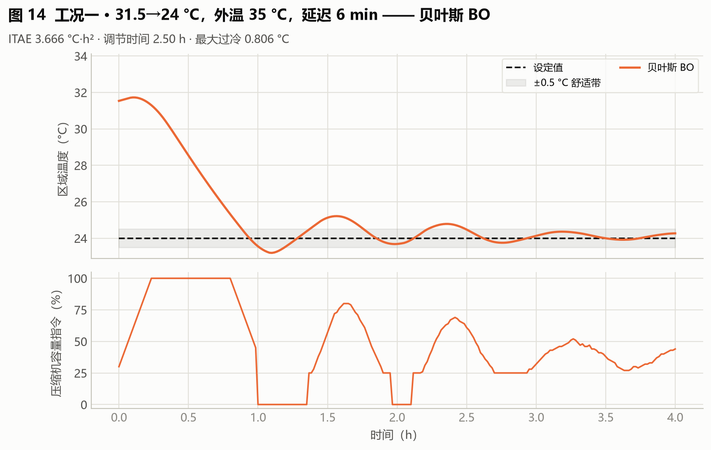
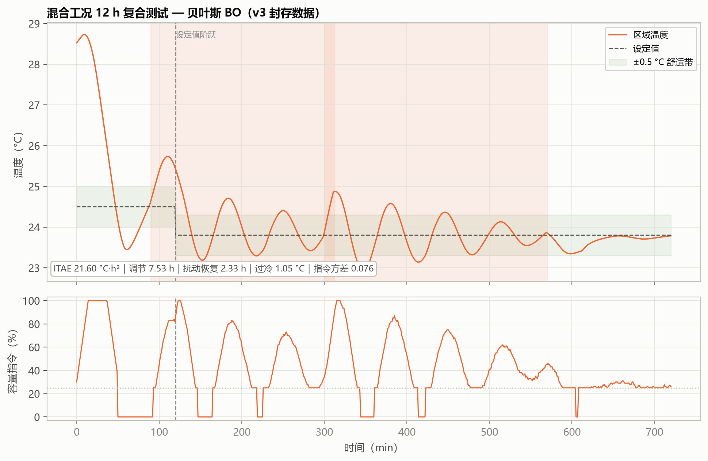

# 06 BO：让程序替我们寻找 Kp、Ki

> **本篇目标**：配置搜索空间、运行搜索、看懂候选与目标曲线。
> **你需要**：第 03 篇的训练集与 J、第 05 篇的 IMC（理解"固定增益的天花板"）。
> **你会得到**：候选搜索记录、冻结参数 Kp=0.5355/Ki=0.006345、独立测试曲线。
> **运行方式**：快速体验 `python run.py benchmark`（约 1.4 秒）/ 完整复现 `python main.py`。
> **版本依据**：`experiments/manifests/v4.yaml` + 封存 `archive/outputs_review_v3/bayesian_search_history.csv`。

---

## 这次要解决什么问题

第 05 篇的 IMC 只敢在一个公式曲面上找最优，万一最优解在曲面之外呢？BO 把限制放开：直接在 (Kp, Ki) 平面上找。但每试一组参数都要跑一次完整仿真，试不起几次——我们希望用已经测过的结果决定下一组测什么。

## 开始前准备什么

- 前置章节：第 03 篇（J 的定义）、第 05 篇（IMC 部署增益 0.5175/0.004054，BO 与它几乎打平的原因在本篇末尾揭晓）。
- 输入数据：训练工况集 + J；FOPDT 只用于生成初始化种子，不进入搜索。
- 预计资源：14 次评估，PC 约 1.4 秒；等效对象时间约 528 h。

## 先跑一个最小实验

```bash
python run.py benchmark --output outputs_bench
```

读哪些输入 → 训练工况与 J 定义。生成哪些文件 → `bayesian_search_history.csv`（每次候选与目标）、`global_bayesian_tuning.csv`（冻结增益）。怎样判断成功 → 最优行 Kp≈0.5355、Ki≈0.006345，J≈34.00，且历史最优曲线单调不升。

## 刚才发生了什么

先说直觉：每次测试一组 PI 参数都有成本，我们希望利用已经测过的结果决定下一组测什么。

再说机制：代理模型估计哪些区域可能更好、哪些区域还不确定，采集函数据此选择候选——在"已知好的地方深挖"与"没摸过的地方看看"之间自动权衡。

最后接到实现：本项目搜索的是 `log(Kp)` 和 `log(Ki)`（Ki 跨 4 个数量级，对数空间才均匀）；候选在训练工况上全闭环仿真评分，GP（Matérn-5/2）拟合"增益→J"，EI 选下一点，预算耗尽冻结最优（`hvac_pid/tuning.py:BayesianGainTuner`，ξ=0.01 偏利用）。一次迭代走七步：重拟合 GP → 现采 512 候选 → 批量预测 → EI 选点 → 解码 → 真实评估 → 入库。

实例：第 5 次迭代进入时最优 J=38.627，GP 预测选中点 μ=37.29、σ=3.27，解码得 Kp=0.5355、Ki=0.006345，实测 J=34.002——全场最优，改善 4.63。GP 的预测（37.3）与实测（34.0）有差距很正常，它给的是概率期望，σ=3.27 恰好说明它知道自己"可能差 ±3"。

## 跟着代码走一遍

入口 `run.py benchmark` → `tools/run_tuning_benchmark.py` → `tuning.py:tune_global_fixed`（初始化：1 个 IMC 点 + 6 个随机点；迭代：GP + EI）。7 次迭代的 GP 超参数全程留痕：信号方差 1.66→2.16 单调上升（响应面比最初估计的更起伏），ℓ_Kp 稳定在 0.49–0.61（Kp 更敏感），ℓ_Ki 从撞上界 3.0 收敛到约 1.1（数据多了才看清 Ki 方向的结构）。

## 结果应该怎么看



> **看哪里**：初始化样本 → 仿真评估 → GP → EI → 下一点的闭环。
> **发生了什么**：14 次评估里只有 4 次刷新最优，其余买的是信息。
> **这说明什么**：BO 的成本观——评估预算花在"变聪明"上，不只花在"变好"上。



> **看哪里**：橙色阶梯线（历史最优，单调不升）、灰点（初始化）、空心圈（EI 选点）。
> **发生了什么**：最优从 242.79（IMC 单工况点，比多数随机点还差）降到 34.00（第 12 次），第 13 次是个 σ=13.11 的探索性选点（J=47.31，未改进）。
> **这说明什么**：愿意为不确定性花预算正是 BO 区别于贪心搜索的地方；IMC 初始化点差是因为它来自单工况辨识，与第 05 篇训练扫描出的部署增益不是同一条路径。



> **看哪里**：BO 与 IMC 曲线的重合度（另两图见 `fig19_工况二_BO.png`、`fig24_工况三_BO.png`）。
> **发生了什么**：ITAE 差 <6%，工况三略优（15.29 vs 15.63），无振荡。
> **这说明什么**：对"单组固定增益 + 该目标函数"，IMC 公式已接近全局最优——这是方法论结论，不是 BO 的失败。



> **看哪里**：调节时长与综合目标。
> **发生了什么**：调节 7.53 h，目标 81.38，明显差于 IMC（71.95）。
> **这说明什么**：固定增益的天花板由训练覆盖度决定——复合扰动在训练中权重低，增益只能靠自身鲁棒性顶住。

## 改一个参数试试看

假设"探索参数管胆量"：把 EI 的 ξ 从 0.01 调大到 0.1，重跑搜索，观察选点是否更分散、最优是否出现更晚。如果符合，说明采集函数确实在"利用 vs 探索"之间起作用；调回 0.01 即可归档。

## 如何确认复现成功

文件检查：`bayesian_search_history.csv` 14 行，最优行 J≈34.00。数值容差：初始化种子固定，搜索可复现；GP 拟合允许末位浮动。行为检查：三工况与 IMC 几乎重合。常见异常：scikit-learn 版本差异导致超参数末位不同——属正常，看相对排序。

## 这次能得出什么结论

- 收益：全自动、14 次即收敛、可复现；holdout 39.72 与 IMC 相当。
- 代价：对训练覆盖敏感，混合工况偏保守；输出单组固定增益。
- 适用条件：调试时一次性自动整定；工况谱漂移大时定期重跑或改用在线自整定（第 08、09 篇）。
- 未证明的部分：BO 没有超越 IMC，不等于"搜索无用"——它证明了 IMC 在该问题上已接近极限，这个阴性结论本身就有价值。

## 附录：本篇数据溯源

| 数据产物（仓库内路径） | 内容 | 支撑本篇何处 |
|---|---|---|
| `archive/outputs_review_v3/global_bayesian_tuning.csv` | 14 次评估收敛结果 | 冻结增益 |
| `archive/outputs_review_v3/bayesian_search_history.csv` | 逐次候选与目标 | 搜索轨迹 |
| `archive/outputs_review_v3/case_metrics.csv` | 三工况指标 | 工况表 |
| `archive/outputs_tuning_benchmark/tuning_runtime_report.md` | 耗时基准 | 整定时间 |

| 代码位置 | 作用 |
|---|---|
| `hvac_pid/tuning.py:BayesianGainTuner` | GP + EI 选点 |
| `hvac_pid/tuning.py:tune_global_fixed` | 全局搜索入口 |
