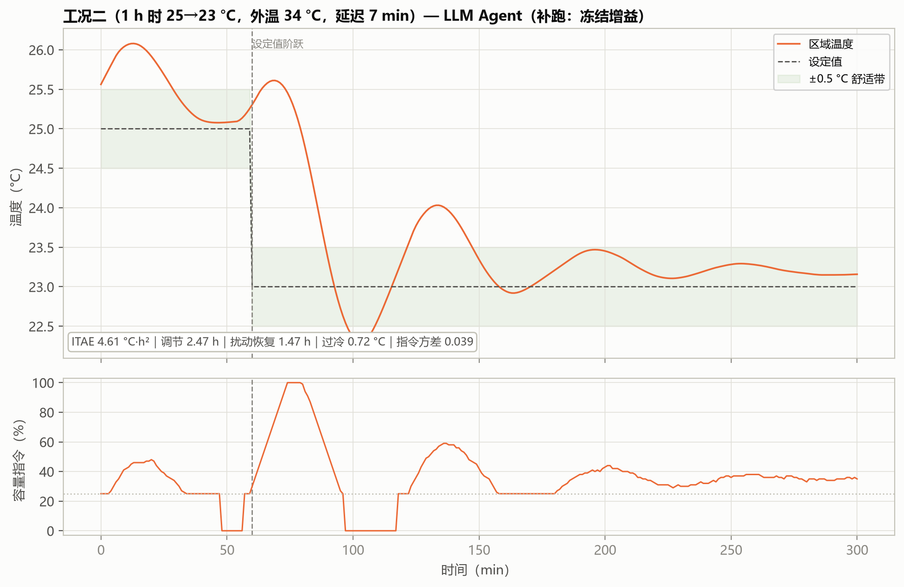
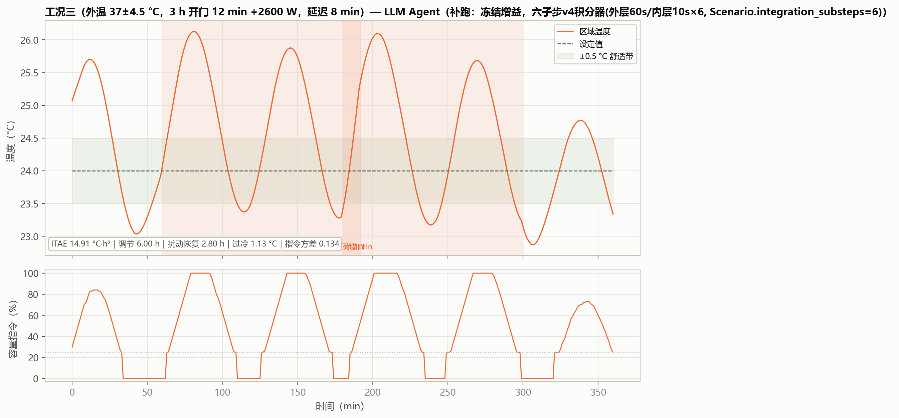

# 06 算法报告：LLM Agent 工具调用整定

> **30 秒看懂**：你有一个调好的 IMC 参数，大模型帮你试着微调——它只负责"看历史、提候选"，是否采用由仿真器验证后决定：验证更好就采用，否则保留原参数。想自己跑：一条命令 `run_llm_agent_demo.py --provider openai-compatible --model qwen-plus --setpoint 24 --seed 71`，几十秒出结果（会产生少量 API 费用，key 放 `.env`）。

**版本**：2026-09-06（v4：走读换为新矩阵会话，v3 走读降级为第 4 节对照）
**数据口径**：真实大模型调用矩阵 v4（qwen-max / qwen-plus / qwen-turbo × std / hard × 种子 71–73 = 18 次，百炼 openai-compatible），走读为 v4 `qwen-max_std_r72`（6 步 / 2 次候选试验 / 1 次接受）；三工况与混合工况曲线为**冻结增益补跑**（v4 部署增益）。溯源见附录 A。
**一句话定位**：大模型不进控制回路，只在离线阶段像"工程师助手"一样自主调用工具（看历史→提候选→跑仿真→读指标）；**最终是否采用由仿真器验证结果和固定检查规则决定，而不是由模型决定**。

---

## 1 算法所需数据、输入与输出

| 项 | 内容 |
|---|---|
| 所需数据 | 历史整定记录（基线增益与指标）、候选仿真工具、指标计算工具、工况描述文本；不需要 FOPDT 显式参数（但基线增益本身源自 IMC/FOPDT 链） |
| 输入 | 工具集 + 基线状态 + 自然语言任务描述 |
| 输出 | Kp/Ki 修改建议（模型建议值 → 限幅 → 采用/舍弃）；v4 走读采用 **Kp=0.4657、Ki=0.003648**（基线参数 0.5175/0.0040536 的 90%；v3 走读采用的是 0.4057/0.002769，基线不同，见第 4 节） |
| 运行时数据需求 | 无——部署后就是一组固定增益 |

工具调用框架支持 OpenAI Responses / OpenAI 兼容（百炼）/ Ollama / Replay / 启发式 provider；本次实验为百炼 `qwen-max`，`/chat/completions` 端点，密钥经 `.env` 注入。v4 矩阵 18 次运行（`artifacts/runs/v4-20260906-8ac9bf4/llm_matrix_v4/`）全部 `live_llm=1`、`llm_replay_disclosure=0`，部署 1/18（`qwen-max_std_r72`）。

## 2 能否自整定 / 能否自动整定

| 判定 | 结论 | 理由 |
|---|---|---|
| 自整定 | **否** | 运行时不参与，部署后增益固定 |
| 自动整定 | **是（低频离线）** | Agent 自己决定查看什么、尝试什么，不需要人工逐步操作；但它只负责"诊断+给建议"，不保证找到全局最优 |

## 3 运行框图

v4 走读会话（`qwen-max_std_r72`，6 步、2 次候选试验）逐步展开：查看历史 ×3（基线 Kp=0.5175、Ki=0.0040536，风险目标 59.49）→ 候选①（小幅增大 Kp/Ki 至 0.57/0.00446，风险 59.49→60.85，恶化 2.30%）**未通过，被舍弃** → 候选②（小幅减小 Kp/Ki 至 0.4657/0.003648，风险 59.49→58.86，改善 1.05%）**被采用** → Agent 主动结束（自述"预算仅剩 1 次、已有边际改善，不值得再冒险，部署当前已接受增益"）。v3 走读（基线 0.4508/0.003077，风险 32.01→30.68，好 4.15%，留下 0.4057/0.002769）保留在第 4 节作对照——**两次基线不同（0.5175 和 0.4508），总分不可跨批次直接比较，只能各自看相对改善与是否被采用**。v4 矩阵其余 17 次保留原参数；18 次均未越界、零失控，保护机制正常生效。

## 4 工具调用轨迹：Agent 的逐步决策与宿主的接受/拒绝

LLM 路线里，大模型不产出可直接下发的增益，而是每一步输出一个**工具调用**：`inspect_history`（查看历史记录）、`evaluate_candidate`（提交一组候选参数，请求宿主用仿真器评估）、`finish`（主动结束）。关键在于**候选能否使用由宿主按固定规则判定，而非由模型决定**：只有经评估确认优于当前参数的候选才会被采用，未通过的候选不改变当前参数，但会消耗一次试验机会。图 6-2 把一次真实调用会话的每一步画了出来。

**这张图怎么看**：横轴是 Agent 的步骤序号（1–6）；纵轴是该步对应的候选风险目标值（越低越好）；每个点上方标注该步调用的工具名。蓝色大实心点 = **被宿主接受**；橙色 × = **被拒绝**；灰色小实心点 = **信息步骤**（查看历史 / 终止，不改变增益）。

**逐步走读（本次会话）**：

| 步骤 | 工具 | 模型自述 / 候选 | 风险目标 | 宿主判定 |
|---|---|---|---|---|
| 1 | 查看历史 | 读取基线：Kp=0.5175、Ki=0.0040536，剩余 3 次 | 59.49 | —（信息步骤） |
| 2 | 查看历史 | 再次读取基线 | 59.49 | —（信息步骤） |
| 3 | 查看历史 | 第三次读取基线（仍未动手） | 59.49 | —（信息步骤） |
| 4 | 评估候选 | "小幅增大 Kp 与 Ki"（0.57 / 0.00446，限幅后 0.5692/0.004459） | 60.85 | **拒绝**：风险调整改进 −2.30% |
| 5 | 评估候选 | "小幅减小 Kp 与 Ki"（**0.4657 / 0.003648**，恰为基线 ×0.90） | **58.86** | **接受**：风险调整改进 +1.05% |
| 6 | 终止 | "预算仅剩 1 次、已有边际改善，不值得再冒险，部署当前已接受增益" | 58.86 | 宿主执行最终复核，确认后采用 |

**从图里能读出四件事**：

1. **做决定的是宿主，不是模型**。2 次候选试验中，模型提出的修改都经过了仿真器实际评估，但只采用了 1 个。第 4 步模型想增大增益，宿主评估发现效果变差（−2.30%），因此未采用——**图上表现为"橙 × 之后，下一个点又落回原位的 59.49"**，这就是拒绝机制在图上的体现。第 5 步模型改换方向（从"增大"改为"减小"）后通过；注意它先连续查看了 3 次历史才行动，比 v3 走读更谨慎。
2. **模型的推理过程全程有记录，可以审计**。每一步的 `reason` 字段都写明了理由（"只在允许的 10% 幅度内调整""还剩 2 次机会"），这是 BO / RL 这类纯数值搜索所没有的——它为什么这样尝试，是可见的，这也是第 8 节"过程可读、可审计"结论的依据。
3. **改善幅度不大，它的定位是小幅微调**。风险目标从 59.49 降到 58.86，仅改善 1.05%；新参数 Kp=0.4657、Ki=0.003648 均为**减小**方向，且恰好为基线参数的 90%（**−10.0%，单步允许的最大调整幅度为 10%，本次用满**）。不应期待它给出全局最优解——它的产出是"一次安全的、有理由的小幅调整"。另注意 v4 基线（0.5175/0.0040536）与 v3 走读基线（0.4508/0.003077）不同，改善百分比均相对于各自基线计算，总分（59 和 32）不能跨批次直接比较。
4. **需要说明的是：模型每次输出可能不同，v4 用 18 次验证了这一点**。v4 矩阵 18 次真实调用中仅 1 次的候选被采用（`qwen-max_std_r72`，即本节走读），其余 17 次的候选均未通过，保留原参数；其中 `hard_r73` 三个会话（三个模型各一）所保留的基线参数在演示场景下本身就不稳定（`stable=0`）——这说明不稳定来自基线参数与该场景的组合，而非模型输出异常，保护机制与上线检查均正常生效（18 次均未越界、零失控）。v3 对照情况：18 次中采用 5 个、18 次全部稳定，走读为 `qwen-max_std`（32.01→30.68，改善 4.15%，采用 0.4057/0.002769）。两次采用率不同（5/18 和 1/18），正说明**单次走读不能代表整体表现，必须看分布**（见第 8 节小结与附录 A）。

## 5 整定时间

| 口径 | 数值 | 性质 |
|---|---|---|
| 能得到 FOPDT 时（本项目） | **真实调用 30.4 s【实测】**（监督式基准：3 轮 / 4 次评估含 API 往返，约 7.6 s/次；墙钟耗时原始记录见附录 A）——比经典方法（0.7–0.9 s）高 1–2 个数量级 | 确定值 |
| 得不到 FOPDT 时 | **【估算】45–90 s**：失去 IMC 基线参照后，Agent 需额外试探建立基线（预计候选试验从 2 次增至 4–6 次，API 往返约 7.6 s/次 + 候选仿真成本）；token 消耗约 0.2–0.4 M | 预测值，依据：单次 API 往返与候选评估实测成本 |
| v4 agent 矩阵（本篇走读同款） | **实测 5.4–25.4 s/次**，18 次合计约 4.3 min（qwen-turbo 最快约 6 s，qwen-max 约 13–21 s，qwen-plus 约 11–25 s；均为真实调用（非回放），费用按百炼账单） | 确定值，依据：`_progress.csv` 逐次墙钟 |

## 6 三个标准工况表现（补跑：冻结增益）

补跑说明：使用 v4 走读采用的参数（0.4657/0.003648）在 v3 相同对象、相同约束、相同种子下重新仿真，标题标注"补跑"（v3 参数 0.4057/0.002769 的旧表已归档，见附录 A）。

| 工况 | ITAE（°C·h²） | 调节时间（h） | 扰动恢复（h） | 最大过冷（°C） | 指令方差 | 综合目标 |
|---|---|---|---|---|---|---|
| 一 初次快速降温 | 4.150 | 2.70 | 2.70 | 0.640 | 0.078 | 64.57 |
| 二 设定温度突变 | 6.167 | 5.00（时窗内未收敛） | 4.00 | 1.073 | 0.072 | 35.87 |
| 三 持续外界热扰动 | 14.912 | 6.00（时窗内未收敛） | 2.80 | 1.130 | 0.134 | 68.52 |

**读图**：v4 采用的参数（0.4657）比 v3（0.4057）更接近基线、调整幅度更大，因此三工况成绩**不如** v3 那组：工况一 ITAE 4.15 稍好但过冷 0.64 °C（v3 为 0.29 °C）；工况二/三的调节时间分别达到 5.00 h / 6.00 h 的窗口边界（窗口内尚未收敛）、过冷超过 1 °C。需要明确：**采用的标准是在调试工况分布下综合更优，而不是这三类工况得分更高**——同一条路线两次采样得到优劣不同的参数，这正是输出不稳定的直接证据，也是第 4 节强调"看分布不看单次"的原因。

## 7 混合工况（多种工况同时出现）表现（补跑：冻结增益）

| ITAE | 调节时间 | 扰动恢复 | 最大过冷 | 指令方差 | 综合目标 | 启停 |
|---|---|---|---|---|---|---|
| 17.72 | 3.42 h | 0.27 h | 0.92 °C | 0.050 | 71.61 | 2 次 |

**表现回答**：复合工况下，v4 这组参数综合目标 71.61（不如 v3 那组的 65.89，主要差在 ITAE 17.72 和过冷 0.92 °C），开门后 0.27 h 恢复，启停各 2 次。以下三点缺一不可：① 这是**一次**真实调用的结果——v4 矩阵中 17/18 次的提议均未通过，模型输出本身不稳定，用任何单组参数做排名都没有意义；② 不应解读为"LLM 比 RL 更会控制"，应理解为"LLM 适合承担低频顾问角色，其建议经过滤后使用是安全的"；③ v3（65.89）与 v4（71.61）的差距源于两次采样选中了不同参数，不是路线变差。

## 8 小结

- 优点：零训练、零梯度，接入成本最低；推理过程完整记录，可审计；有保护机制，不会超出安全范围；
- 缺点：耗时和费用比经典方法高 1–2 个数量级；输出不稳定，目前已有 v3（18 次，采用 5 个）与 v4（18 次，采用 1 个，另有 3 次系基线参数本身不稳定）两次实测，但 36 次尚不足以对模型间做显著性比较；效果上限取决于模型本身；
- 落地建议：建议定位为"远程调试助手"——低频、离线、只给建议；启发式 dry-run 只能证明链路正常，不能证明 LLM 好用；规模化应用前，先多跑几批真实调用看分布。

## 附录

本附录列出的数据文件、代码位置与命令，均为**本项目代码仓库内的相对路径**，仅面向需要核对数据来源或复现结果的读者。仅阅读本报告的读者可直接跳过——理解正文全部结论所需的输入、参数与数值已在正文中给出，不依赖这些文件。

### A 本篇数据溯源

| 数据产物（仓库内路径） | 内容 | 支撑本篇何处 |
|---|---|---|
| `outputs_llm_matrix/qwen-max_std/llm_agent_trace.csv` | v3 走读会话轨迹（6 步 / 2 次候选试验 / 1 次留下），现作对照 | 第 3 节、第 4 节图 6-2 |
| `outputs_advanced_bailian/llm_tuning_history.csv` | qwen-max 监督式基准：3 轮 / 4 次评估记录 | 第 3 节、第 5 节 |
| `outputs_advanced_bailian/tuning_wall_time.csv` | 该批次墙钟耗时原始记录 | 第 5 节 |
| `outputs_llm_agent_bailian/llm_agent_trace.csv` | 独立真实调用会话轨迹（候选未通过，保留 IMC） | 第 3 节 、第 4 节图 6-2 |
| `outputs_llm_agent_bailian/llm_agent_summary.json` | 会话摘要与部署增益 | 第 1 节、第 3 节 |
| `分报告/data/supplement_metrics.json` | 冻结增益补跑的三工况 / 混合工况指标（v4 部署增益 0.4657/0.003648；v3 旧值见 git 历史） | 第 6、7 节 |
| `artifacts/runs/v4-20260906-8ac9bf4/llm_matrix_v4/` | v4 真实调用矩阵：18 次运行目录 + `matrix_summary.csv` + `AGGREGATE_REPORT.md` + `_progress.csv`（逐次墙钟） | 第 3、4、5 节 |
| `artifacts/runs/v4-20260906-8ac9bf4/llm_matrix_v4/qwen-max_std_r72/` | v4 走读会话 4 文件（6 步 / 2 次候选试验 / 1 次接受） | 第 4 节图 6-2 |

本篇结论涉及的实现位置：

| 代码位置 | 作用 |
|---|---|
| `hvac_pid/advanced_tuning.py` :: LLMSupervisoryTuner | 监督式 LLM 整定流程与安全检查 |
| `hvac_pid/advanced_tuning.py` :: OpenAICompatibleChatProposer | 百炼端点调用（本次模型 qwen-max） |

**复现说明**：v4 走读命令为 `run_llm_agent_demo.py --provider openai-compatible --model qwen-max --setpoint 24 --seed 72`（输出目录记为 `qwen-max_std_r72`），**模型每次输出可能不同**，重复运行不保证得到同一组参数；矩阵 18 次中 17 次的候选未通过，保留原参数。18 次均未越界、零失控。未配置 API 密钥时，脚本会自动切换为启发式模式——可用于验证链路，但**不能**作为 LLM 效果证据。
