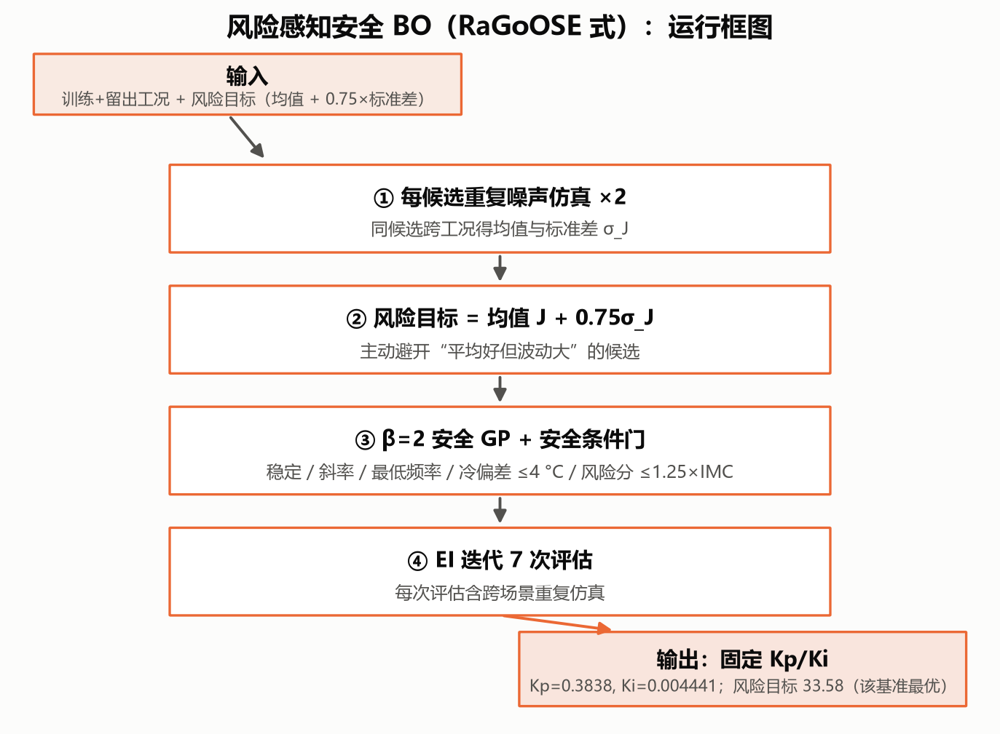
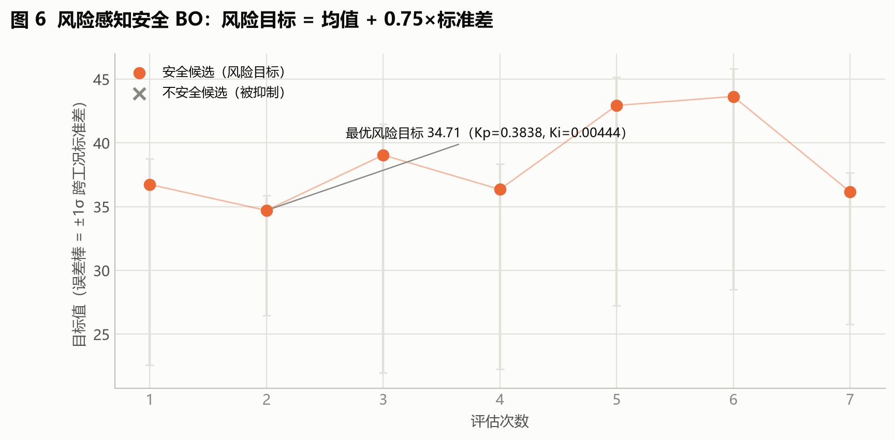
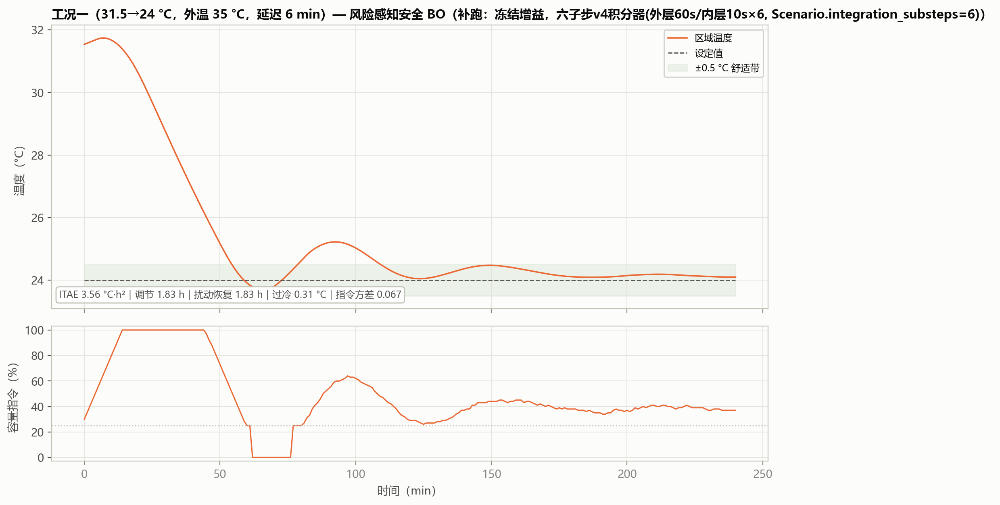
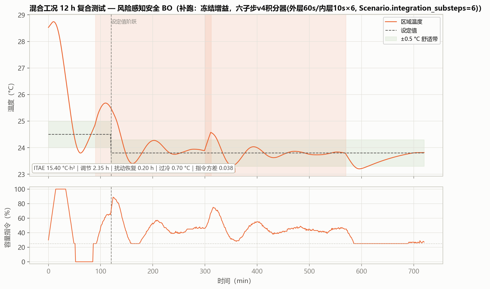

# 07 Safe BO：不仅追求分数，也约束风险

> **本篇目标**：比较普通 BO 与风险感知搜索，区分初始化收益和搜索收益。
> **你需要**：第 06 篇（普通 BO 只看平均分）。
> **你会得到**：风险目标搜索记录、冻结参数 Kp=0.3838/Ki=0.004441、补跑曲线。
> **运行方式**：快速体验 `python run.py advanced --quick --llm-provider heuristic`（约 1.4 秒）/ 真实基准见附录。
> **版本依据**：`experiments/manifests/v4.yaml` + 封存 `archive/outputs_advanced_quick/safe_bo_history.csv`。

---

## 这次要解决什么问题

第 06 篇的 BO 只看平均分，有个隐患：两个候选平均值几乎一样，但一个处处稳、一个偶尔失控——只看均值分不出来。本篇补上"发挥稳不稳"这一维，专挑"平均好、波动小"的。

## 开始前准备什么

- 前置章节：第 06 篇（BO 的 GP+EI 流程）。
- 输入数据：训练工况 + 独立留出工况；每个候选在多工况 × 2 个噪声种子下重复仿真（成本是普通 BO 的数倍）。
- 预计资源：7 次评估，PC 约 1.4 秒；等效对象时间约 700–900 h。

## 先跑一个最小实验

```bash
python run.py advanced --quick --llm-provider heuristic --output outputs_adv
```

读哪些输入 → 训练/留出工况、风险权重 0.75、安全条件。生成哪些文件 → `safe_bo_history.csv`（每次候选的均值、标准差、风险值、安全裕量）。怎样判断成功 → 文件存在 7 行，且能指出哪一行是 `selected=1`。

## 刚才发生了什么

先说直觉：不仅问"平均多好"，还要问"最差能有多糟、会不会出事"。

再说机制：每个候选跑 2 个噪声种子 × 全部工况，算均值 J̄ 与标准差 σ，用**风险目标 J_risk = J̄ + 0.75σ** 引导搜索；另用安全裕度 q（稳定、过冷≤2 °C、零斜率违规、零低容量运行、风险≤1.25×IMC）过滤候选。两个 GP 分别拟合 J_risk 与 q，LCB（μ−1.25σ）在保守安全集内选点（`hvac_pid/advanced_tuning.py:RiskAwareSafeBOTuner`）。

最后接到实现：本轮第 4 次评估均值最低（30.32）但 σ=8.06，按均值会选中它；第 2 次均值 31.17 但 σ 只有 4.71，风险目标 34.71 vs 36.36——**1.65 的差距就是风险口径规避掉的波动**。安全检查方面如实记录：本轮 7 个候选物理约束全通过，真正起作用的是"风险≤1.25×基线"这条相对约束（q 与 J_risk 相关系数恰为 1.0）——物理安全门在本轮没有被真正考验过，要验证它得靠专门的越界用例。

## 跟着代码走一遍

入口 `run.py advanced` → `tools/run_advanced_tuning_benchmark.py` → `advanced_tuning.py:RiskAwareSafeBOTuner.tune`（4 个初始点：1 基线 + 3 局部乘子种子；3 次 GP 迭代：拟合双 GP → 采样 512 → 保守过滤 → LCB 选点 → 重复仿真）。长度尺度authorized全程极小（0.037–0.077，贴着下界）——样本太少时 GP 只能认定"变化剧烈"，这是样本量瓶颈的量化体现。

## 结果应该怎么看



> **看哪里**：重复仿真 → 风险目标 → 安全过滤 → LCB 的链条。
> **发生了什么**：3 次 GP 迭代的候选风险目标为 42.94、43.65、36.18，全部劣于初始第 2 次的 34.71。
> **这说明什么**：最终部署的 Kp=0.3838/Ki=0.004441 来自第 2 次评估（`selected=1`），**不是搜索出来的**——预算太少 + 种子已经很好。正确解读是"搜索证明了种子附近没有更好的点"，这是有价值的阴性结论，不应写成"搜索找到了更优解"。



> **看哪里**：橙点（风险目标）与灰误差棒（均值±σ）；第 2 次与第 4 次两个橙点的落差。
> **发生了什么**：均值最优（第 4 次）与风险最优（第 2 次）不是同一个点；迭代阶段风险目标抬高。
> **这说明什么**：0.75σ 惩罚项的全部价值就是区分"平均一样好、波动差一倍"的候选；安全检查本轮零拦截。



> **看哪里**：保守增益在三工况的 ITAE 与方差（另两图 `fig_case2_safebo.png`、`fig_case3_safebo.png`）。
> **发生了什么**：工况二 ITAE 3.14（BO 的 44%），工况三 9.64（远优于全部 v3 五算法），方差全程最小。标题均标注"补跑"。
> **这说明什么**：跨工况最坏情形口径下整定的增益，对训练外的困难工况留有更多裕度。但要记住：**能证明的是这组保守参数的表现，尚不能把改善全部归因于搜索机制**。



> **看哪里**：复合扰动下的目标、恢复与启停。
> **发生了什么**：目标 58.71 七算法最优，恢复 0.2 h，方差 0.034，零启停。
> **这说明什么**：风险目标惩罚的正是"平均好但个别工况差"的候选。但该增益整定于独立留出集，与本工况族不同——结论应理解为泛化能力证据，而非"本族必然最优"。

## 改一个参数试试看

假设"0.75 管着胆量"：把 `risk_weight` 从 0.75 改成 0，重跑搜索，观察选中点是否从第 2 次滑向第 4 次（均值最优）。如果符合，说明风险口径确实在起作用；改回 0.75 归档（该系数应按行业风险偏好评审后固化，不是学出来的）。

## 如何确认复现成功

文件检查：`safe_bo_history.csv` 7 行，`selected=1` 为第 2 次。数值容差：风险目标 34.71、留出集平均 33.58（普通 BO 37.96、IMC 36.29 同口径）。行为检查：补跑标题带"补跑"，对象约束种子与 v3 一致。常见异常：把留出集分数与 80 场景分数混比——两个口径，禁止直接比较。

## 这次能得出什么结论

- 收益：以可量化的风险口径换取跨工况稳健性；混合工况最优；全程可审计。
- 代价：评估成本数倍于普通 BO；固定增益、无在线自适应；本轮搜索零改进。
- 适用条件：安全敏感、工况谱宽、调试窗口有限的场合。
- 未证明的部分：改善来自保守初始化还是搜索机制——本轮数据指向前者；要验证搜索本身，需更大预算与专门越界用例。

## 附录：本篇数据溯源

| 数据产物（仓库内路径） | 内容 | 支撑本篇何处 |
|---|---|---|
| `archive/outputs_advanced_quick/safe_bo_history.csv` | 7 次评估搜索历史 | 搜索与选中 |
| `archive/outputs_advanced_quick/advanced_holdout_summary.csv` | 独立留出集汇总 | 留出集结论 |
| `分报告/data/supplement_metrics.json` | 冻结增益补跑指标 | 工况表 |

| 代码位置 | 作用 |
|---|---|
| `hvac_pid/advanced_tuning.py:RiskAwareSafeBOTuner` | 风险目标与安全检查 |
