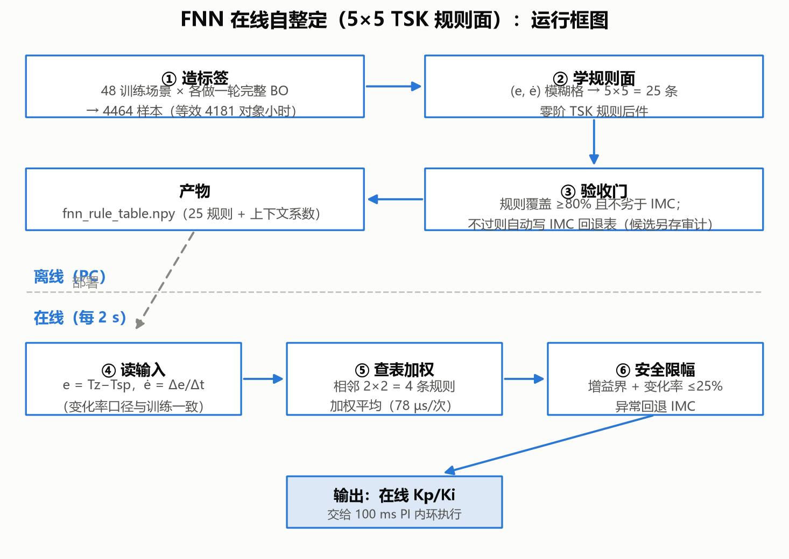
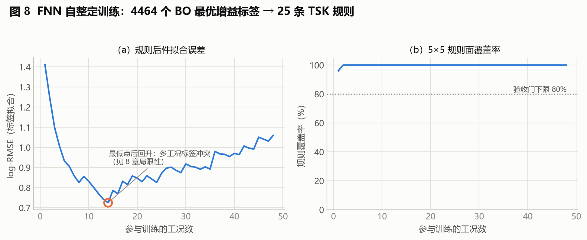
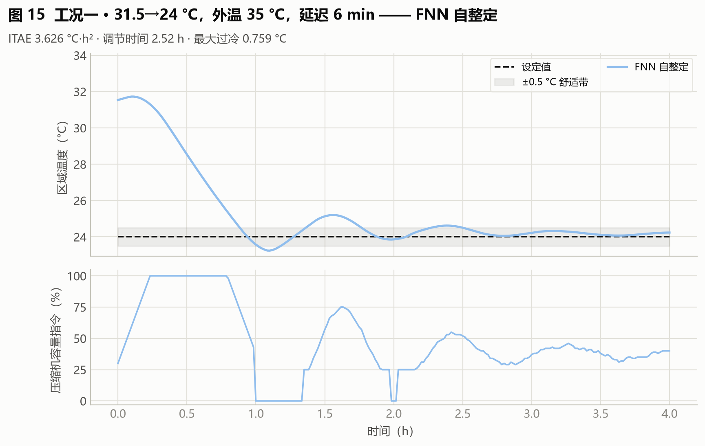
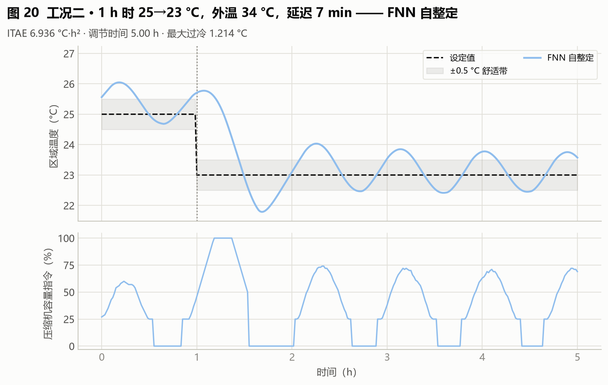
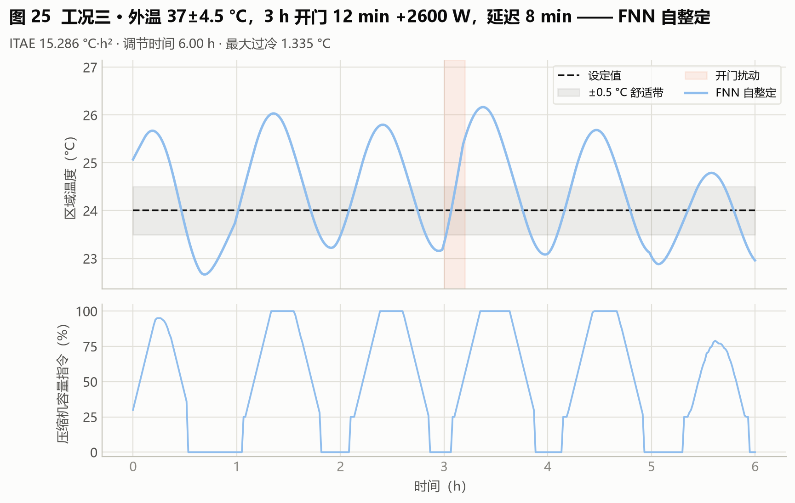
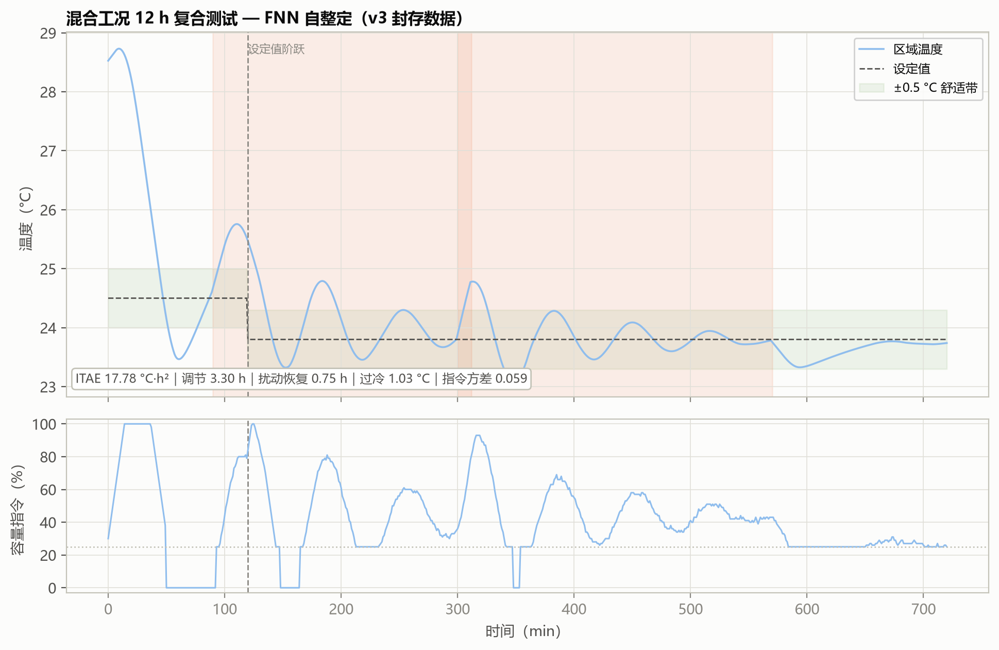

# 07 算法报告：FNN 在线自整定（5×5 TSK 规则面）

**版本**：2026-09-03
**数据口径**：v3 封存验收批次（48 场景训练、25 条 TSK 规则表）+ 整定耗时基准。溯源见附录 A。
**一句话定位**：把"当前偏差 e 和偏差变化率 ė"模糊化成 5×5 网格，25 条零阶 TSK 规则存成一张可在 MCU 上查的表——离线用 BO 造标签训练，在线每 2 s 查表调增益。

---

## 1 算法所需数据、输入与输出

| 项 | 内容 |
|---|---|
| 所需数据 | **离线**：48 个训练场景 × 各做一轮完整 BO，得到 4464 个"(e, ė) → BO 最优增益"标签；**在线**：仅需当前 e 与 ė |
| 输入 | e = Tz−Tsp（中心点 [−3, −0.75, 0, 1.5, 5] °C）；ė = Δe/Δt（中心点 [−0.30, −0.05, 0, 0.05, 0.30] °C/min）——用变化率而非增量，使 PC 5 min 训练节拍与 MCU 秒级节拍物理含义一致 |
| 输出 | 在线时变 Kp(t)/Ki(t)：每次仅 4 条相邻规则非零激活，加权平均后经公共限幅与变化率限制 |
| 产物 | 规则表文件（25 条规则后件，文件名见附录 A）；封存清单中规则值约 Kp∈[0.49, 0.53]、Ki∈[0.0048, 0.0049] |

## 2 能否自整定 / 能否自动整定

| 判定 | 结论 | 理由 |
|---|---|---|
| 自整定 | **是** | 投运后每 2 s 根据当前 (e, ė) 在线调整增益，无需人工干预 |
| 自动整定 | **训练阶段是** | 标签由 BO 自动生成、规则面自动学习、验收门自动判定；但"造标签"依赖 BO，不是无师自通 |

## 3 运行框图

部署门：规则覆盖率 ≥80% 且平均目标不劣于 IMC，否则自动写 IMC 回退表（候选规则表另存一份供审计，文件名见附录 A）；在线增益单次变化 ≤25%，异常回退 IMC。在线推理 **78.2 µs/次**（实测）。

## 4 离线训练过程：4464 个标签 → 25 条规则

FNN 的"学习"全部发生在离线：48 个训练场景各跑一轮完整 BO，把 BO 在每个 (e, ė) 网格位置上选出的最优增益记成标签，共 **4464 个"(e, ė) → BO 最优增益"标签**；随后用带先验的最小二乘把这一批标签拟合到 5×5 = 25 条零阶 TSK 规则的后件上（在线时每次只有 4 条相邻规则非零激活，加权平均后限幅输出）。图 7-2 的两个子图分别回答两个问题：拟合得好不好、规则面有没有被"走遍"。

**这张图怎么看**：两子图横轴相同，都是**参与训练的工况数**（1–48）。
**（a）** 纵轴 = log-RMSE（标签拟合误差，越低越好），橙空心圈标出最低点。
**（b）** 纵轴 = 规则覆盖率（%），即 25 条规则中至少被一个训练样本激活过的比例；灰色点线是部署验收门下限 80%。

**从图里能读出四件事**：

1. **拟合误差先快速下降，第 14 个工况触底后不降反升**。误差从第 1 个工况的 1.411 降到第 14 个工况的 **0.725**（全场最低），之后震荡回升到第 48 个工况的 **1.059**。这不是训练失败，而是**多工况标签冲突**：不同工况在同一个 (e, ė) 格子上要求的最优增益不同，而每条规则只有一个后件值，纳入的工况越多、折中越大。这与主报告第 8 章的局限性一致，也是第 8 节列出的缺点之一。
2. **误差回升的幅度是可控的**。从最低 0.725 回到 1.059，仍明显低于只用 1 个工况时的 1.411——**学到的仍是一个"广谱可用"的折中面，而不是对某一工况的过拟合**。
3. **覆盖率几乎立刻打满，但这只是必要条件**。第 1 个工况就覆盖 24/25 = 96%，第 2 个工况起 25/25 = 100%，全程远高于 80% 门限。含义是本对象的典型轨迹会走遍 5×5 网格的绝大部分格子，规则表里没有"从未被激活的死规则"。**但"每个格子都被踩到过"不等于"每个格子都被踩够次数"**——结合（a）的误差回升看，覆盖率是必要而不充分的部署条件，所以第 3 节的部署门还有第二条：平均目标不劣于 IMC。本批次两条都通过（末次记录 `deployment_accepted=1`，验证集基线目标 32.70 → 学习后 31.92）。
4. **在线部分不在这张图里**。训练结束后 25 条规则后件冻结成一张表，在线每 2 s 查表（78.2 µs/次），不再有任何学习。这条"离线学、在线查"的分界，正是第 3 节框图的上/下两条通道。

## 5 整定时间

| 口径 | 数值 | 性质 |
|---|---|---|
| 能得到 FOPDT 时（本项目） | **训练 PC 7.65 s【实测】**；等效对象时间 **4181 h**（标签来源：48 场景 × 每场景一轮完整 BO 搜索）；在线推理 78.2 µs/次 | 确定值 |
| 得不到 FOPDT 时 | **【估算】PC 约 8.2–8.6 s / 等效约 4600–4900 h**：FNN 训练本身不消费 FOPDT，但其标签链依赖 BO，BO 失去 FOPDT 初始化种子后每次搜索约多 10–15% 评估（见 04 号报告），等效对象时间同比增加 | 预测值，依据：BO 单评估成本实测 |

## 6 三个标准工况表现

| 工况 | ITAE（°C·h²） | 调节时间（h） | 扰动恢复（h） | 最大过冷（°C） | 指令方差 | 综合目标 |
|---|---|---|---|---|---|---|
| 一 初次快速降温 | 3.626 | 2.52 | 2.52 | 0.759 | 0.081 | 61.90 |
| 二 设定温度突变 | 6.936 | 5.00 | 4.00 | 1.214 | 0.091 | 36.41 |
| 三 持续外界热扰动 | 15.286 | 6.00 | 2.80 | 1.335 | 0.146 | 70.96 |

**读图**：与 BO/IMC 几乎重合（ITAE 差 <3%），工况一略优（3.63 vs BO 3.67）；80 场景 holdout 39.26、相对 IMC 比值 0.9979（95% 上界 1.0067）**通过部署验收门**，规则覆盖率 100%。注意一个诚实记录：ESP32 七算法演示批次中该 FNN 候选未通过可见验收门、以影子模式运行——v3 封存验收与演示是不同批次，结论互不覆盖。

## 7 混合工况（多种工况同时出现）表现

| ITAE | 调节时间 | 扰动恢复 | 最大过冷 | 指令方差 | 综合目标 | 启停 |
|---|---|---|---|---|---|---|
| 17.78 | 3.30 h | 0.75 h | 1.04 °C | 0.059 | 71.38 | 3 次 |

**表现回答**：多工况叠加时 FNN 比固定增益的 BO（81.38）明显好、与 IMC（71.95）持平：规则面能在大偏差阶段（初始降温、开门后）给出更积极的增益、接近设定值时收敛回保守区——调节时间 3.30 h 比 IMC 的 5.92 h 快 44%，这正是"自整定"在复合工况下的价值。但它没有超越安全 BO（58.71）：标签来自 BO 平均目标最优增益，规则面学到的是"平均最优策略"，对训练覆盖外的极端叠加没有风险裕度意识。

## 8 小结

- 优点：在线自整定、推理极快（78 µs，可上 MCU）、规则表可审计；holdout 通过部署门；
- 缺点：训练链最重（4464 标签 ≈ 4181 等效对象小时）；性能上限受 BO 标签质量约束；多工况标签冲突使 log-RMSE 后期回升（见主报告第 8 章局限性）；
- 落地建议：适合"算力极受限、但需要工况自适应"的边缘场景；部署前务必过覆盖率+IMC 对照双门。

## 附录

本附录列出的数据文件、代码位置与命令，均为**本项目代码仓库内的相对路径**，仅面向需要核对数据来源或复现结果的读者。仅阅读本报告的读者可直接跳过——理解正文全部结论所需的输入、参数与数值已在正文中给出，不依赖这些文件。

### A 本篇数据溯源

| 数据产物（仓库内路径） | 内容 | 支撑本篇何处 |
|---|---|---|
| `outputs_review_v3/fnn_rule_table.npy` | 25 条零阶 TSK 规则后件（5×5） | 第 1 节产物 |
| `outputs_review_v3/fnn_rule_table_candidate.npy` | 未过部署门时的候选规则表（供审计） | 第 3 节部署门 |
| `outputs_review_v3/fnn_training_samples.csv` | 4464 个“(e, ė) → BO 最优增益”标签 | 第 1 节 |
| `outputs_review_v3/fnn_training_history.csv` | 训练收敛与规则覆盖率历史 | 第 5 节 、第 4 节图 7-2 |
| `outputs_review_v3/case_metrics.csv` | v3 三标准工况 × 五算法指标 | 第 6 节 |
| `outputs_review_v3/case_timeseries.csv` | 三工况逐分钟时序 | 图 7-3～7-5 |
| `outputs_tuning_benchmark/tuning_stage_times.csv` | 整定耗时基准 | 第 5 节 |

本篇结论涉及的实现位置：

| 代码位置 | 作用 |
|---|---|
| `hvac_pid/ai_controllers.py` :: train_fnn_rule_table | 离线造标签与规则面训练 |
| `hvac_pid/ai_controllers.py` :: FNNGainController | 在线 2 s 查表、加权平均与增益限幅 |

**复现说明**：标签由 48 个训练场景各跑一轮完整 BO 生成，链路上依赖 04 号报告的 BO；规则面训练本身为确定性最小二乘，可复现。
