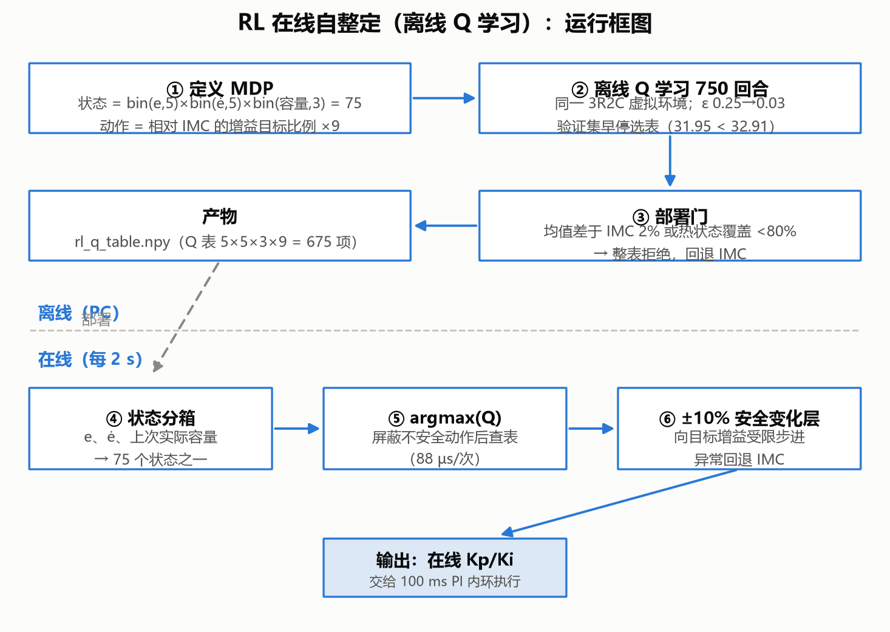
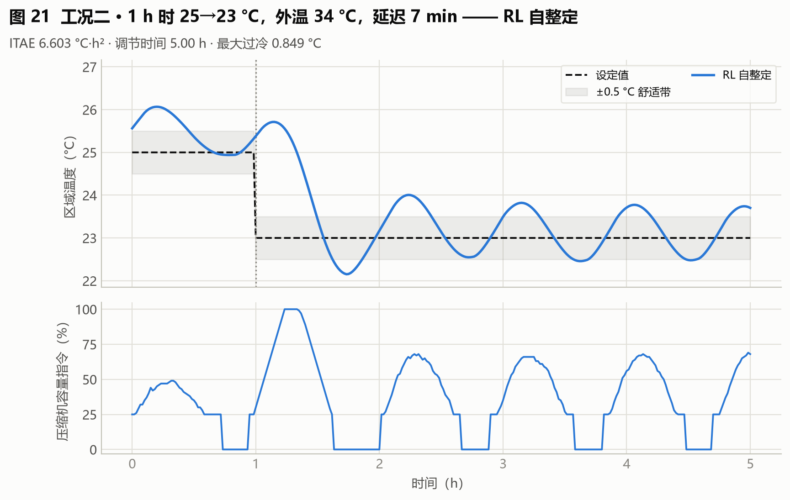
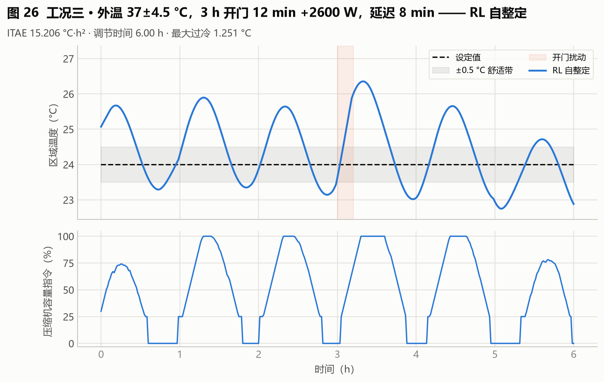
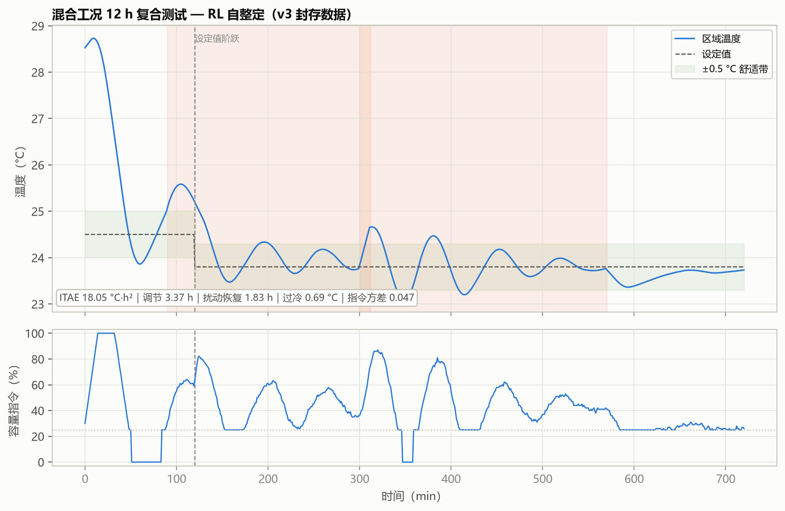

# 08 算法报告：RL 在线自整定（离线 Q 学习）

**版本**：2026-09-03
**数据口径**：v3 封存验收批次（750 回合 Q 学习训练与冻结 Q 表）+ 80 场景 holdout。溯源见附录 A。
**一句话定位**：把温控整定建模为离散 MDP，在虚拟对象上离线学 750 回合 Q 表，部署后每 2 s 按"当前热状态"查表给出增益目标——**80 场景 holdout 37.61，七算法全场最优**。

---

## 1 算法所需数据、输入与输出

| 项 | 内容 |
|---|---|
| 所需数据 | 虚拟对象（3R2C 环境）供离线训练；IMC 基准增益（动作语义参照）；不需要人工标签 |
| 输入 | 状态 $s$ = bin(e, 5) × bin(ė, 5) × bin(上次实际容量指令， 3) = **75 个热状态**（仅统计物理轨迹真实到达的状态，不伪造覆盖） |
| 输出 | **9 个动作之一：相对 IMC 基准增益的目标比例**（Kp/Ki 各 ×0.9/×1.0/×1.1 的组合）→ 经 ±10% 安全变化层限步进 |
| 产物 | Q 表文件（5×5×3×9 = 675 项，文件名见附录 A）；验证集早停选表（31.95 < 32.91） |

关键设计：动作是"相对 IMC 的目标比例"而非增益增量——修复旧版"增益递归相乘"的非马尔可夫问题，使同一状态下动作含义恒定。

## 2 能否自整定 / 能否自动整定

| 判定 | 结论 | 理由 |
|---|---|---|
| 自整定 | **是** | 投运后每 2 s：状态分箱 → 屏蔽不安全动作 → argmax(Q) → 增益目标；随工况持续自适应 |
| 自动整定 | **训练阶段是** | 750 回合训练、ε 退火（0.25→0.03）、验证集早停全自动；**训练全部在虚拟对象完成，真机只查冻结策略、不做随机探索** |

部署门：均值差于 IMC 2% 或热状态覆盖 <80% → 整表拒绝、回退 IMC（v3 中通过）。

## 3 运行框图

## 4 训练过程：750 回合的奖励收敛与验证集早停

RL 在虚拟 3R2C 对象上做表格式 Q 学习：状态 = bin(e, 5) × bin(ė, 5) × bin(上次实际容量指令, 3)，动作 = 9 个"相对 IMC 基准增益的目标比例"。每 5 min 决策一次、每回合最长 240 min，共 **750 回合 / 36,000 转移 / 180,000 环境步**。每 25 回合在**独立验证场景集**（16 个，与 48 个训练场景不重叠）上评估一次检查点，共 30 个检查点。

**这张图怎么看**：
**（a）** 横轴 = 训练回合（1–750）；左纵轴 = 回合奖励的 20 回合滑动平均；右纵轴（灰色虚线）= 探索率 ε（0.25 → 0.03 线性退火）。
**（b）** 横轴 = 训练回合；纵轴 = **验证集目标值**（越低越好）。灰色空心点 = 每 25 回合的检查点验证值（30 个）；蓝色实线 = 到当前为止的最优检查点（单调不升）；灰色水平虚线 = **IMC 基线 32.91**；标注为早停选表 31.95。

**从图里能读出五件事**：

1. **（a）的奖励曲线不能当收敛证据——这是本图最容易被误读的地方**。20 回合滑窗之后，奖励仍在 −66.7（第 276 回合，全程最好）到 −153.0（第 340 回合，全程最差）之间大幅波动，末值（第 750 回合）−111.0 甚至差于训练初期。原因是回合奖励既含 ε-贪婪探索的随机性，也随每回合工况难度起伏。**真正可靠的收敛证据是（b）的验证集目标**，这也是本项目把部署决策放在验证集而非训练奖励上的原因。
2. **即使 ε 退火到 0.03，奖励依然波动**。ε 从 0.25 线性降到 0.03，而（a）的波动幅度并没有随之收窄——说明波动主要来自环境与工况，而非探索噪声。
3. **（b）的累计最优在第 450 回合就停止改善**。蓝线从首个检查点（第 25 回合）的 34.84 单调不升，到第 450 回合达到**全场最优 32.77** 后即不再下降；第 475～750 回合的 12 个检查点，验证目标在 33.00～36.88 之间（末次 33.67），**全部劣于 32.77**。这是一条典型的"训练后半程无收益"曲线——**早停是有数据依据的，不是偷懒**。
4. **在验证集口径上，RL 对 IMC 的优势极小**。累计最优 32.77 只比 IMC 基线 32.91 好 0.14（**0.42%**）。这一点必须诚实写出：第 8 节引用的"holdout 全场最优 37.61"是 **80 场景 holdout** 口径，与本图 16 场景验证集口径不同，两者不可混用。
5. **最终部署的不是"最佳检查点"，而是早停后重新选表得到的策略**。部署策略在验证集上的目标为 **31.95**，优于最佳检查点 32.77，也优于 IMC 基线 32.91（改善 2.92%），并被部署门接受（`deployment_accepted=1`）。读者容易问"为什么早停选表 31.95 比最佳检查点 32.77 还好"——答案是两者口径不同：32.77 是训练途中每 25 回合快照的验证值，31.95 是训练结束后在验证集上做最终资格化评估（含基线 bootstrap 与热状态分箱策略族选择）得到的部署值。

**状态覆盖**：第 1 回合仅 9/25 = 36%，第 42 回合起 25/25 = 100%。覆盖快速打满，因此第 2 节"热状态覆盖 <80% 则整表拒绝"的门未被触发。

## 5 整定时间

| 口径 | 数值 | 性质 |
|---|---|---|
| 能得到 FOPDT 时（本项目） | **训练 PC 16.22 s【实测】**（750 回合、每回合最长 240 min、每 5 min 决策、36,000 转移 / 180,000 环境步）；等效对象时间 **4018 h**；在线推理 88.0 µs/次 | 确定值 |
| 得不到 FOPDT 时 | **【估算】PC 仍约 16–17 s / 等效 4018 h + 标定成本**：RL 训练只依赖虚拟对象本身，不消费 FOPDT；但动作语义"相对 IMC 的比例"失去 IMC 参照后须改锚定其他基准（如 BO 全局增益），基准更换需重新标定动作含义并重训，标定与重训约 +0.5–1 倍训练成本 | 预测值，依据：训练耗时实测与动作定义耦合分析 |

## 6 三个标准工况表现

| 工况 | ITAE（°C·h²） | 调节时间（h） | 扰动恢复（h） | 最大过冷（°C） | 指令方差 | 综合目标 |
|---|---|---|---|---|---|---|
| 一 初次快速降温 | **3.484** | **1.73** | **1.73** | **0.229** | 0.063 | **58.95** |
| 二 设定温度突变 | **6.603** | 5.00 | 4.00 | **0.849** | **0.074** | **34.39** |
| 三 持续外界热扰动 | **15.206** | 6.00 | 2.80 | 1.251 | **0.132** | **68.15** |

（粗体：v3 五算法中该工况该项最优）

**读图**：三工况全面领先或并列领先 v3 五算法——工况一调节 1.73 h（其他算法 2.5 h）、过冷 0.229 °C（次优 0.68）；指令方差全程最小。策略行为可读：大偏差阶段选积极增益加速，接近设定值切回保守档。

## 7 混合工况（多种工况同时出现）表现

| ITAE | 调节时间 | 扰动恢复 | 最大过冷 | 指令方差 | 综合目标 | 启停 | 回退事件 |
|---|---|---|---|---|---|---|---|
| 18.05 | 3.37 h | 1.83 h | **0.69 °C** | **0.047** | **67.32（v3 五算法最优）** | **2 次** | 1 次 |

**表现回答**：多工况叠加是 RL 相对其他 v3 算法优势最大的场景——综合目标 67.32 对 IMC 71.95 / FNN 71.38 / BO 81.38 / Z-N 165.03；过冷与指令方差双最小，启停最少（2 次）。机理：状态中的"上次实际容量指令"维度让策略能区分"开门热冲击"（需快速加冷）与"人员负荷缓升"（需平稳跟踪），逐状态选择不同增益目标。**诚实记录两点**：① 该测试中出现过 1 次回退事件（异常状态触发 IMC 回退后恢复，属安全机制按设计生效）；② 若把补跑的安全 BO（58.71）与 LLM（65.89）纳入比较，RL 在混合工况并非绝对最优——风险导向整定的保守固定增益在该复合场景更强，这说明"在线自适应"与"风险口径整定"解决的是不同问题。

## 8 小结

- 优点：holdout 全场最优（37.61）、混合工况 v3 五算法最优、推理 88 µs 可上 MCU、真机零探索；
- 缺点：训练等效 4018 对象小时（成本高）；Q 表离散化牺牲精度；动作语义锚定 IMC（换基准需重训）；1 次回退事件提示宽工况覆盖仍是边界；
- 落地建议：适合"工况谱宽、长期运行、可把训练成本摊薄"的产品线；与风险感知安全 BO 的组合（安全 BO 定基准 + RL 在线自适应）是值得探索的下一步。

## 附录

本附录列出的数据文件、代码位置与命令，均为**本项目代码仓库内的相对路径**，仅面向需要核对数据来源或复现结果的读者。仅阅读本报告的读者可直接跳过——理解正文全部结论所需的输入、参数与数值已在正文中给出，不依赖这些文件。

### A 本篇数据溯源

| 数据产物（仓库内路径） | 内容 | 支撑本篇何处 |
|---|---|---|
| `outputs_review_v3/rl_q_table.npy` | Q 表 5×5×3×9 = 675 项 | 第 1 节产物 |
| `outputs_review_v3/rl_q_table_candidate.npy` | 未过部署门时的候选 Q 表 | 第 2 节部署门 |
| `outputs_review_v3/rl_training_history.csv` | 750 回合训练奖励与验证集早停记录 | 第 5 节 、第 4 节图 8-2 |
| `outputs_review_v3/rl_training_transitions.csv` | 36,000 条状态转移 | 第 5 节 |
| `outputs_review_v3/holdout_summary.csv` | 80 场景 holdout 汇总 | 第 8 节 |
| `outputs_review_v3/holdout_metrics.csv` | 80 场景逐场景指标 | 第 8 节 |
| `outputs_review_v3/case_metrics.csv` | v3 三标准工况 × 五算法指标 | 第 6 节 |
| `outputs/case_timeseries.csv` | 三工况逐分钟时序 | 图 8-3～8-5 |
| `outputs_review_v3/policy_manifest_v3.json` | v3 封存部署清单（通过部署门记录） | 第 2 节 |

本篇结论涉及的实现位置：

| 代码位置 | 作用 |
|---|---|
| `hvac_pid/ai_controllers.py` :: train_offline_q_policy | 离线表格式 Q 学习（750 回合、ε 退火、验证集早停） |
| `hvac_pid/ai_controllers.py` :: IncrementalRLController | 在线 2 s 查表与不安全动作屏蔽 |

**复现说明**：训练在虚拟对象上完成、使用固定随机种子，可复现；真机部署只查冻结策略，不做随机探索。
