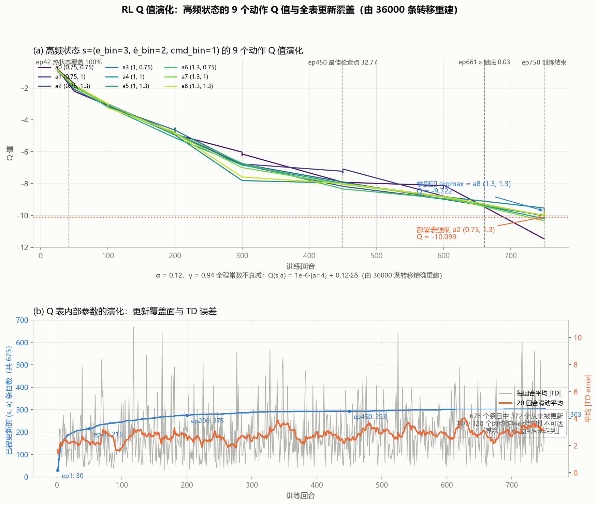
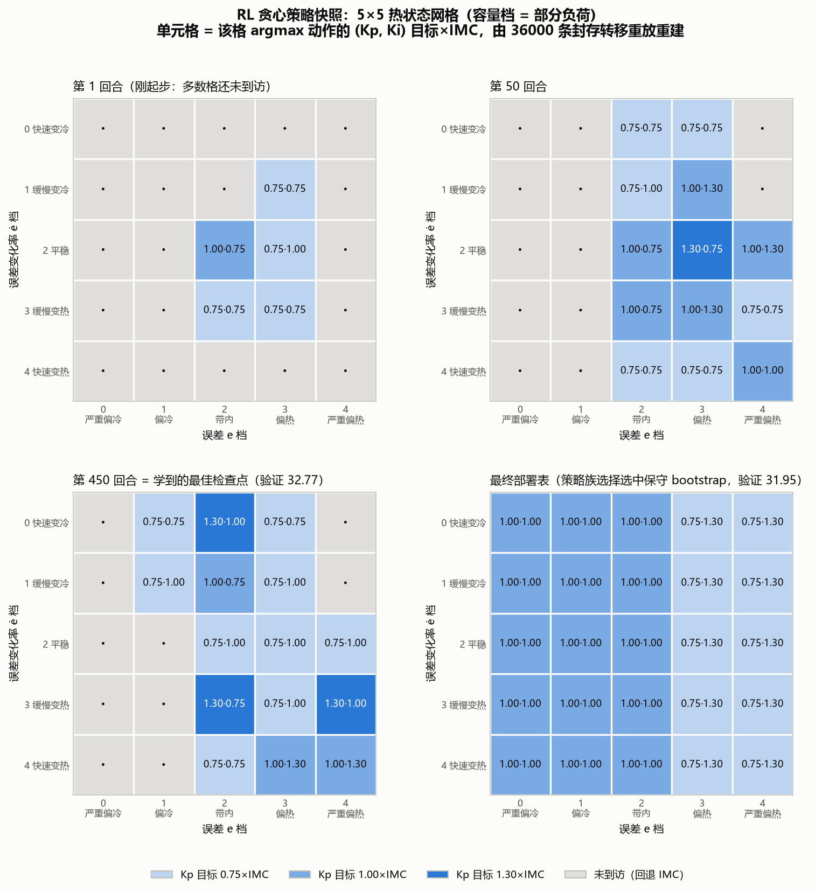

# 09 RL：在虚拟房间里学习调参策略

> **本篇目标**：理解状态/动作/奖励、离线训练、冻结策略并检查覆盖。
> **你需要**：第 08 篇（"离线学、在线查"的另一实例）、第 03 篇（覆盖门）。
> **你会得到**：Q 表（675 项）、奖励与验证曲线、覆盖与回退记录。
> **运行方式**：快速体验 `python main.py --quick`（训练约 16 秒）/ 完整复现 `python main.py`。
> **版本依据**：`experiments/manifests/v4.yaml` + 封存 `archive/outputs_review_v3/rl_training_history.csv`。

---

## 这次要解决什么问题

第 08 篇的规则面是"拟合 BO 标签"学来的，能不能不依赖标签，让程序自己在虚拟房间里试错学出来？RL 把调参当成打游戏：状态是"偏差×偏差变化×上次出力"75 格，动作是 9 档"相对 IMC 的增益倍数"，练 750 局，把最好的记成表。

## 开始前准备什么

- 前置章节：第 08 篇（对照另一种"离线学在线查"）、第 05 篇（动作语义锚定 IMC）。
- 输入数据：虚拟 3R2C 环境 + IMC 基准增益；不需要人工标签。
- 预计资源：训练 PC 约 16.22 秒（750 回合、36000 转移、等效约 4018 h）；在线推理 88.0 µs/次。

## 先跑一个最小实验

```bash
python main.py --quick --output outputs_quick
```

读哪些输入 → 训练/验证场景划分（16 个验证场景与训练不重叠）。生成哪些文件 → `rl_q_table.npy`（675 项）、`rl_training_history.csv`（奖励与验证记录）、`rl_training_transitions.csv`（状态转移）。怎样判断成功 → 末次 `deployment_accepted=1`，且覆盖率≥80%。

## 刚才发生了什么

每 5 min 决策一次、每回合最长 240 min，共 750 回合。ε 从 0.25 退火到 0.03。每 25 回合在独立验证集上评估检查点（30 个），累计最优第 450 回合后不再改善（32.77），早停有据。最终部署值 31.95（优于 IMC 基线 32.91，好 2.92%）是训练结束后的最终复核（含基线 bootstrap 与策略族选择），与途中快照口径不同——这正是"32.77 与 31.95 为什么不一样"的答案。

关键设计：动作是"相对 IMC 的目标比例"而非增益增量，修复了旧版递归相乘的非马尔可夫问题；状态只统计物理轨迹真实到达的，不伪造覆盖；未见过的状态按设计切回 IMC。

## 跟着代码走一遍

- 训练：`hvac_pid/ai_controllers.py:train_offline_q_policy`——750 回合、ε 退火、验证集早停。
- 在线：`ai_controllers.py:IncrementalRLController`——每 2 s 分箱、屏蔽不安全动作、argmax(Q)、±10% 步进；未覆盖状态回退 IMC。
- 上线检查：平均比 IMC 差 2% 以上、或覆盖 <80%，整表作废（本轮通过）。

## 这一局的地图和记分牌

强化学习三要素，本任务里具体是：

**状态（75 格 = 5×5×3）**：三个维度各自分箱——

| 维度 | 边界 | 档位含义 |
|---|---|---|
| 误差 e = Tz − Tsp（°C） | −2 / −0.5 / +0.5 / +2 | 严重偏冷 · 偏冷 · 带内 · 偏热 · 严重偏热 |
| 误差变化率 ė（°C/min） | −0.15 / −0.03 / +0.03 / +0.15 | 快速变冷 · 缓慢变冷 · 平稳 · 缓慢变热 · 快速变热 |
| 上次实际容量指令 | 0.05 / 0.70 | 停机 · 部分负荷 · 高负荷 |

**动作（9 档）**：相对 IMC 基准的绝对目标比例，(Kp, Ki) ∈ {0.75, 1.00, 1.30}× 的 3×3 组合，动作 4 = (1.00, 1.00) 即"保持 IMC"。目标经 ±10% 信任域逐步逼近。偏冷状态只放行 Kp、Ki 都不升的 4 档，带内屏蔽升 Ki 档，偏热才放开全部 9 档——探索也只能在白名单里随机。

**奖励（每 5 min 一步，恒为负）**：−|误差| − 1.5×舒适带超限 − 0.08×指令变化 − 0.02×出力，再减 0.08×实际增益变化和 0.015×偏离 IMC 的程度。前四项是"控得好不好"，后两项是"别乱调、没证据别偏离基准"。RL 学的是"负得更少"，不是"变正"。

**为什么是 Q 学习（Value-Based），而不是 Policy-Based？** 本任务动作只有 9 档、状态 75 格，一张 675 项的表就装下了：能整表审计、能直接搬上 MCU（88 µs 查表）、配合"先屏蔽再 argmax"策略永远出不了安全圈、"哪个格子没见过"一目了然（覆盖掩码与 IMC 回退全靠它）。策略网络适合连续动作和高维状态，放在这里是黑箱 + 杀鸡用牛刀，安全层和部署链还得全部重做。**建议**：将来若要连续增益目标，优先加密动作网格仍保持表格式；只有状态维度大幅扩展（湿度、多区）才值得上小型策略网络。

## 跟着一局 rollout 走一遍

一句话直觉：**在虚拟房间里打 750 局，把"每个格子该调到哪一档"记成一张表。**

数据全部来自封存文件 `archive/outputs_review_v3/rl_training_transitions.csv` 的第 1 回合（训练场景 #32，IMC 基准 Kp=0.5175、Ki=0.004054，该回合 ε=0.25）；Q 值用 α=0.12、γ=0.94 逐行重放 48 条转移复核，与 CSV 的 td_error 列逐条一致（重放方法见下文"自己动手验证"）。

**走查前先核对一件事**：先手算第 1 步的奖励，给后面的程序值立一个检查标准——就像先算出"最短 6 步"再去检查算法学到了什么。第 1 步误差从 −4.94 °C 升到 −4.67 °C，区间平均 |e| ≈ (4.94+4.67)/2 ≈ 4.80，此时压缩机尚未启动（出力≈0、指令几乎不变），奖励的主项是

$-|e| - 1.5\times(|e|-0.5) \approx -4.80 - 1.5\times4.30 \approx -11.26$

封存 CSV 里第 1 步的实际奖励是 **−11.24**。差的 0.02 来自"两点取平均"的线性近似与增益微调罚项——手算和程序对上了，可以放心往下走。

**分箱：连续读数落进格子**。每次决策的第一步是把三个连续读数压成三个格子坐标，程序里只有一行：

```python
# hvac_pid/ai_controllers.py:600-601
def _bin(value: float, edges: np.ndarray) -> int:
    return int(np.searchsorted(edges, float(value), side="right"))
```

```python
# hvac_pid/ai_controllers.py:637-640 —— 每次决策先落格（在线 _propose；训练循环用同一套分箱）
def _propose(self, error_c, delta_error_c, *, applied_command=0.0, **_):
    e_bin = self._bin(error_c, self.error_edges)
    d_bin = self._bin(delta_error_c, self.delta_edges)
    command_bin = self._bin(applied_command, self.command_edges)
```

**微型地图**（本回合 48 步落入的格子，数字 = 落入次数，行 = ė 档，列 = e 档）：

| ė \ e | 严重偏冷 | 偏冷 | 带内 | 偏热 | 严重偏热 |
|---|---|---|---|---|---|
| 快速变冷 | • | • | • | • | • |
| 缓慢变冷 | • | • | • | 2 | • |
| 基本平稳 | 1 | • | **23** | 4 | • |
| 缓慢变热 | 5 | 5 | 4 | 3 | • |
| 快速变热 | 1 | • | • | • | • |

地图读法：这是一个**冷启动回合**——房间从低于设定值 4.9 °C 起步（左下角），压缩机基本不转（容量档 0），房间自然升温冲过设定值进入偏热区，压缩机转入部分负荷把温度拉回，最后 48 步里 23 步停在"带内 + 平稳"那一格。

**逐步走查**（前 6 步，更新公式：$Q(s,a) \leftarrow Q(s,a) + \alpha\,[\,r + \gamma \max_{a'} Q(s',a') - Q(s,a)\,]$）：

| 步 | e (°C) / ė (°C/min) | 落格 (e, ė, u) | 动作 | Kp 目标× → 实际 | 奖励 | Q(s,a) 前 → 后 |
|---|---|---|---|---|---|---|
| 1 | −4.94 / 0.00 | (0, 2, 0) | 3 | 1.00× → 0.5175 | −11.24 | 0 → −1.35 |
| 2 | −4.67 / +0.05 | (0, 3, 0) | 0 | 0.75× → 0.4657 | −10.39 | 0 → −1.25 |
| 3 | −4.31 / +0.07 | (0, 3, 0) | 1 | 0.75× → 0.4192 | −9.51 | 0 → −1.14 |
| 4 | −3.96 / +0.07 | (0, 3, 0) | 4 | 1.00× → 0.4611 | −8.63 | 1e−6 → −1.04 |
| 5 | −3.61 / +0.07 | (0, 3, 0) | 3 | 1.00× → 0.5072 | −6.44 | 0 → −0.77 |
| 6 | −2.36 / +0.25 | (0, 4, 0) | 4 | 1.00× → 0.5175 | −4.67 | 1e−6 → −0.65 |

**自举：一步只能传一格**。看第 5、6 步这对相邻格子。第 5 步写入 Q[(0,3,0), 动作3] = −0.77；紧接着第 6 步算 TD 目标时，max 恰好查到这个刚写进去的数：

$$\text{td}_6 = -4.67 + 0.94 \times (-0.77) = -5.40 \;\neq\; -4.67$$

这 0.73 的差值就是"信息往回传了一格"：第 6 步还不知道第 7 步以后的任何事，它只知道"下一步那个格子的当前估值是 −0.77"。这与价值迭代里 V₁(3,1)=−0.01 → V₂(3,1)=0.94 是同一件事——目标（或好格子）的价值沿转移链一格一格往回传，一步更新只能传一格。程序里就是这四行：

```python
# hvac_pid/ai_controllers.py:783-786 —— TD 更新（末步目标只含奖励，无自举）
next_allowed = IncrementalRLController._allowed_actions(next_state[0])
target = reward if step == decisions - 1 else reward + gamma * np.max(q[next_state][next_allowed])
td_error = float(target - q[state + (action,)])
q[state + (action,)] += alpha * td_error
```

**注意这里（看完例子未必自己悟得出来）**：

1. **Q 表从"抄奖励"开始**：初始全 0（仅"保持"动作预置 1e−6），第 1~5 步的 Q 值就是 0.12×奖励；第 6 步才第一次自举（见上面的手算）。"抄奖励"和"自举"的分界，在走查表里一眼可见。
2. **动作是目标不是命令**：第 2 步目标 Kp=0.75×IMC（0.388），实际只施加 0.4657；第 4 步选"保持"后目标回到 0.5175，实际只走到 0.4611。执行层永远看不到突变，因为目标要经 ±10% 信任域逐步逼近：

```python
# hvac_pid/ai_controllers.py:746-751 —— 目标经 ±10% 信任域逐步逼近
target_scale = IncrementalRLController._actions[action]
old_kp, old_ki = controller.kp, controller.ki
target_kp = fallback_gains[0] * target_scale[0]
target_ki = fallback_gains[1] * target_scale[1]
controller.kp = float(np.clip(target_kp, old_kp * 0.90, old_kp * 1.10))
controller.ki = float(np.clip(target_ki, old_ki * 0.90, old_ki * 1.10))
```

3. **探索也出不了安全圈**：偏冷状态只有 4 档可选，前 3 步必是随机探索（贪心只会选预置 1e−6 的"保持"），但随机只能在白名单里随机。

**假设说明**：α=0.12——奖励里混着场景随机性、传感器噪声（σ=0.04 °C）和探索动作，小步长相当于对每个格子约 8 次近期更新做平均，防止单条噪声改写整表；γ=0.94——有效视野 ≈ 1/(1−γ) ≈ 17 步 ≈ 83 min，刻意短于 240 min 整回合，让 Q 只回答"近期局部能不能改善"，回避长程 credit assignment；ε 从 0.25 线性退火到 0.03——先覆盖 75 格、后收敛，末值保留少量探索防过早锁死。这三个值在 v3 封存运行中固定未再调优；以上为与代码行为一致的工程解释。

**从一步到全局：Q 表的演化**。上面只看了 6 步；把 36000 条转移全部重放，就能像价值迭代的"第 0/1/3/6 轮价值表"一样，看 Q 表随回合长大的全过程。



> **看哪里**：(a) 高频状态（带内+平稳+部分负荷）的 9 个动作 Q 值随回合的演化，虚线标出热状态覆盖打满（第 42 回合）、最佳检查点（第 450 回合）、ε 触底（第 661 回合）；(b) 全表 675 项中被更新过的条目数与每回合平均 |TD 误差|。
> **发生了什么**：9 条 Q 曲线先一起"抄奖励"下沉，约 200 回合后彼此分化；覆盖从第 1 回合的 5 项涨到 303/675（其中 120 项因安全屏蔽结构性不可达）；|TD| 滑动平均持续收窄。
> **这说明什么**：曲线分化意味着同一格子里不同动作的长期后果被区分开了——Q 从"抄奖励"变成了"做预测"；覆盖停在 303/675 是安全屏蔽下的刻意保守，不是训练失败。



> **看哪里**：四张 5×5 网格（行=ė 档、列=e 档，取部分负荷容量档），每格写该格当前贪心动作的 (Kp, Ki) 目标×IMC，灰色 = 还没到访。左三张是第 1 / 50 / 450 回合的训练快照，右下是最终部署表。
> **发生了什么**：第 1 回合大多数格子还是灰色；第 50 回合到访格子各奔东西；第 450 回合偏热两列聚出"1.30 积极升 Kp"的结构。而右下部署表几乎是均匀的"1.00·1.00（保持 IMC）"，只有偏热两列换成"0.75·1.30"。
> **这说明什么**：学到的检查点输给了保守 bootstrap——策略族选择在同种子验证对比中选中了后者。这张图就是"上面热闹的学习"与"实际部署的保守策略"之间的全部距离；差在哪、为什么，下一节自己动手验证。

## 自己动手验证

上一节说了两个可检验的承诺：走查数字对得上、Q 表可以重建。这里给你三个不用跑训练就能做的检查，数据全在封存文件里。

**① 核对任意一步走查**（一行 pandas）：

```python
import pandas as pd
rows = pd.read_csv("archive/outputs_review_v3/rl_training_transitions.csv")
print(rows[(rows.episode == 1) & (rows.decision.isin([1, 5, 6, 48]))]
      [["state_error_bin", "state_delta_bin", "state_command_bin", "action",
        "reward", "td_error"]])
```

输出的落格、动作、奖励应与上文走查表逐格一致。

**② 末步终端检查**：第 48 步是本回合最后一个决策，回合结束后没有"下一步"，所以 TD 目标只含奖励、不含自举项（上面第三段代码的三元表达式）。CSV 里第 48 步奖励 −0.2855、td −0.1747，倒推 Q 更新前值 = 目标 − td = −0.2855 − (−0.1747) = **−0.1108**——是负的，且 |−0.1108| < |−0.2855|：奖励恒负决定 Q 恒负，但反复经过"好格子"的更新把它抬得比单步奖励温和。

**③ 整表复现：把诚实版本写在前面**。用 α=0.12、γ=0.94 对全部 36000 条转移逐行重放（含 ② 的终端处理），结果是：

- 36000 条 td_error **逐条一致（36000/36000）**——训练轨迹本身可以从公开 CSV 完整重建；
- 但重放到第 750 回合的"学到的 Q 表"与封存 `rl_q_table.npy` **并不相等**（最大差 54.6，argmax 仅 28% 一致）；
- 原因不是复现失败，而是封存表本来就不是学到的表：`rl_q_table.npy` 与三行构造式**逐元素精确相等**（`np.array_equal` 为 True）——

```python
boot = np.zeros((5, 5, 3, 9))
boot[:, :, :, 4] = 1.0     # 其余全部"保持 IMC"（动作 4）
boot[3:, :, :, 2] = 2.0    # 偏热两行换成动作 2（降 Kp、升 Ki）
```

- 这是 SPIBB 风格的策略族选择在起作用：训练出的最佳检查点必须与保守 bootstrap 族在同种子（40_000 系列）验证对比中竞争，两次封存运行（v3、v4）都选中了 `baseline_bootstrap_hot_bin_3`（`rl_training_history.csv` 末行 `selected_policy_family`）。同种子可比的数字是：bootstrap **31.95** < IMC 基线 **32.91**（v3）。注意口径：上文"最佳检查点 32.77"来自另一个种子系列（50_000）的检查点评估，与 31.95 不可直接相减。
- 所以部署值 31.95 对应的策略是：除偏热状态积极降 Kp 升 Ki 外，其余全部"保持 IMC"。

"图 9-1/9-2 里学到的东西去哪了"的诚实答案是：**学习确实发生了（36000 条转移可精确重建、检查点曾到 32.77），但最终上表的是保守策略——它在同种子验证对比中赢了**。代码注释写明了原因：无约束的 Q 表在稀疏长延时数据上常选出"同时大幅升增益"的冒险动作，工程上宁可选保守（这与第 03 篇"安全优先于最优"同一条立场）。

## 结果应该怎么看


> **看哪里**：离线训练与在线查表双通道，以及"未覆盖→IMC"的回退箭头。
> **发生了什么**：训练全在虚拟对象完成，真机只查冻结策略、零随机探索。
> **这说明什么**：RL 的"学习"与"执行"是彻底分离的两个阶段，安全边界才成立。


> **看哪里**：(a) 奖励滑窗仍在 −66.7 到 −153.0 大幅波动，(b) 验证集累计最优单调不升到 32.77 后停滞。
> **发生了什么**：(a) 不能当收敛证据——训练奖励被 ε 探索和工况随机性一起污染，波动主要来自工况；(b) 才是部署依据。
> **这说明什么**：教学示例里"固定 ε=0.30 的训练分低但关探索后照样找到最短路"，与本图是同一个混淆——训练曲线衡量"边探索边行动的得分"，验证集衡量"学到的策略本身"，两者必须分开读。把部署决策放在验证集而非训练奖励上，是本项目避免自欺的关键设计。验证集上对 IMC 的优势仅 0.42%，必须诚实写出——holdout 的"全场最优"与此口径不同，不可混用。


> **看哪里**：调节时长与过冷（另两图 `fig21_工况二_RL.png`、`fig26_工况三_RL.png`）。
> **发生了什么**：工况一调节 1.73 h（其他 2.5 h）、过冷 0.229 °C，三工况全面领先或并列 v3 五算法。
> **这说明什么**：策略行为可读——大偏差积极、近目标保守。但这是 v3 五算法口径内的领先，不是跨口径的绝对最优。


> **看哪里**：目标、方差、启停，以及"切回 IMC 1 次"的记录。
> **发生了什么**：目标 67.32（v3 五算法最优），过冷与方差双最小，启停 2 次；遇到 1 次没见过的状态，切回 IMC 后恢复。
> **这说明什么**："上次实际容量"维度让策略能区分热冲击与缓升负荷；那 1 次回退恰好证明覆盖仍是边界。若纳入补跑的安全 BO（58.71），RL 并非绝对最优——在线自适应与风险整定解决的是不同问题。

## 改一个参数试试看

假设"覆盖是边界"：统计 `rl_training_transitions.csv` 里访问次数最少的 5 个状态，对比它们在混合工况回退点的状态。如果重合，说明回退不是偶然，而是覆盖的固有缺口——加训练工况谱比调学习率更管用。

## 如何确认复现成功

文件检查：Q 表 shape (5,5,3,9)，转移数 36000（完整版）。数值容差：验证集部署值优于 IMC、覆盖 100%（封存第 42 回合起打满）。行为检查：未覆盖状态回退 IMC 且有计数。常见异常：①把验证集 32.77 与部署值 31.95 混为一谈——两者口径不同，差 2.92% 的改善来自最终复核；②把部署 Q 表当成学到的表——它是策略族选择选中的保守 bootstrap（三行构造式即可重建，见"自己动手验证"③），重放学到的表与它 argmax 仅 28% 一致属预期。

## 这次能得出什么结论

- 收益：holdout 全场最优（37.61，v3 口径）、混合工况 v3 五算法最优、推理可上 MCU、真机零探索。
- 代价：训练成本最高；Q 表离散化牺牲精度；动作锚定 IMC（换基准需重训）；1 次回退说明宽工况覆盖仍是边界。
- 适用条件：工况谱宽、长期运行、能摊薄训练成本的产品线；与安全 BO 组合值得探索。
- 未证明的部分：跨分布（训练外极端叠加）的优势归属——v4 密封中 RL 配对比如实记录在第 11 篇。

## 附录：本篇数据溯源

| 数据产物（仓库内路径） | 内容 | 支撑本篇何处 |
|---|---|---|
| `archive/outputs_review_v3/rl_q_table.npy` | Q 表 675 项 | 产物 |
| `archive/outputs_review_v3/rl_training_history.csv` | 750 回合记录 | 训练图 |
| `archive/outputs_review_v3/rl_training_transitions.csv` | 36000 条转移 | 覆盖 |
| `archive/outputs_review_v3/holdout_summary.csv` | 80 场景汇总 | 小结 |

| 代码位置 | 作用 |
|---|---|
| `hvac_pid/ai_controllers.py:train_offline_q_policy` | 离线 Q 学习 |
| `hvac_pid/ai_controllers.py:IncrementalRLController` | 在线查表 |
| `reports/make_s4_figures.py` | 图 9-1/9-2（只读封存 CSV 重放出图） |
