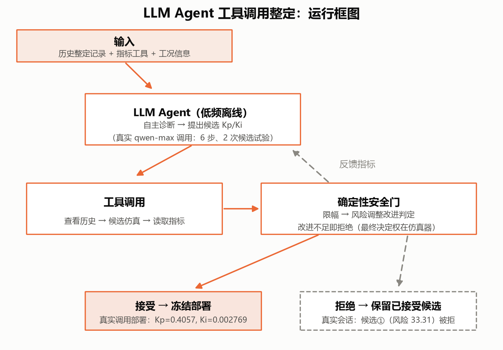
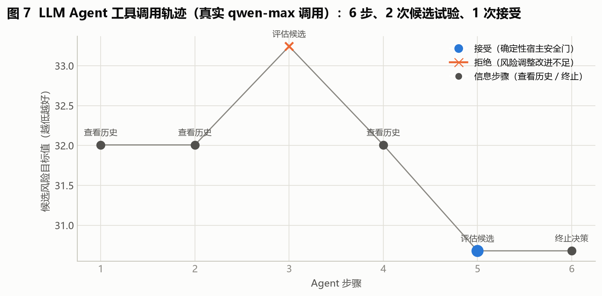
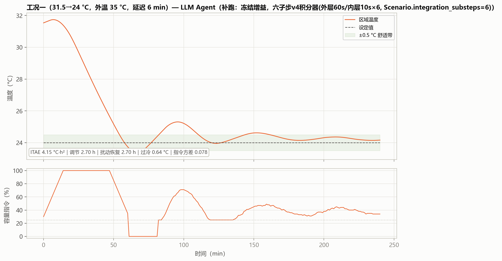
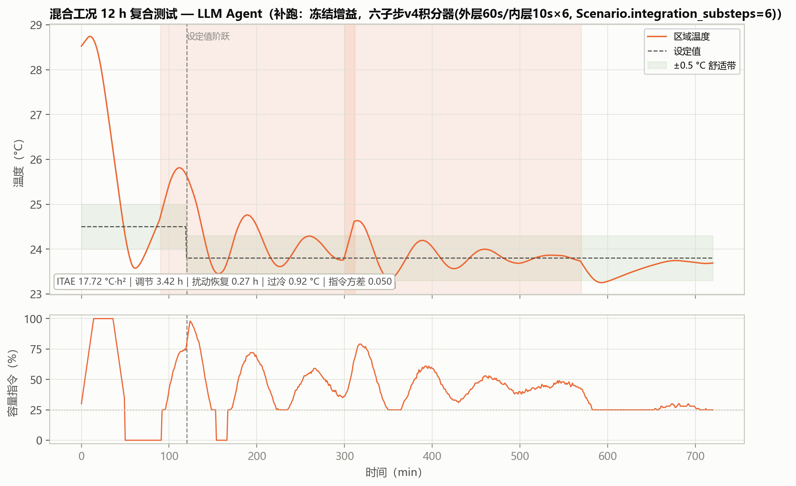

# 10 LLM Agent：让模型提出建议，让程序负责验收

> **本篇目标**：先跑 replay，再理解真实调用、工具轨迹、预算与安全门。
> **你需要**：第 05 篇的 IMC 基线（建议的起点）、第 03 篇的回退规则。
> **你会得到**：工具调用轨迹、候选接受/拒绝记录、冻结增益（若被采用）。
> **运行方式**：快速体验 `python run.py llm-agent --provider replay`（零费用）/ 真实调用见正文（付费）。
> **版本依据**：矩阵 `artifacts/runs/v4-20260906-8ac9bf4/llm_matrix_v4`（18 次真实调用）+ 走读 `qwen-max_std_r72`。

---

## 这次要解决什么问题

前面所有方法都是数值搜索，能不能让大模型像工程师助手一样"看看历史、提个建议"？可以，但有个底线：模型只给建议，用不用由程序说了算。本篇先跑免费的 replay，再看真实调用长什么样。

## 开始前准备什么

- 前置章节：第 05 篇（基线增益与指标从哪来）。
- 输入数据：历史整定记录、候选仿真工具、指标工具；不需要 FOPDT 显式参数（基线本身源自 IMC 链）。
- 预计资源：replay 零费用；真实调用每次约 5–25 s + API 费用，key 放 `.env`（`DASHSCOPE_API_KEY`），未配置自动切启发式（只能验链路，不能当证据）。

## 先跑一个最小实验

在哪执行 → 项目根目录。执行什么 → 离线 replay：

```bash
python run.py llm-agent --provider replay --output outputs_llm_replay
```

读哪些输入 → 基线状态 + 工具集。生成哪些文件 → `llm_agent_trace.csv`（每一步工具调用）、`llm_agent_summary.json`（部署增益）。怎样判断成功 → 轨迹里出现 `inspect_history → evaluate_candidate → finish`，且每次候选都有宿主判定（接受/拒绝）。

真实调用（付费，按需）：

```bash
python run.py llm-agent --provider openai-compatible --model qwen-max --setpoint 24 --seed 72
```

模型每次输出可能不同，重复运行不保证得到同一组参数——这是预期行为，不是 bug。

## 刚才发生了什么

Agent 每步只输出一个工具调用：`inspect_history`（看历史）、`evaluate_candidate`（提交候选，请求仿真评估）、`finish`（结束）。候选先限幅（±10% + 增益界），再经重复仿真评估，只有确认优于当前参数才采用。v4 走读（`qwen-max_std_r72`，6 步/2 次试验/1 次接受）：连看 3 次历史 → 候选①增大增益（风险 59.49→60.85，−2.30%）被拒 → 候选②减小到 0.4657/0.003648（恰为基线×0.90，用满单步幅度）改善 +1.05% 被采用 → 主动结束（"预算仅剩 1 次，不值得再冒险"）。

## 跟着代码走一遍

- 循环：`hvac_pid/advanced_tuning.py:LLMAgentAutoTuner`——预算、限幅、评估、接受/拒绝、最终复核全在宿主侧。
- 调用：`advanced_tuning.py:OpenAICompatibleChatProposer`——百炼 `/chat/completions` 端点（本次 qwen-max），另有 Responses/Ollama/Replay/启发式 provider。
- 轨迹：`llm_agent_trace.csv` 的 `reason` 字段记录模型自述，可审计——这是纯数值搜索没有的东西。

## 结果应该怎么看



> **看哪里**：模型 → 候选 → 仿真评估 → 宿主判定的单向箭头（没有模型直达部署的线）。
> **发生了什么**：做决定的是宿主，不是模型。
> **这说明什么**：工具白名单、试验预算、±10%、仿真门和 IMC 回退共同构成"模型可以错、系统不能错"的结构。



> **看哪里**：横轴步骤 1–6，纵轴候选风险目标；蓝点接受、橙×拒绝、灰点信息步骤。
> **发生了什么**：橙×之后下一点落回 59.49（拒绝不改变当前参数）；第 5 步换方向后通过。
> **这说明什么**：改善仅 1.05%，定位是小幅微调，不应期待全局最优。v3 走读（基线 0.4508→0.4057/0.002769，+4.15%）基线不同，总分不可跨批比较。



> **看哪里**：v4 参数（0.4657）在三工况的调节与过冷（另两图 `fig_case2_llm.png`、`fig_case3_llm.png`）。
> **发生了什么**：工况二/三调节到窗口边界（5.00/6.00 h 未收敛），过冷超 1 °C；不如 v3 那组（0.4057）。
> **这说明什么**：采用标准是在调试工况分布下综合更优，不是这三类更高——同路线两次采样优劣不同，正是输出不稳定的直接证据，所以必须看分布。



> **看哪里**：复合工况目标 71.61 与恢复 0.27 h。
> **发生了什么**：不如 v3 那组（65.89），差在 ITAE 与过冷。
> **这说明什么**：单组参数排名没有意义（17/18 提议未通过）；正确理解是"低频顾问+过滤使用是安全的"，而不是"LLM 比 RL 会控制"。

## 改一个参数试试看

假设"预算管着胆量"：把 `max_trials` 从 3 改成 6，重跑 replay，观察接受次数是否增加、最终增益是否走得更远。如果变化不大，说明瓶颈在"候选质量"而不在"试验次数"——加预算不如换模型或改提示。

## 如何确认复现成功

文件检查：轨迹 CSV 非空，`summary.json` 有部署增益。数值容差：replay 确定性一致；真实调用只要求"轨迹完整、约束满足"，不要求相同建议。行为检查：18 次均未越界、零失控；v4 矩阵 1/18 采用、3 个 hard_r73 基线本身不稳定（`fallback_failed`，不是模型异常）。常见异常：把启发式 dry-run 当 LLM 证据——链路通不等于模型好用。

## 这次能得出什么结论

- 收益：零训练、接入成本最低、过程可审计、有保护。
- 代价：耗时费用高 1–2 量级；输出不稳定（v3 5/18、v4 1/18）；上限取决于模型。
- 适用条件：远程调试助手——低频、离线、只给建议；规模化前多跑几批看分布。
- 未证明的部分：模型间显著性比较——36 次尚不足；效果上限未知。

## 附录：本篇数据溯源

| 数据产物（仓库内路径） | 内容 | 支撑本篇何处 |
|---|---|---|
| `artifacts/runs/v4-20260906-8ac9bf4/llm_matrix_v4/` | 18 次运行目录 + 汇总 + 墙钟 | 分布与耗时 |
| `artifacts/runs/v4-20260906-8ac9bf4/llm_matrix_v4/qwen-max_std_r72/` | 走读 4 文件 | 轨迹 |
| `分报告/data/supplement_metrics.json` | 冻结增益补跑指标（v4 0.4657；v3 旧值见 git 历史） | 工况表 |

| 代码位置 | 作用 |
|---|---|
| `hvac_pid/advanced_tuning.py:LLMAgentAutoTuner` | 宿主循环与安全检查 |
| `hvac_pid/advanced_tuning.py:OpenAICompatibleChatProposer` | 百炼调用 |
