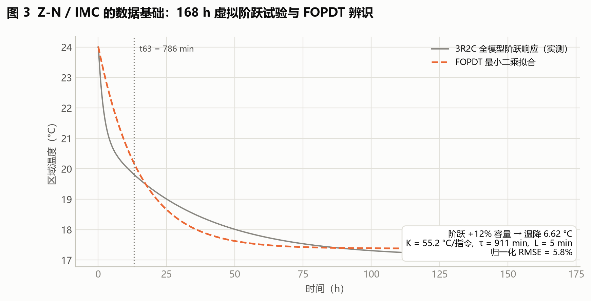
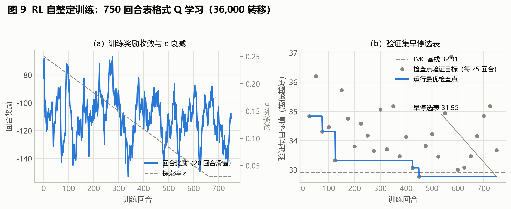
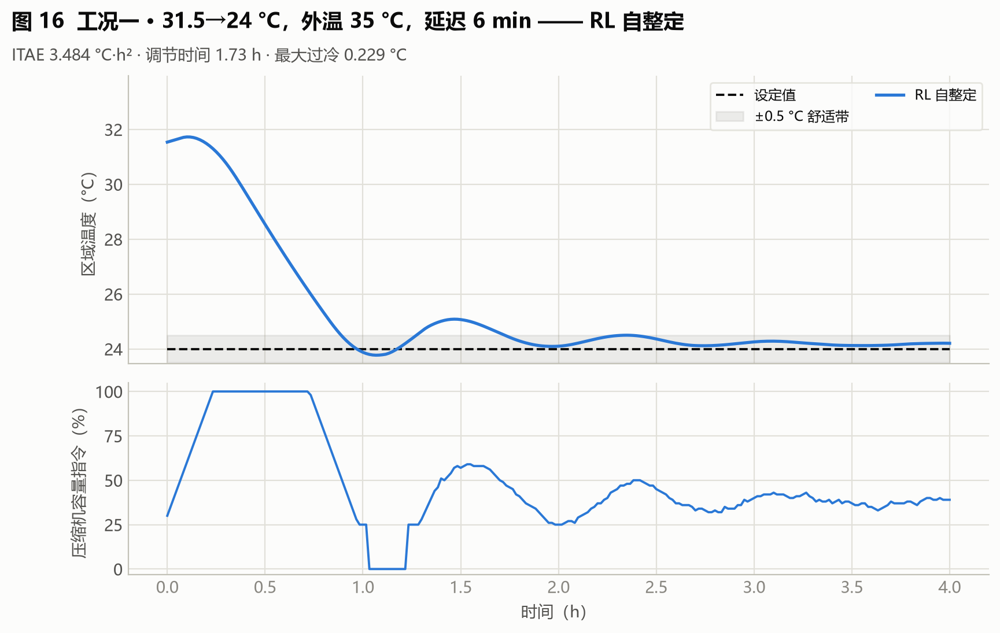

# AI-PI 整定实验报告

**项目**：变频精密/机柜空调 AI-PI 自动整定演示（`hvac-ai-pid-demo`）
**日期**：2026-09-02（2026-09-03 更新：LLM Agent 章节改用真实 API 调用结果）
**定位**：本报告为"逐算法详解版"，按《实验报告生成.md》大纲撰写；结论导向的综述见《实验报告_AI自动整定.md》，两者互补。
**数据来源**：`archive/outputs_review_v3/`（封存 v3 验收证据）、`archive/outputs_tuning_benchmark/`（耗时基准）、`archive/outputs_advanced_quick/`（安全 BO / LLM 高级整定）、`archive/outputs_embedded_demo/`（七算法统一演示，2026-09-03 起含 LLM 真实调用）、`archive/outputs_llm_agent_bailian/`（LLM Agent 独立真实调用会话）、`archive/outputs_advanced_bailian/`（LLM 监督整定真实调用基准）、`docs/ALGORITHM_GUIDE.md`。图 1–2、10–11 由 `reports/make_figures.py` 生成，图 3–9 由 `reports/make_tuning_figures.py` 生成，图 12–27 由 `reports/make_case_figures.py` 生成。
**诚信声明**：全部结论限于仿真与 SIL 层，真机验收未开始；LLM Agent 结果为真实 API 调用（阿里云百炼 qwen-max，单批次、样本量小，见 4.6 与第 8 章）；等效对象时间为估算口径。凡属估算的数值均标注"（估算）"。

---

## 1 实验概述

### 1.1 实验目的

在变频精密/机柜空调（HVAC）送风温度闭环的仿真环境中，对比 7 种 PI 参数整定方法，回答三个工程问题：

1. **参数从哪来**——每种算法的整定方式（人工公式 / 离线自动搜索 / 在线自整定）；
2. **要多久**——整定/训练耗时（PC 墙钟时间与等效对象时间双口径）；
3. **效果如何**——在密封测试工况与典型工况下的控制性能。

### 1.2 被控对象与报告范围

- 被控对象：单区机柜空调送风温度，3R2C 集中参数热模型 + 纯延迟 + 一阶执行器滞后（第 2 章）。
- 控制回路：100 ms PI 内环 + 2 s AI 增益调度层（第 3 章）。
- 范围边界：仿真与 SIL 验证；真机（10 min 串口验收、实测 WCET、HIL）未开始，见第 8 章。

### 1.3 核心术语表

| 术语 | 定义 |
|---|---|
| 自整定（self-tuning） | 投运后控制器**运行中在线**修正自身参数（本项目：FNN / RL，每 2 s 一次） |
| 自动整定（auto-tuning） | **投运前**由算法在仿真/安全约束下离线完成一次参数搜索（本项目：IMC-λ、贝叶斯 BO、安全 BO、LLM Agent） |
| 非自整定 | 由人工经验公式一次算出并冻结（本项目：Z-N 反应曲线法） |
| FOPDT | 一阶惯性 + 纯延迟近似模型 $G(s) = K e^{-Ls}/(\tau s + 1)$，由 3R2C 阶跃响应辨识得到 |
| holdout（留出测试） | 训练与调参全程不许使用、算法冻结后才"开封"考核的工况集，防止算法"背题"导致成绩虚高。本项目两道密封线：① 数据集划分出的 16 个测试场景；② 另用 5 个验收种子各生成 16 个全新场景（5×16 = 80 个封存验收场景，只考一次取平均，压掉运气成分），结果见 `deployment_acceptance.csv` |
| objective（目标值） | 全项目统一的多指标加权综合指标（定义见 5.2 节），越低越好 |

---

## 2 被控对象与实验条件（对应原始需求 ①）

被控对象为单区机柜空调送风温度：**3R2C 集中参数热模型（两热容 + 三热阻）串联纯延迟与一阶执行器滞后**，实现于 `hvac_pid/plant.py`，物理参考模型为 OpenModelica `PrecisionCabinetCooling.mo`（62 条方程）。名义参数：区域热容 1.8×10⁶ J/K、围护热容 1.2×10⁷ J/K、最大制冷量 7000 W（场景随机 4500–10500 W）、纯延迟 5 min（随机 2–12 min）、仿真步长 1 min。状态方程组与完整参数表见附录 D.1。

执行器与传感器施加六条变频空调标准约束，**所有算法在完全相同的约束下运行**以保证公平：最小制冷容量 25%、指令量化 1%、变频斜率 5 个百分点/min（刻意偏保守）、最短运行 5 min / 最短停机 3 min 驻留、纯延迟 + 一阶惯性、测量噪声 σ=0.04 °C 加滤波。逐条取值与工程依据见附录 D.2。这组约束是后文"AI 层必须限幅 + 回退"的直接原因（第 3.1 节）。

Z-N 与 IMC 整定所需的 FOPDT 代理模型由 168 h 加速虚拟阶跃试验辨识（有界最小二乘拟合增益、时间常数与延迟，三标准工况归一化 RMSE ≈ 12%），辨识过程与整定公式见附录 D.3–D.4。模型可信度经数值 / 降阶 / 物理三层交叉验证，策略导出经 75 条 Py/C++ 一致性校验（最大误差 2.98×10⁻⁸），见附录 D.5。

---

## 3 控制系统架构与框图（对应原始需求 ②）

### 3.1 分层控制架构

系统采用"**快内环 + 慢调度**"两层结构：

- **内环（100 ms 周期）**：PI 基础控制器

$$e = T_z - T_{sp}, \qquad I \leftarrow I + e\, \Delta t, \qquad u = \mathrm{clamp}(K_p\, e + K_i\, I,\ 0,\ 1)$$

采用**条件积分抗饱和**：输出已饱和且误差继续推向饱和方向时不更新积分项，避免长时间 100% 制冷后积分累积导致严重过冷。
- **外环（2 s 周期，AI 增益调度层）**：FNN/RL 只调整 $K_p$/$K_i$，不直接控制压缩机。四层安全保护：① AI 每 2 s 才更新一次，把 PI 留给 100 ms 执行；② 增益界 $K_p \in [0.002,\ 1.5]$、$K_i \in [10^{-5},\ 0.08]$；③ 单次增益变化不超过当前值的 25%；④ 输入/模型异常时立即恢复 IMC 的 `fallback_gains`。

这样分层的原因：第 2 章的执行器约束（附录 D.2）决定了控制量必须缓慢、受限地变化；AI 推理有微秒~毫秒级时延；限幅 + 回退保证任何 AI 失效情形下系统退化为已验证的 IMC 闭环。

### 3.2 系统结构框图


信号流：设定值 Tsp 与测量温度 Tz 求误差 e → PI 内环（Kp/Ki 由 AI 调度层修正，限幅 ±10~25%）→ 容量指令 u → 执行器约束环节（量化/斜率/驻留/延迟/滞后）→ 3R2C 对象 → 传感器噪声与滤波 → 反馈。

### 3.3 实验流程框图


流程：场景数据集划分（48/16/16）→ 各算法整定/训练 → 统一闭环仿真 → 指标计算 → 部署验收门判定 → 封存对比。

---

## 4 算法逐一说明（对应原始需求 ③）

### 4.1 七算法总览对比表

| 算法 | 整定方式 | 在线? | 输入 | 输出 | 整定/训练耗时 | 80 场景 holdout |
|---|---|---|---|---|---|---:|
| Z-N 反应曲线法 | 人工经验公式 | 否 | FOPDT 的 K/L/τ | 固定 Kp, Ti | 0.163 s / 等效 168 h | 58.19 |
| IMC-λ | 离线自动整定（λ 扫描） | 否 | FOPDT + λ | 固定 Kp, Ti | 3.03 s / 等效 1008 h | 39.53 |
| 贝叶斯 BO | 离线自动整定（GP+EI） | 否 | 工况 + 目标函数 | 固定 Kp/Ki | 1.42 s / 等效 528 h | 39.72 |
| 风险感知安全 BO | 离线自动整定（RaGoOSE 式） | 否 | 同上 + 风险项 | 固定 Kp/Ki | 1.41 s（7 次评估） | 33.58（风险目标，见 6.2） |
| LLM Agent | 离线自动整定（工具调用） | 否 | 工况信息 + 指标工具 | Kp/Ki 修正决策 | 真实调用 30.4 s（监督式基准口径） | 见 6.3 |
| FNN 自整定 | 在线自整定 | **是**（每 2 s） | e, ė（模糊化） | Kp/Ki 增益 | 训练 7.65 s / 等效 4181 h | 39.26（PASSED） |
| RL 自整定 | 在线自整定 | **是**（每 2 s） | 热状态 + 容量模式 | 相对 IMC 的增益目标 | 训练 16.22 s / 等效 4018 h | **37.61（最优）** |

> 耗时列来自 `archive/outputs_tuning_benchmark/tuning_runtime_report.md`（基准问题：31.5→24 °C、7600 W、延迟 6 min、8 个离线工况）；holdout 列来自 v3 封存验收。安全 BO 的 33.58 为高级整定基准（`archive/outputs_advanced_quick/`）上的**风险目标**，与 80 场景基准非同一口径，不可直接混比。

以下每小节按统一模板展开：a) 输入量 b) 输出量 c) 是否自整定/能否自动整定 d) 整定预估耗时 e) 各工况下的表现 f) 所需数据/训练方法/训练时间 g) 安全性与回退机制。

### 4.2 Z-N 反应曲线法

- **a) 输入量**：FOPDT 辨识结果 (K, τ, L)（辨识过程见附录 D.3）。
- **b) 输出量**：一组固定 Kp/Ti（本次基准 Kp=0.4508、Ki=0.003077）。
- **c) 整定方式**：**非自整定、非自动整定**——人工依据经验公式代入计算，投运前一次完成并冻结。
- **d) 整定预估耗时**：公式计算 PC 实测 0.163 s；但**安全对象辨识采数需等效 168 对象小时**——公式本身免费，贵的是阶跃试验。
- **e) 各工况表现**：三标准工况 ITAE 7.05–18.75（全部算法中最差），最大过冷 1.46–2.21 °C、容量指令方差 0.15–0.20（波动最大）；80 场景 holdout 58.19，明显偏振荡（宽工况下延迟敏感）。
- **f) 所需数据/方法/时间**：仅需一个稳定工况的阶跃响应数据（168 h 虚拟阶跃）；无训练过程。
- **g) 安全性**：最终 `np.clip` 限幅属工程安全限制而非 Z-N 原公式；ESP32 演示中该候选被可见验收门拒绝、部署 IMC 回退（见 6.3）。



图 3：Z-N 与 IMC 共同的输入来源——168 h 阶跃响应（灰实线）与 FOPDT 拟合（橙虚线）。围护结构热容造成的长尾是单时间常数近似的固有误差来源（本工况归一化 RMSE 5.8%）。

### 4.3 IMC-λ（内模控制）

- **a) 输入量**：FOPDT 参数 (K, τ, L) + 闭环时间常数 λ。
- **b) 输出量**：固定 Kp/Ti；保守回退值取 $\lambda = \max(\tau/3,\ 3L,\ 12\ \mathrm{min})$。
- **c) 整定方式**：**自动整定（离线）**——λ 只在训练集上扫描（21 个候选，0.88 s），验证/测试集冻结；保守公式值保留作故障回退。
- **d) 整定预估耗时**：PC 3.03 s（含 λ 扫描）；等效对象时间 1008 h（辨识 168 h/工况 × 多工况 + 候选评估）。
- **e) 各工况表现**：三标准工况 ITAE 3.89–15.63，过冷 0.68–1.20 °C，全部工况稳定；80 场景 holdout 39.53。稳健但为单组固定增益，无法随工况自适应。
- **f) 所需数据/方法/时间**：FOPDT 模型 + 训练工况闭环仿真（`imc_lambda_tuning.csv`、`classical_tuning_history.csv`）；无迭代训练。
- **g) 安全性**：本项目全部 AI 方法的**回退基准**——AI 越界或异常时恢复到 IMC 增益。


图 4：λ 扫描曲线——21 个候选中训练集平均目标在 λ*=26.9 min 处取最小值（蓝圈）；保守公式回退值 303.7 min（橙叉）的目标值高出近 6 倍——这直接回答了"IMC 是结构不合适还是 λ 没选对"：主要是 λ 没选对。

### 4.4 贝叶斯 BO（固定增益）

- **a) 输入量**：log(Kp)、log(Ki) 候选点 → 每个候选在多训练工况上跑完整闭环仿真并计算综合目标 J（对数空间处理 Ki 跨数量级问题）。
- **b) 输出量**：一套**全局固定** Kp/Ki（v3 基准 Kp=0.6093、Ki=0.001754；高级整定基准 0.5882/0.005271）。
- **c) 整定方式**：**自动整定（离线搜索）**——Matérn-5/2 高斯过程近似"增益→J"，EI（期望改进）选点，IMC/Z-N/随机点初始化；运行时零学习负担。
- **d) 整定预估耗时**：PC 1.42 s（10 次评估）；等效对象时间 528 h。
- **e) 各工况表现**：三标准工况 ITAE 3.67–15.29（场景 1 略优于 IMC，场景 3 与 IMC 持平）；80 场景 holdout 39.72，与 IMC 39.53 相当——单组固定增益已接近其上限。
- **f) 所需数据/方法/时间**：多工况闭环仿真 + 目标函数值；无训练标签。搜索历史见 `bayesian_search_history.csv` / `bayesian_search_trace.png`。
- **g) 安全性**：离线搜索，部署后不探索；目标函数对不稳定/越界轨迹施加 1e6 大惩罚。


图 5：BO 搜索轨迹——7 个初始化点（灰）之后 EI 迭代（橙圈）迅速把目标值从 ~242 压到 33 附近并收敛；搜索只发生在离线训练工况上，部署后不再探索。

### 4.5 风险感知安全 BO（RaGoOSE 式）

- **a) 输入量**：候选 Kp/Ki + 每候选每场景重复噪声仿真（2 次）。
- **b) 输出量**：固定 Kp/Ki（0.3838/0.004441）。
- **c) 整定方式**：**自动整定（离线）**——在性能均值之外惩罚噪声方差，风险目标定义为 $\bar{J} + 0.75\, \sigma_J$（$\bar{J}$ 为样本均值、$\sigma_J$ 为样本标准差）；$\beta = 2$ 安全 GP 抑制危险试验点。
- **d) 整定预估耗时**：PC 1.41 s（7 次评估，`tuning_wall_time.csv`）。
- **e) 各工况表现**：独立留出集（4 场景）风险目标 **33.58，为该基准最优**——优于启发式 34.18、IMC 36.29、普通 BO 37.96；mean_objective 33.58 且 objective_std 20.93 显著小于普通 BO 的 29.18（更稳）。七算法统一演示中综合目标 43.23 亦为七者最优，开门扰动恢复 25 min 次快。
- **f) 所需数据/方法/时间**：7 训练 + 4 留出场景的重复噪声仿真；安全条件：稳定、斜率无违规、无最低运行频率违规、最大冷偏差 ≤4.0 °C、调参风险分不超过 IMC 基线 1.25 倍。历史见 `safe_bo_history.csv`。
- **g) 安全性**：安全条件内建于搜索目标；安全裕量逐候选记录（预测/实测）。


图 6：安全 BO 的 7 次候选评估——误差棒为跨工况标准差，风险目标（均值 + 0.75σ）引导搜索主动避开高方差候选。

### 4.6 LLM Agent（工具调用整定）

- **a) 输入量**：Agent 自主选择工具——查看历史、运行候选仿真、读取指标；本真实会话（qwen-max）6 步、2 次候选试验。
- **b) 输出量**：候选 Kp/Ki 建议（原始建议 → 安全限幅 → 接受/拒绝决策）。
- **c) 整定方式**：**自动整定（离线）**——低频离线诊断与候选生成；**仿真器、安全约束和回退 PI 拥有最终决定权**。
- **d) 整定耗时（实测）**：监督式基准（`archive/outputs_advanced_bailian/tuning_wall_time.csv`）3 轮 / 4 次评估含 API 往返共 **30.4 s**（约 7.6 s/次调用），比经典方法（0.7–0.9 s）高 1–2 个数量级。
- **e) 各工况表现（真实 qwen-max 调用）**：七算法演示会话 6 步——查看历史 ×2 → 候选①（增大 Kp/Ki，风险 33.31）被拒 → 查看历史 → 候选②（小幅减小 Kp/Ki 至 0.4057/0.00277，风险目标 32.01→30.68，改善 4.1%）**被确定性安全门接受并部署** → 主动 finish（模型自述"已有改善且仅剩一次试验，不值得再冒险"）。演示综合目标 45.04、开门恢复 38 min（次快）、过冷 0.81 °C（全算法最小）。另一独立会话（`archive/outputs_llm_agent_bailian/`）中模型两个候选均被安全门拒绝、系统回退 IMC（46.07）——模型输出非确定，但两次会话均无越界、零失控，回退机制按设计生效。
- **f) 所需数据/方法/时间**：工具调用框架（OpenAI Responses / OpenAI 兼容（百炼）/ Ollama / Replay / 启发式 provider）；本次实验为百炼 `qwen-max`，`/chat/completions` 端点，密钥经 `.env` 注入；启发式 dry-run 只验证安全流水线，**不能作为 LLM 效果证据**。
- **g) 安全性**：每条建议经安全门限幅（硬边界 + ±10% 信赖域），风险调整改进不足即拒绝，全程可回退 IMC；轨迹完整记录于 `llm_agent_trace.csv` / `llm_tuning_history.csv`。


图 7：真实调用轨迹逐步展开——查看历史（基线 32.0）→ 候选①（增大 Kp/Ki）风险 33.31 被拒 → 查看历史 → 候选②（小幅减小 Kp/Ki）风险 30.68 被确定性安全门接受 → 主动 finish 并部署已接受候选。

### 4.7 FNN 在线自整定（5×5 TSK 规则面）

- **a) 输入量**：误差 $e = T_z - T_{sp}$（中心点 [−3, −0.75, 0, 1.5, 5] °C）与误差变化率 $\dot{e} = \Delta e / \Delta t$（中心点 [−0.30, −0.05, 0, 0.05, 0.30] °C/min）——用变化率而非增量，使 PC 5 min 训练节拍与 MCU 秒级节拍物理含义一致。
- **b) 输出量**：Kp(t)/Ki(t)——25 条规则中每次仅 4 条相邻规则非零激活，加权平均得到增益，再经公共限幅与变化率限制。
- **c) 整定方式**：**在线自整定**——投运后每 2 s 根据当前 (e, ė) 查规则表调整增益。
- **d) 整定预估耗时**：训练 PC 7.65 s；等效对象时间 4181 h（标签来自每工况完整 BO 搜索）；在线推理 78.2 µs/次。
- **e) 各工况表现**：三标准工况 ITAE 3.63–15.29，与 BO 相当、场景 1 略优；80 场景 holdout 39.26，**相对 IMC 比值 0.9979（95% 上界 1.0067），通过部署验收门**；规则覆盖率 100%。注意：ESP32 七算法演示中该 FNN 候选未通过可见验收门，以影子模式运行并回退 IMC（与 v3 封存验收为不同批次运行，见第 8 章）。
- **f) 所需数据/方法/训练时间**：4464 样本（48 场景的 BO 最优增益标签）→ 按 (e, ė) 模糊格学习 25 个规则后件（`fnn_rule_table.npy`）；内部验证集选择 IMC 先验权重；log-RMSE 1.41→1.059，训练 7.65 s。
- **g) 安全性与回退**：覆盖率 <80% 或平均目标劣于 IMC 时拒绝候选表、自动写 IMC 回退表（候选存 `fnn_rule_table_candidate.npy` 供审计）；增益变化限 25%/次；异常恢复 IMC。


图 8：FNN 训练过程——（a）log-RMSE 随训练工况数先降后升，反映多工况标签冲突（见第 8 章局限性）；（b）规则覆盖率很快达到并维持 100%，远高于 80% 验收门下限。

### 4.8 RL 在线自整定（表格式 Q 学习）

- **a) 输入量**：状态 $s = \mathrm{bin}(e, 5) \times \mathrm{bin}(\dot{e}, 5)$ 的 25 个热状态 × $\mathrm{bin}(u_{prev}, 3)$（上次实际容量指令 3 档）；仅统计物理轨迹真实到达的状态（不伪造覆盖）。
- **b) 输出量**：9 个动作之一——**相对 IMC 的绝对 Kp/Ki 目标比例**（修复旧版增益递归相乘的非马尔可夫问题）→ 经同一 ±10% 安全变化层。
- **c) 整定方式**：**在线自整定**——投运后每 2 s 状态分箱 → 屏蔽不安全动作 → argmax(Q) → 增益目标；**训练全部在虚拟对象完成，真机只查冻结策略、不做随机探索**。
- **d) 整定预估耗时**：训练 PC 16.22 s（750 回合、每回合最长 240 min、每 5 min 决策、36,000 转移 / 180,000 环境步）；等效对象时间 4018 h；在线推理 88.0 µs/次。
- **e) 各工况表现**：三标准工况全面领先或并列领先：场景 1 ITAE 3.484（最优）、调节时间 1.733 h（其他算法 2.5 h）、最大过冷 0.229 °C（次优者 0.68–1.46）；80 场景 holdout **37.61，全场最优**（次序：RL 37.61 < FNN 39.26 ≈ IMC 39.53 ≈ BO 39.72 < Z-N 58.19）；相对 IMC 比值 0.9595（上界 0.9743）**PASSED**；开门扰动恢复 24 min 为七算法最快。
- **f) 所需数据/方法/训练时间**：奖励函数与 Q 更新分别为

$$r = \mathrm{mean}_{interval}\left[ -|e| - 1.5\, v_{c} - 0.08\, |\Delta u| - 0.02\, u \right] - 0.08\, |\Delta g| - 0.015\, |s_{target} - 1|$$

$$Q(s, a) \leftarrow Q(s, a) + \alpha \left[ r + \gamma \max_{a'} Q(s', a') - Q(s, a) \right]$$

其中 $v_c$ 为舒适带超限度时、$\Delta g$ 为实际增益变化、$s_{target}$ 为相对 IMC 的增益目标比例。$\varepsilon$ 由 0.25 衰减至 0.03；验证集早停锁定最佳检查点（32.77，种子系列 50_000），最终部署表由 SPIBB 风格策略族选择在同种子（40_000 系列）对比中产出（31.95 vs IMC 基线 32.91，选中的是保守 bootstrap，详见 4.8.3"自己动手验证"）；产物 `rl_q_table.npy`（675 项）。
- **g) 安全性与回退**：训练期若平均目标比 IMC 差 2% 以上或 25 热状态覆盖 <80%，整张策略拒绝部署并回退 IMC；不安全动作在线屏蔽；回退率 0.19%。

#### 4.8.1 状态、动作、奖励：本任务的三要素声明

**状态 $s$**（75 格 = 5×5×3，分箱边界实现于 `ai_controllers.py` 的 `IncrementalRLController`）：

| 维度 | 分箱边界 | 5 档含义 |
|---|---|---|
| 误差 $e = T_z - T_{sp}$（°C） | $[-2.0,\ -0.5,\ 0.5,\ 2.0]$ | 档 0：严重偏冷（$e<-2$）；档 1：偏冷（$-2\sim-0.5$）；档 2：带内（$\pm0.5$）；档 3：偏热（$0.5\sim2$）；档 4：严重偏热（$e>2$） |
| 误差变化率 $\dot{e}$（°C/min） | $[-0.15,\ -0.03,\ 0.03,\ 0.15]$ | 档 0/1：快速/缓慢变冷；档 2：基本平稳；档 3/4：缓慢/快速变热 |
| 上次实际容量指令 $u_{prev}$ | $[0.05,\ 0.70]$ | 档 0：停机（≤5%）；档 1：部分负荷（5%~70%）；档 2：高负荷（>70%） |

第三个维度 $u_{prev}$ 的作用：同样的误差出现在"刚停机"和"高负荷运行中"意味着完全不同的热惯性，该维度让策略能区分这两种情形（第 09 篇分报告中"混合工况 1 次回退"的归因即与此有关）。

**动作 $a$**（9 档，均为**相对 IMC 基准的绝对目标比例**，不是增量）：

| | Ki 目标 0.75× | Ki 目标 1.00× | Ki 目标 1.30× |
|---|---|---|---|
| **Kp 目标 0.75×** | 动作 0 | 动作 1 | 动作 2 |
| **Kp 目标 1.00×** | 动作 3 | **动作 4（保持 IMC）** | 动作 5 |
| **Kp 目标 1.30×** | 动作 6 | 动作 7 | 动作 8 |

目标增益经 ±10% 信任域钳制后生效（见 4.8.3 现象 ②）。

**动作安全屏蔽**（`_allowed_actions`，探索与贪心同样受限）：

| 误差档位 | 允许的动作 | 工程理由 |
|---|---|---|
| 档 0–1（偏冷） | 仅 {0, 1, 3, 4}（Kp、Ki 均不得高于基准） | 单向制冷执行器在偏冷状态升增益无益，只会让下次启动更猛 |
| 档 2（带内） | {0, 1, 2, 3, 4, 6, 7}（屏蔽升 Ki 档） | 带内升积分增益易引发积分饱和/过冷 |
| 档 3–4（偏热） | 全部 9 档 | 需要全力降温，放开全部选择 |

**奖励 $r$**（4.8 f) 公式逐项含义）：

| 项 | 权重 | 物理含义 |
|---|---|---|
| $-|e|$（区间均值） | 1 | 跟踪误差 |
| $-1.5\, v_c$ | 1.5 | 舒适带（±0.5 °C）外超限的惩罚 |
| $-0.08\, |\Delta u|$ | 0.08 | 容量指令平稳性（保护压缩机） |
| $-0.02\, u$ | 0.02 | 能耗代理 |
| $-0.08\, |\Delta g|$ | 0.08 | 实际增益变化量（对数幅度，惩罚"乱调"） |
| $-0.015\, |s_{target}-1|$ | 0.015 | 偏离 IMC 基准的正则项——没有充分证据就不许偏离基准 |

#### 4.8.2 为什么选 Value-Based 表格式 Q 学习，而不是 Policy-Based

- **动作空间小且离散（9 档），表格法表达力足够**。675 项 Q 表可以整表打印、逐项审计、直接导出到 MCU（在线推理 88 µs、零依赖）；策略网络则是一个无法逐项检查的黑箱。
- **值方法与安全屏蔽天然组合**：先按误差档位屏蔽不安全动作、再在白名单内取 argmax，策略永远落在工程许可集合内。Policy-Based 方法输出的是分布，需要额外的投影/约束机制才能保证不越界。
- **覆盖与回退依赖表格法特有概念**：覆盖掩码显式记录"哪些状态被物理轨迹真实到达过"，未覆盖状态回退 IMC。神经策略没有天然的"见过/没见过"边界，无法支撑这一安全设计。
- **样本效率与训练成本**：off-policy 单步 TD 更新使每条转移都直接改进 Q 表；纯 CPU 16.22 s 训完全部 750 回合，无梯度框架、无 GPU。
- **Policy-Based 的适用场景**是连续动作、高维状态或需要随机策略探索的问题。本项目状态 75 格、动作 9 档，均在表格法的舒适区内。
- **建议**：若未来需要连续增益目标，优先**加密动作网格仍保持表格式**（如 5×5 动作）；仅当状态维度显著扩展（如加入湿度、多区耦合）再考虑小型策略网络，且必须重建安全屏蔽、覆盖判定与部署链，重新通过全部验收门。

#### 4.8.3 一次 rollout 走查（worked example）

**数据来源**：`archive/outputs_review_v3/rl_training_transitions.csv` 第 1 回合（训练场景 #32，IMC 基准增益 Kp=0.5175、Ki=0.004054；该回合 ε=0.25）。下表全部 Q 值由 α=0.12、γ=0.94 对该回合 48 条转移逐行重放复核，与 CSV 的 `td_error` 列逐条一致。

**一句话直觉**：算法在虚拟房间里反复打 750 局，把"每个格子该把增益调到哪一档"记成一张表——先试错、后查表，仅此而已。

**走查前先核对一件事**：先手算第 1 步的奖励，给后面的程序值立一个检查标准。第 1 步误差从 −4.94 °C 升到 −4.67 °C，区间平均 |e| ≈ (4.94+4.67)/2 ≈ 4.80，此时压缩机尚未启动（出力≈0、指令几乎不变），奖励的主项为

$$-|e| - 1.5\times(|e|-0.5) \approx -4.80 - 1.5\times4.30 \approx -11.26$$

封存 CSV 里第 1 步的实际奖励是 **−11.24**。差的 0.02 来自"两点取平均"的线性近似与增益微调罚项（Ki 被 ±10% 信任域钳制，触发 0.08×增益变化与 0.015×偏离 IMC 两项，合计约 0.013）——手算和程序对上了，可以放心往下走。

**分箱：连续读数落进格子**。每次决策的第一步是把三个连续读数压成三个格子坐标（边界见 4.8.1），程序里只有一行：

```python
# hvac_pid/ai_controllers.py:600-601
def _bin(value: float, edges: np.ndarray) -> int:
    return int(np.searchsorted(edges, float(value), side="right"))
```

```python
# hvac_pid/ai_controllers.py:637-640 —— 每次决策先落格（在线 _propose；训练循环用同一套分箱）
def _propose(self, error_c, delta_error_c, *, applied_command=0.0, **_):
    e_bin = self._bin(error_c, self.error_edges)
    d_bin = self._bin(delta_error_c, self.delta_edges)
    command_bin = self._bin(applied_command, self.command_edges)
```

**更新公式**（即 4.8 f) 的 Q 更新，走查中反复用到）：

$$Q(s, a) \leftarrow Q(s, a) + \alpha \left[ r + \gamma \max_{a'} Q(s', a') - Q(s, a) \right]$$

**微型地图**（本回合 48 个决策落入的格子，数字为落入次数，• 表示未到访；行 = $\dot{e}$ 档，列 = $e$ 档）：

| $\dot{e}$ \ $e$ | 档 0 严重偏冷 | 档 1 偏冷 | 档 2 带内 | 档 3 偏热 | 档 4 严重偏热 |
|---|---|---|---|---|---|
| 档 0 快速变冷 | • | • | • | • | • |
| 档 1 缓慢变冷 | • | • | • | 2 | • |
| 档 2 基本平稳 | 1 | • | **23** | 4 | • |
| 档 3 缓慢变热 | 5 | 5 | 4 | 3 | • |
| 档 4 快速变热 | 1 | • | • | • | • |

地图读法：本回合是**冷启动工况**——房间从低于设定值 4.9 °C 开始（左下区域），压缩机基本不启动（前 15 步 $u_{prev}$ 档 0）、房间自然升温；冲过设定值进入偏热区（档 3）后压缩机转入部分负荷（$u_{prev}$ 档 1）把温度拉回，最终 48 步中 23 步停在"带内 + 平稳"那一格。

**逐步走查**（前 6 个决策；Q 值保留两位小数，"实际施加 Kp"体现 ±10% 信任域钳制）：

| 步 | 时刻 $e$ (°C) / $\dot{e}$ (°C/min) | 落格 $(e, \dot{e}, u)$ | 动作 | 目标 (Kp, Ki)×IMC | 实际施加 Kp | 奖励 $r$ | 下一格 | $Q(s,a)$ 前 → 后 |
|---|---|---|---|---|---|---|---|---|
| 1 | −4.94 / 0.00 | (0, 2, 0) | 3 | (1.00, 0.75) | 0.5175 | −11.24 | (0, 3, 0) | 0 → −1.35 |
| 2 | −4.67 / +0.05 | (0, 3, 0) | 0 | (0.75, 0.75) | 0.4657 | −10.39 | (0, 3, 0) | 0 → −1.25 |
| 3 | −4.31 / +0.07 | (0, 3, 0) | 1 | (0.75, 1.00) | 0.4192 | −9.51 | (0, 3, 0) | 0 → −1.14 |
| 4 | −3.96 / +0.07 | (0, 3, 0) | 4 | (1.00, 1.00) | 0.4611 | −8.63 | (0, 3, 0) | 1e−6 → −1.04 |
| 5 | −3.61 / +0.07 | (0, 3, 0) | 3 | (1.00, 0.75) | 0.5072 | −6.44 | (0, 4, 0) | 0 → −0.77 |
| 6 | −2.36 / +0.25 | (0, 4, 0) | 4 | (1.00, 1.00) | 0.5175 | −4.67 | (0, 3, 0) | 1e−6 → −0.65 |

**走查后点破三个关键现象**（读者未必自己看得出来，指着说）：

1. **Q 表从"抄奖励"开始，第 6 步起自举才生效**。Q 表初始化全 0（唯一例外：动作 4 预置 1e−6，保证没见过的状态默认"保持 IMC"）。于是第 1~5 步的 td_error 就是奖励本身（Q 前值为 0、下一格 max Q 也≈0），Q 值等于 0.12×奖励——纯粹的"抄分"。第 6 步第一次出现 td_error（−5.40）≠ 奖励（−4.67）：

   $$\text{td}_6 = -4.67 + 0.94 \times (-0.77) = -5.40$$

   差值 0.94×(−0.77) 里的 −0.77 正是**本回合第 5 步刚写入**的 Q[(0,3,0), 动作3]——第 6 步算 TD 目标时，max 恰好查到这个刚写进去的数。这就是"信息沿转移链一格一格往回传"：第 6 步还不知道第 7 步以后的任何事，它只知道下一步格子的当前估值（与价值迭代里 V₁(3,1)=−0.01 → V₂(3,1)=0.94 同构，一步更新只能传一格）。程序里就是这四行：

   ```python
   # hvac_pid/ai_controllers.py:783-786 —— TD 更新（末步目标只含奖励，无自举）
   next_allowed = IncrementalRLController._allowed_actions(next_state[0])
   target = reward if step == decisions - 1 else reward + gamma * np.max(q[next_state][next_allowed])
   td_error = float(target - q[state + (action,)])
   q[state + (action,)] += alpha * td_error
   ```
2. **动作是"目标"不是"命令"**。第 2 步选了"Kp 目标 0.75×IMC"（=0.388），但实际施加 0.4657——被 ±10% 信任域钳制，只能从当前值 0.5175 向目标迈一步（×0.90）。第 4 步改选"保持"后又被逐拉回（0.4611→0.5072→0.5175）。执行层永远看不到增益突变，这正是 3.1 节四层安全保护的第③层。程序里是两行 `np.clip`：

   ```python
   # hvac_pid/ai_controllers.py:746-751 —— 目标经 ±10% 信任域逐步逼近
   target_scale = IncrementalRLController._actions[action]
   old_kp, old_ki = controller.kp, controller.ki
   target_kp = fallback_gains[0] * target_scale[0]
   target_ki = fallback_gains[1] * target_scale[1]
   controller.kp = float(np.clip(target_kp, old_kp * 0.90, old_kp * 1.10))
   controller.ki = float(np.clip(target_ki, old_ki * 0.90, old_ki * 1.10))
   ```
3. **安全屏蔽先于探索**。本回合房间偏冷（$e$ 档 0），9 档动作只有 4 档可选（{0,1,3,4}）——上表 6 步的动作全部落在白名单内。注意第 1~3 步必然是 ε 随机探索（贪心只会选 Q=1e−6 的动作 4），但**随机也只能在白名单内随机**：探索永远出不了安全圈。另注意奖励恒为负、且从 −11.24 改善到带内后的约 −0.1——RL 学的不是"变好"而是"负得更少"。

**假设说明（α、γ、ε 取值）**：

| 参数 | 取值 | 为什么选这么小/这个值 |
|---|---|---|
| 学习率 $\alpha$ | 0.12 | 每步奖励混有场景随机性、传感器噪声（σ=0.04 °C）和 ε 探索动作的干扰，单条转移很"吵"。小步长相当于对同一 (s,a) 的约 1/α≈8 次近期更新做有效平均，防止单次噪声改写整张表。 |
| 折扣 $\gamma$ | 0.94 | 有效视野 1/(1−γ)≈16.7 次决策 ≈ 83 min，刻意短于 240 min（48 步）的整回合。奖励本身是逐区间（5 min）的局部度量，γ 折扣让 Q 集中回答"接下来约一个半小时能否把误差压下去"，回避长程 credit assignment，也让自举目标更稳。 |
| 探索率 $\varepsilon$ | 0.25 → 0.03（750 回合线性退火） | 前期多试（覆盖 75 格状态）、后期多利用（收敛到最优档），末值 0.03 保留少量探索防止过早锁死。 |

α、γ、ε 在 v3 封存运行中即取上述值并固定未再调优；表中"为什么"为与代码行为一致的工程解释，而非事后调参记录。

**自己动手验证**（三个不跑训练就能做的检查；数据全在封存文件里）：

1. **核对任意一步走查**——一行 pandas：`pd.read_csv("archive/outputs_review_v3/rl_training_transitions.csv")` 后过滤 `episode==1`，落格、动作、奖励与上表逐格一致。
2. **末步终端检查**——第 48 步是回合最后一个决策，回合结束后没有"下一步"，TD 目标只含奖励、不含自举项（上面代码的三元表达式）。CSV 第 48 步奖励 −0.2855、td −0.1747，倒推 Q 更新前值 = 目标 − td = −0.2855 − (−0.1747) = **−0.1108**：奖励恒负决定 Q 恒负，但该格是"好格子"，反复经过的更新已把它抬得比单步奖励温和。
3. **整表复现（诚实版本）**——用 α=0.12、γ=0.94 对全部 36000 条转移逐行重放（含末步终端处理）：36000 条 `td_error` **逐条一致（36000/36000）**，训练轨迹可由公开 CSV 完整重建。但重放到第 750 回合的"学到的 Q 表"与封存 `rl_q_table.npy` **并不相等**（最大差 54.6，argmax 仅 28% 一致）——原因不是复现失败，而是封存表本来就不是学到的表：`rl_q_table.npy` 与三行构造式逐元素精确相等（`boot[:,:,:,4]=1.0; boot[3:,:,:,2]=2.0`），即 SPIBB 风格策略族选择选中的保守 `baseline_bootstrap_hot_bin_3`（v3 与 v4 两次封存运行均如此，见 `rl_training_history.csv` 末行 `selected_policy_family`）。同种子（40_000 系列）可比的数字：bootstrap 31.95 < IMC 基线 32.91；上文"最佳检查点 32.77"来自另一个种子系列（50_000）的检查点评估，与 31.95 不可直接相减。代码注释写明了选择保守的理由：无约束 Q 表在稀疏长延时数据上常选出"同时大幅升增益"的冒险动作。

Q 值逐回合演化与贪心策略快照的可视化（含"学到的策略 vs 部署的保守策略"对照）见分报告第 09 篇图 9-1/9-2；本节不重复插图。



图 9：RL 训练过程——（a）回合奖励波动大（状态访问随机）但探索率 ε 按计划从 0.25 衰减到 0.03，训练奖励受 ε 探索与工况随机性污染、不能当收敛证据；（b）检查点验证目标（种子系列 50_000）逐步下降，约第 425 回合后低于 IMC 基线（32.91），早停锁定最佳检查点 32.77；最终部署值 31.95 则是策略族选择在同种子（40_000 系列）验证对比中选中的保守 bootstrap（见上文"自己动手验证"③）。

---

## 5 实验设置与验收协议

### 5.1 数据集划分与密封协议

- **场景数据集**：48 训练 / 16 验证 / 16 测试；制冷量 4500–10500 W、延迟 2–12 min 随机化；工况族 7 类（热启动/冷启动/设定值升阶跃/降阶跃/开门热脉冲/持续负荷/低温降阶跃，`hvac_pid/config.py` 的 `sample_adaptive_scenarios`）。逐场景 SHA-256 写入 `dataset_manifest.csv`，并执行数据泄漏/重复拒绝检查（缺陷 E2 闭环）。
- **封存验收**：5 个验收种子（101/211/307/401/503）× 16 场景 = **80 个封存验收场景**，结果封存于 `archive/outputs_review_v3/deployment_acceptance.csv`。
- **部署验收门**：密封测试均值比（算法/IMC）的 95% 上界 ≤ 阈值；FNN 比值 0.9979（上界 1.0067）、RL 0.9595（上界 0.9743）均 **PASSED**。
- **实验平台**：Windows 10 / Python 3.11.7 / numpy+scipy+scikit-learn，全程纯 CPU，无 GPU、无深度学习框架。

### 5.2 统一指标体系定义

所有算法使用同一指标集（`hvac_pid/metrics.py`、`calculate_metrics()`）：

| 类别 | 指标与定义 |
|---|---|
| 跟踪精度与速度 | RMSE（°C）；$IAE = \int \left| e \right| dt$（°C·h）；$ITAE = \int t \left| e \right| dt$（°C·h²）；调节时间（进入 ±0.5 °C 带且保持 60 min） |
| 动态品质 | 扰动恢复时间（h）；最大过热/最大过冷（°C）；舒适带超限度时（±0.5 °C 带外积分） |
| 执行机构与能耗 | 容量指令方差；$\sum \left| u[k] - u[k-1] \right|$（控制变化量）；启停次数；$\int Q_c\, dt$ 制冷能量代理（未含 COP 与风机/泵功耗，仅横向比较代理） |
| 安全与实时性 | 稳定率；回退次数；AI 推理时间（µs/次） |
| **综合目标 J** | 定义见下方公式；不稳定或越界轨迹罚 $10^{6}$ |

$$J = 2\, IAE + 1.5\, ITAE + 10\, V_c + 3\, U_{max} + 0.35\, t_s + 0.08\, M_u + 0.7\, Var_u + E$$

其中 $V_c$ 为舒适区违规（°C·h）、$U_{max}$ 为最大过冷（°C）、$t_s$ 为调节时间（h）、$M_u$ 为控制变化量、$Var_u$ 为容量指令方差、$E$ 为能耗项。

> 术语对应：本指标体系**没有**"超调量%"与"稳态误差"的直接命名——超调对应 max_undershoot（过冷）/max_overheat（过热）；稳态误差对应 IAE/RMSE。报告统一使用后者。

---

## 6 实验结果与对比

### 6.1 整定耗时对比


| 方法 | PC 离线整定/训练 (s) | 等效虚拟对象时间 (h) | 首次进入 ±0.5 °C (min) | 基准目标值 | PC AI 推理 (µs) |
|---|---:|---:|---:|---:|---:|
| Z-N | 0.163 | 168 | 54 | 79.17 | — |
| IMC-λ | 3.03 | 1008 | 54 | 63.59 | — |
| 贝叶斯 BO | 1.42 | 528 | 54 | 64.50 | — |
| FNN | 7.65 | 4181 | 54 | 66.52 | 78.2 |
| RL | 16.22 | 4018 | 54 | 63.59 | 88.0 |

**等效虚拟对象时间的含义**（计算逻辑 `tools/run_tuning_benchmark.py:126-136`）：不是 CPU 时间，而是"若在真实压缩机/机柜上串行完成同样整定试验，设备需实际运行的时长"。构成：① FOPDT 安全辨识采数 168 h/工况；② 每组候选 Kp/Ki 评估约 5 h；③ 试验次数随方法膨胀——FNN/RL 的训练标签要求"每工况最优增益"，须先对每工况做完整搜索，故达 4000+ h。这些试验在真机上受执行器安全约束根本不可行；PC 加速仿真（约 200×）把全部试错压缩到秒级，**真机只部署结果、不做试验**。这就是 FNN/RL 的核心工程价值：把 4000+ 对象小时的安全试验压缩为 PC 上 8–16 秒。

### 6.2 控制性能对比


**80 场景封存验收（v3）**：RL 37.61 < FNN 39.26 ≈ IMC 39.53 ≈ BO 39.72 < Z-N 58.19。

留出工况汇总（五算法，`archive/outputs_review_v3/engineering_report.md` §4）：

| 算法 | 平均 ITAE (°C·h²) | 平均调节时间 (h) | 平均最大过冷 (°C) | 平均容量指令方差 | 稳定率 |
|---|---:|---:|---:|---:|---:|
| 贝叶斯自动整定 | 6.089 | 2.919 | 1.767 | 0.0684 | 1 |
| Z-N 反应曲线法 | 9.799 | 4.671 | 2.164 | 0.1509 | 1 |
| IMC-λ | 6.170 | 3.165 | 1.687 | 0.0622 | 1 |
| FNN 自整定 | 6.047 | 2.997 | 1.711 | 0.0639 | 1 |
| RL 自整定 | **5.850** | **2.891** | **1.666** | **0.0552** | 1 |

高级整定基准（独立留出集，风险目标口径）：安全 BO 33.58 < 启发式 34.18 < IMC 36.29 < 普通 BO 37.96——安全 BO 同时取得最小的 objective_std（20.93 vs 普通 BO 29.18），即**跨工况最稳**。

### 6.3 典型工况逐算法表现

**三标准工况**（v3 封存，完整 15 行数据出处：`engineering_report.md` §4）：

| 场景 | 算法 | ITAE (°C·h²) | 调节时间 (h) | 扰动恢复 (h) | 最大过冷 (°C) | 指令方差 |
|---|---|---:|---:|---:|---:|---:|
| 初次快速降温 (31.5→24 °C) | Z-N | 7.054 | 4.000 | 4.000 | 1.456 | 0.1939 |
| | IMC-λ | 3.887 | 2.517 | 2.517 | 0.684 | 0.0809 |
| | BO | 3.666 | 2.500 | 2.500 | 0.806 | 0.0925 |
| | FNN | 3.626 | 2.517 | 2.517 | 0.759 | 0.0814 |
| | **RL** | **3.484** | **1.733** | **1.733** | **0.229** | **0.0631** |
| 设定温度突变 (1 h 时 25→23 °C) | Z-N | 11.20 | 5 | 4 | 1.765 | 0.1813 |
| | IMC-λ | 6.846 | 5 | 4 | 1.177 | 0.0871 |
| | BO | 7.113 | 5 | 4 | 1.297 | 0.0970 |
| | FNN | 6.936 | 5 | 4 | 1.214 | 0.0908 |
| | **RL** | **6.603** | 5 | 4 | **0.849** | **0.0740** |
| 持续外界热扰动 (37±4.5 °C, 开门 12 min +2600 W) | Z-N | 18.75 | 6 | 2.8 | 2.209 | 0.1956 |
| | IMC-λ | 15.63 | 6 | 2.8 | 1.202 | 0.1454 |
| | BO | 15.29 | 6 | 2.8 | 1.547 | 0.1498 |
| | FNN | 15.29 | 6 | 2.8 | 1.335 | 0.1458 |
| | **RL** | **15.21** | 6 | 2.8 | 1.251 | **0.1320** |

逐算法闭环响应曲线见图 12–图 26（每工况 5 张、每算法单独成图；上：区域温度与 ±0.5 °C 舒适带，下：压缩机容量指令；图题下方标注该算法该工况的 ITAE / 调节时间 / 最大过冷）。曲线由 `reports/make_case_figures.py` 从 v3 封存策略按封存种子复现，与 `case_metrics.csv` 指标的最大相对偏差 < 1e-12。

**工况一 · 初次快速降温**（图 12–16）：




图 12–16 对比可见：各算法前 1 h 均以满容量降温，差异体现在进入舒适带之后——Z-N 持续振荡、多次启停（指令方差 0.194 全场最大），RL 最大过冷最小（0.229 °C）且最早稳定（调节时间 1.73 h，其余 2.5–4 h）。

**工况二 · 设定温度突变**（图 17–21）：


图 17–21 对比可见：1 h 设定值 25→23 °C（竖点线）后 Z-N 振幅最大且不衰减；RL/IMC/BO/FNN 的残余波动由外温正弦扰动驱动、相位一致，RL 过冷最小（0.849 °C）。

**工况三 · 持续外界热扰动**（图 22–26）：


图 22–26 对比可见：3 h 开门 12 min（橙色区）注入 2600 W 热脉冲，各算法均满容量响应并在约 2.8 h 内恢复带内；Z-N 全程振幅最大，RL 容量指令波动最小（指令方差 0.132）。

**七算法统一演示场景**（ESP32 温度闭环，30→24 °C、min 189 开门扰动，`seven_algorithm_summary.csv`）：

| 算法 | 首次进带 (min) | 开门恢复 (min) | 综合目标 | 最大过冷 (°C) | 部署状态 |
|---|---:|---:|---:|---:|---|
| Z-N | 34 | 42 | 46.07 | 1.004 | 候选被验收门拒绝，IMC 回退 |
| IMC | 34 | 42 | 46.07 | 1.004 | 已部署（回退基准） |
| BO | 34 | 44 | 51.38 | 1.430 | 已部署 |
| 安全 BO | 34 | **25** | **43.23** | 0.933 | 已部署 |
| FNN | 34 | 42 | 46.07 | 1.004 | 候选影子模式 + IMC 回退（该批次） |
| RL | 34 | **24** | 44.41 | 0.959 | 已部署（冻结策略） |
| LLM Agent | 34 | 38 | 45.04 | **0.811** | 真实 qwen-max 调用，候选被安全门接受后部署 |


图 27 与上表同批数据：min 189 开门扰动（橙色区）后 RL 与安全 BO 恢复最快；Z-N、FNN 曲线与 IMC 完全重合，是因为该批次中二者候选被验收门拦截、实际部署的是 IMC 回退策略——与表中"部署状态"列一致。

要点：RL 开门恢复 24 min 最快、安全 BO 25 min 次之、LLM Agent 38 min 第三（真实 qwen-max 调用，过冷 0.81 °C 全算法最小）；Z-N 与 FNN 候选在该演示批次被验收门拦截，恰是"安全门 + 回退"机制生效的实例。

---

## 7 讨论

1. **自动整定 vs 在线自整定的代价—收益**。离线自动整定（IMC/BO/安全 BO/LLM）产出单组固定增益，部署最简单、运行零负担，但性能上限受"一组增益覆盖全部工况"限制（BO 39.72 ≈ IMC 39.53 即证据）；在线自整定（FNN/RL）每 2 s 依工况调整，holdout 上 RL 以 37.61 领先且三标准工况全面占优，代价是需要 4000+ 等效对象小时的训练数据（PC 上 8–16 s）和在线推理/回退机制。
2. **安全约束的必要性**。执行器约束（25% 最小容量、5%/min 斜率、启停驻留）使真机试凑既昂贵又不安全；AI 路线把试错全部搬到离线仿真，并用限幅 + 回退 + 部署验收门三重机制兜底——七算法演示中 Z-N/FNN 候选被门拦截即为机制生效实例。安全 BO 进一步把风险（跨工况方差）内建进搜索目标，取得最稳的留出集表现。
3. **风险目标优于均值目标**。普通 BO 优化均值取得 37.96，安全 BO 优化"均值+0.75×std"取得 33.58 且方差显著更小——对精密空调这类"最差工况也不能失控"的对象，风险感知搜索是更合适的口径。
4. **LLM Agent 的定位**。真实调用实验（qwen-max）已完成：Agent 在 6 步内自主探索出被安全门接受的候选（风险目标改善 4.1%），演示综合目标 45.04、开门恢复 38 min 次快、过冷全算法最小——决策逻辑合理（改进不足即拒绝、有改善后主动止损）。但其代价是耗时比经典方法高 1–2 个数量级（30.4 s vs <1 s），且输出非确定（另一次独立会话全部候选被拒、回退 IMC）。定位为**低频离线诊断与候选生成工具**：适合接入自然语言工况描述、历史故障档案等非结构化信息，不适合追求单点指标最优。
5. **AI 收益的本质**。AI 自整定的收益不在单点目标值的大幅领先（37.61 vs 39.53 约 5%），而在**免人工、免真机试错、跨工况自适应且带安全回退**——以及把 4000+ 对象小时的整定成本压缩到 PC 秒级。

---

## 8 局限性与诚信声明

| 项目 | 状态 | 影响 |
|---|---|---|
| 真机验收（10 min 串口曲线、实测 WCET、HIL） | **未开始** | 全部耗时为 PC/仿真口径；PC 推理 78/88 µs 不是 STM32/ESP32 WCET，须用 DWT/ GPIO 脉冲实测 |
| LLM Agent | 已完成单批次真实 API 调用（百炼 qwen-max） | 仅 2 次会话，输出非确定性未做统计表征；耗时/费用为单次实测，规模扩大后需重新评估 |
| 等效对象时间 | 估算口径（`tools/run_tuning_benchmark.py:126-136`） | 衡量"搬到真机需多久"的工程换算，非实测 |
| 批次差异 | 耗时基准中 RL 部署验收列为 False；ESP32 演示中 FNN 候选被拒（影子模式）；v3 封存验收中两者均 PASSED | 不同批次运行的验收判定不一致，正式发布前需重新生成封存产物并复跑 |
| RL 马尔可夫性 | 残留缺陷 C4（部分闭环） | 容量已进 Q 状态；积分、限制器和负荷仍是安全上下文记录，真实负荷为估计量 |
| FNN 标签冲突 | log-RMSE 1.059–1.85 | 多场景同状态异标签限制规则面拟合精度 |
| 评审缺陷闭环 | A1–E5 中除 C4 外全部闭环 | 证据矩阵见 `archive/outputs_review_v3/engineering_report.md` 附表与 `docs/REVIEW_DEFECTS.md` |
| 能耗与指令方差 | 代理量 | ∫Qc dt 未含 COP 与风机/泵功耗；指令方差不能直接换算压缩机寿命 |
| 湿度与结霜 | 未建模 | 仅显热平衡；潜热负荷、除湿与蒸发器结霜对送风温度回路的影响未覆盖 |

---

## 9 结论与后续工作

**结论**（对应 1.1 节三个问题）：

1. **参数从哪来**：Z-N 由人工公式代入 FOPDT 辨识结果；IMC/BO/安全 BO/LLM 由离线自动搜索（λ 扫描 / GP+EI / 风险感知 GP / Agent 工具调用）；FNN/RL 由离线训练策略在线查表，每 2 s 自整定。
2. **要多久**：PC 口径 0.16–16.22 s；等效对象口径 168–4181 h——真机上均不可行或不可接受，AI 路线用离线仿真承担全部试错。
3. **效果如何**：80 场景封存验收 RL 最优（37.61，比值 0.9595 PASSED），FNN 通过验收门（39.26，0.9979 PASSED），IMC/BO 相当（39.53/39.72），Z-N 最差（58.19）；风险感知安全 BO 在其基准上同时取得最优均值与最小方差。全部算法稳定率 100%、零失控。

**后续工作**：真机串口验收与 WCET 实测（SIL → HIL → 只读影子模式 → 有限增益试运行 → 单机试点 → 多季节回归）；LLM Agent 多批次真实调用统计实验（当前仅 2 次会话，需表征输出非确定性与费用分布）；缺陷 C4（RL 马尔可夫性）补齐；封存产物与当前代码的批次一致性复跑。

---

## 附录

### A 数据文件索引

| 目录 | 内容 |
|---|---|
| `archive/outputs_review_v3/` | v3 封存验收（最权威）：`engineering_report.md`、`deployment_acceptance.csv`、`dataset_manifest.csv`、`holdout_summary.csv`、各算法训练历史 CSV、`policy_parity_vectors.csv`、`algorithm_reports/` |
| `archive/outputs_tuning_benchmark/` | 整定耗时基准：`tuning_runtime_report.md`、`tuning_stage_times.csv`、`imc_lambda_candidates.csv` |
| `archive/outputs_advanced_quick/` | 安全 BO / LLM 高级整定（启发式 dry-run 批次）：`advanced_tuning_report.md`、`advanced_holdout_summary.csv`、`safe_bo_history.csv`、`llm_tuning_history.csv`、`tuning_wall_time.csv` |
| `archive/outputs_advanced_bailian/` | LLM 监督整定**真实调用**基准（qwen-max）：`llm_tuning_history.csv`（3 轮，第 3 轮被接受）、`tuning_wall_time.csv`（LLM 30.4 s） |
| `archive/outputs_llm_agent_bailian/` | LLM Agent **独立真实调用会话**（qwen-max，候选均被拒、回退 IMC）：`llm_agent_trace.csv`、`llm_agent_temperature_demo.html` |
| `archive/outputs_embedded_demo/` | 七算法统一演示（2026-09-03 起 LLM 为真实调用）：`seven_algorithm_summary.csv`、每算法 `*_temperature_demo.csv/html`、`llm_agent_trace.csv` |
| `archive/outputs_review_v3/` | 主实验与自整定完整产物：`case_metrics.csv`、`case_timeseries.csv`（三工况 × 五算法逐分钟时序，本轮新增）、`dynamic_metrics.csv`、`training_labels.csv`、`fnn_rule_table.npy`、`rl_q_table.npy` |

### B 复现命令

```bash
python main.py --quick          # 冒烟实验
python main.py                  # 完整 48/16/16 实验
python run.py benchmark      # 整定耗时基准
python run.py advanced  # 安全 BO / LLM 高级整定（加 --llm-provider openai-compatible --llm-model qwen-max 为真实调用）
python run.py embedded     # ESP32 七算法温度闭环演示（加 --provider openai-compatible --model qwen-max 为真实调用）
python reports/make_figures.py  # 重生成图 1–2、10–11
python reports/make_tuning_figures.py  # 重生成图 3–9（整定过程图，数据源为封存 CSV）
python reports/make_case_figures.py  # 重生成图 12–27（含 v3 封存指标复现自检）
python reports/md2docx.py 实验报告_AI-PI整定.md  # 重生成 docx（公式渲染为图片；原文件被 Word 占用时自动另存 .new.docx）
python reports/md2docx.py 实验报告_AI-PI整定.md 实验报告_AI-PI整定_v2.docx  # 第二个参数指定输出名：另存新版、不覆盖原 docx
```

### C 图表清单

| 图 | 文件 | 内容 |
|---|---|---|
| 图 1 | `reports/figures/fig1_系统结构框图.png` | 分层控制架构与信号流 |
| 图 2 | `reports/figures/fig2_实验流程框图.png` | 实验流程 |
| 图 3 | `reports/figures/fig03_zn_fopdt辨识.png` | Z-N / IMC 数据基础：168 h 阶跃试验与 FOPDT 辨识 |
| 图 4 | `reports/figures/fig04_imc_lambda扫描.png` | IMC-λ 训练工况扫描（21 候选） |
| 图 5 | `reports/figures/fig05_bo搜索轨迹.png` | 贝叶斯 BO 的 GP + EI 搜索轨迹 |
| 图 6 | `reports/figures/fig06_安全bo风险搜索.png` | 安全 BO 风险目标搜索（均值 + 0.75σ） |
| 图 7 | `reports/figures/fig07_llm工具调用轨迹.png` | LLM Agent 工具调用轨迹（真实 qwen-max 调用） |
| 图 8 | `reports/figures/fig08_fnn训练收敛.png` | FNN 训练：拟合误差与规则覆盖率 |
| 图 9 | `reports/figures/fig09_rl训练收敛.png` | RL 训练：奖励收敛与验证集早停选表 |
| 图 10 | `reports/figures/fig10_整定耗时对比.png` | PC 耗时与等效对象时间双口径 |
| 图 11 | `reports/figures/fig11_控制性能对比.png` | 80 场景 holdout 性能对比 |
| 图 12–16 | `fig12_工况一_ZN.png` … `fig16_工况一_RL.png` | 工况一 × 五算法逐算法闭环响应（温度 + 容量指令） |
| 图 17–21 | `fig17_工况二_ZN.png` … `fig21_工况二_RL.png` | 工况二 × 五算法逐算法闭环响应 |
| 图 22–26 | `fig22_工况三_ZN.png` … `fig26_工况三_RL.png` | 工况三 × 五算法逐算法闭环响应 |
| 图 27 | `reports/figures/fig27_七算法统一演示.png` | ESP32 演示场景 × 七算法：温度 + 容量指令 |

> 图 3–9 由 `reports/make_tuning_figures.py` 生成（只读封存 CSV 绘图）；图 12–27 由 `reports/make_case_figures.py` 生成（含封存指标复现自检）。

### D 模型与整定公式细节

#### D.1 3R2C 集中参数热模型

对象为"两热容 + 三热阻"（3R2C）的集中参数热模型，实现于 `hvac_pid/plant.py` 的 `ThermalPlant3R2C.step()`，物理参考模型为 OpenModelica 的 `modelica/HVACAI/PrecisionCabinetCooling.mo`（62 条方程）。状态方程组：

$$C_z \frac{dT_z}{dt} = \frac{T_o - T_z}{R_{oz}} + \frac{T_w - T_z}{R_{zw}} + Q_{int} - Q_c$$

$$C_w \frac{dT_w}{dt} = \frac{T_o - T_w}{R_{ow}} + \frac{T_z - T_w}{R_{zw}}$$

$$\tau_u \frac{dQ_c}{dt} = Q_{max}\, u(t - L) - Q_c$$

三式依次为**区域空气热平衡**、**围护结构热平衡**、**执行器一阶滞后 + 纯延迟**。其中 $T_z$ 为机柜/房间空气温度（被控量）、$T_w$ 为围护结构等效温度、$T_o$ 为室外温度、$Q_{int}$ 为设备/人员/开门热负荷、$Q_c$ 为实际制冷量、$u \in [0, 1]$ 为压缩机归一化容量指令、$L$ 为纯延迟。

| 参数 | 取值 | 参数 | 取值 |
|---|---|---|---|
| 区域热容 Cz | 1.8×10⁶ J/K | 外墙–环境热阻 Roz | 0.012 K/W |
| 围护热容 Cw | 1.2×10⁷ J/K | 区域–围护热阻 Rzw | 0.006 K/W |
| 最大制冷量 Qmax | 7000 W（场景随机 4500–10500 W） | 围护–环境热阻 Row | 0.020 K/W |
| 纯延迟 L | 5 min（场景随机 2–12 min） | 仿真步长 | 1 min |

建模假设：集总参数（单一区域空气 + 单一围护等效体）；参数在工作温区内视为常数（线性化）；室外温度与热负荷作为外生时序输入。

#### D.2 执行器与传感器约束的工程依据

全部约束实现于统一比较层（`hvac_pid/config.py` 的 `Scenario` 默认值 + `hvac_pid/actuator.py` 的 `CompressorCommandLimiter`），**所有算法在完全相同的约束下运行**，保证对比公平。六条约束均为变频压缩机空调控制的标准约束类别，取值与工程依据如下：

| 环节 | 取值（默认值；场景随机范围） | 工程依据 |
|---|---|---|
| 最小制冷容量 | 25%（低于此值视为停机） | 变频压缩机最低稳定转速约为额定的 20–30%，再低有回油/润滑/共振风险——教科书级标准值 |
| 指令量化 | 1% 台阶 | 驱动器频率指令的实际分辨率（0.1 Hz 量级 / Modbus 整数指令） |
| 变频斜率 | 运行段 5 个百分点/min | 斜率限制为标配（防电流冲击与机械应力）；真机变频器通常可设 0.5–1 Hz/s（折算容量每分钟数十个百分点），5%/min 属刻意偏慢的保守设定，目的是精密温控防超调，且对全部算法一致 |
| 启停驻留 | 最短运行 5 min / 最短停机 3 min | 防短循环保护的行业惯例（3–5 min）；停机驻留让高低压侧压力均衡后再启动 |
| 纯延迟 + 一阶惯性 | 延迟 5 min（随机 2–12）+ $\tau_u$ = 4 min（随机 2–10） | 冷量建立（制冷剂回路 + 蒸发器热容，分钟级）与送回风输运/空间混合/传感滞后的集总死时间；延迟取值偏长偏难，但在机房空调文献量级内 |
| 传感器 | 噪声 $\sigma$ = 0.04 °C（随机 0.025–0.075）+ 滤波 $\tau$ = 2 min | NTC/PT1000 测温噪声与软件滤波常见量级 |

未建模项：潜热/除湿与蒸发器结霜（仅显热平衡，见第 8 章）、过流/排温保护降频（正常工况极少触发）、COP 随工况变化（能耗为代理量，见 5.2 节）。

这些约束是后文"AI 层必须限幅 + 回退"的直接原因（第 3.1 节）。

#### D.3 FOPDT 模型辨识过程

FOPDT 代理模型只用于 Z-N / IMC 整定，其生成流程（`hvac_pid/controllers.py` 的 `identify_fopdt()` / `identify_fopdt_audit()`）：

1. 在稳定工况下给压缩机施加虚拟阶跃，运行 **168 h 加速虚拟阶跃试验**（保证响应充分到达稳态）；
2. 用**有界最小二乘**同时拟合温降幅度 A、时间常数 τ 和延迟 L；
3. 计算增益 $K = A/\Delta u$，得到每工况的 FOPDT 传递函数 $\Delta T(s)/\Delta u(s) = -K e^{-Ls}/(\tau s + 1)$。

> 该流程修正了旧版 12 h 试验尚未到达 63.2% 响应就把末点当 t63 的截尾问题；t28/t63 仍被记录，但只用于校验曲线确实走过关键响应区间。全部候选存于 `archive/outputs_review_v3/fopdt_fit_history.csv`，逐项计算存于 `archive/outputs_review_v3/classical_tuning_steps.csv`。

三个标准工况的辨识结果（`archive/outputs_review_v3/engineering_report.md` §1.1）：

| 场景 | K（°C/指令） | τ（min） | L（min） | 归一化 RMSE（%） | 判定 |
|---|---:|---:|---:|---:|---|
| 初次快速降温 | 59.89 | 911.1 | 6 | 12.0 | 通过 |
| 设定温度突变 | 59.89 | 912.1 | 7 | 11.96 | 通过 |
| 持续外界热扰动 | 64.63 | 913.2 | 8 | 11.92 | 通过 |

#### D.4 由 FOPDT 导出的整定公式

两条经典路线均以 D.3 辨识出的 (K, τ, L) 为输入：

**Z-N 反应曲线法**（激进经典基线，响应快、易过冲）：

$$K_p = \frac{0.9\, \tau}{K L}, \qquad T_i = 3.33\, L, \qquad K_i = \frac{K_p}{T_i}$$

**IMC 内模控制**（保守稳健基线，$\lambda$ 为闭环时间常数）：

$$\lambda = \max(\tau/3,\ 3L,\ 12\ \mathrm{min})$$

（上式为保守故障回退取值。）

$$K_p = \frac{\tau}{K(\lambda + L)}, \qquad T_i = \min[\tau,\ 4(\lambda + L)], \qquad K_i = \frac{K_p}{T_i}$$

用于性能比较的 IMC 通过 `tune_global_imc_lambda()` **只在训练工况搜索 λ**（候选集见 `archive/outputs_review_v3/imc_lambda_tuning.csv`），Kp/Ti 仍受 IMC 公式约束；进入验证与密封测试后参数冻结。这样能公平回答"IMC 是结构不合适，还是 λ 没选对"。IMC 同时是全部智能方法的安全回退基准。

#### D.5 模型可信度：三层交叉验证

| 验证层 | 对比双方 | 结果 |
|---|---|---|
| 数值层 | 1 min 离散模型 vs SciPy DOP853 连续积分 | RMSE 0.0041–0.0966 °C（初次快速降温工况 0.0966 未通过内部阈值，其余通过） |
| 降阶层 | FOPDT 代理 vs 3R2C 全模型阶跃响应 | 归一化 RMSE ≈ 12%（见 D.3 表） |
| 物理层 | OpenModelica DASSL vs Python DOP853 | RMSE 7.16×10⁻⁶ °C（7211 点，12 h 工况） |

策略导出后另有 Py/C++ 一致性校验：冻结为 C++ 头文件（`generated_policy.hpp`，CRC v3 校验），75 条奇偶校验向量最大误差 2.98×10⁻⁸（`archive/outputs_review_v3/policy_parity_vectors.csv`）。

---

*本报告按《实验报告生成.md》大纲撰写；图表由 `reports/make_figures.py` 生成；docx 版本由 `reports/md2docx.py` 转换。*
