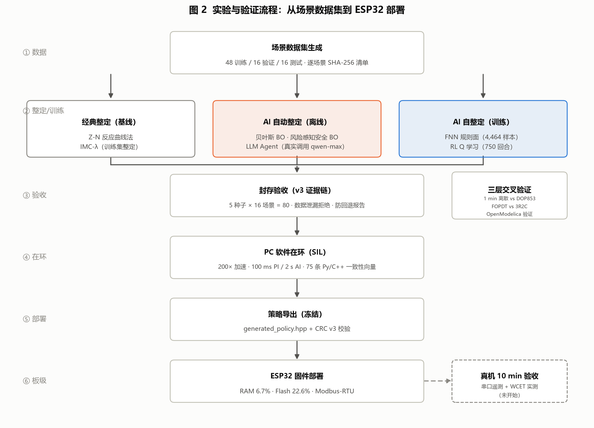
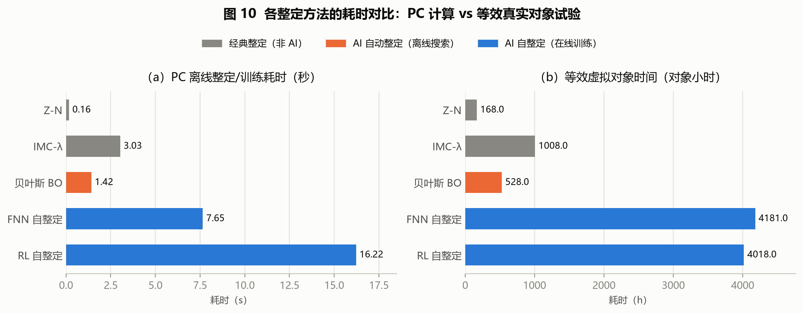
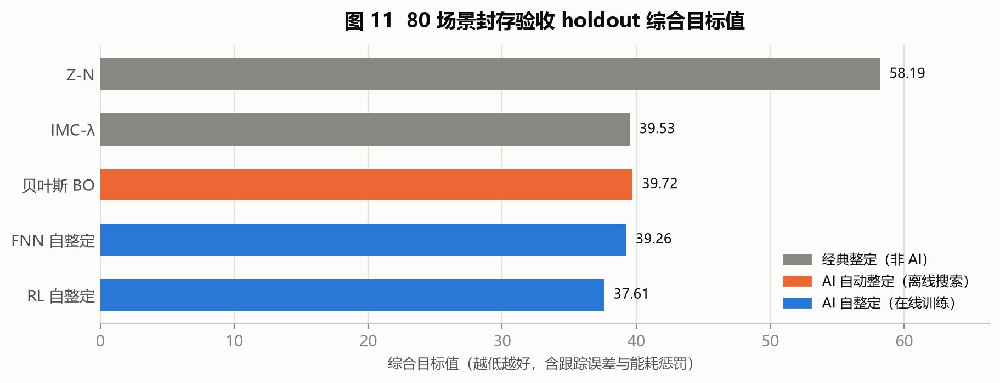
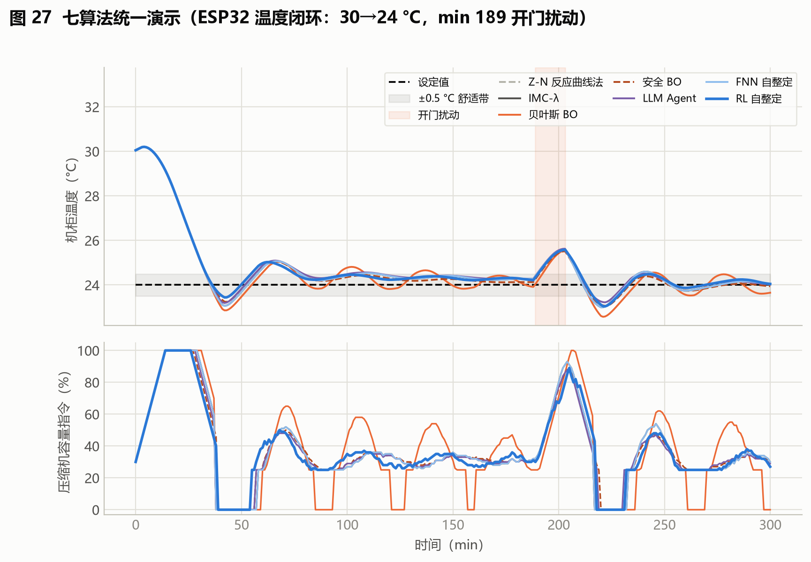

# HVAC AI-PI 自动整定实验报告

**项目**：变速精密/机柜空调 AI-PI 自动整定演示（`hvac-ai-pid-demo`）
**日期**：2026-09-01
**数据来源**：`archive/outputs_tuning_benchmark/`、`archive/outputs_review_v3/`（封存 v3 验收证据）、`archive/outputs_advanced_quick/`、`archive/outputs_embedded_demo/`；图表由 `reports/make_figures.py` 生成
**说明**：本文所有数据均来自项目已有实验产物；凡属估算的数值均以"（估算）"标注并给出估算依据。CSV 原始数据文件受企业透明加密保护，本报告数字以明文报告 `archive/outputs_tuning_benchmark/tuning_runtime_report.md` 与封存验收文档为准。

---

## 1. 实验设置

### 1.1 被控对象与控制回路

被控对象为单区机柜空调场景的 **3R2C 集中参数热模型**（两个热容、三个热阻），串联纯延迟队列与一阶执行器滞后，实现于 `hvac_pid/plant.py`，并另有 OpenModelica 物理参考模型 `modelica/HVACAI/PrecisionCabinetCooling.mo`（62 条方程）。

| 参数 | 取值 | 参数 | 取值 |
|---|---|---|---|
| 区域热容 Cz | 1.8×10⁶ J/K | 外墙-环境热阻 Roz | 0.012 K/W |
| 围护热容 Cw | 1.2×10⁷ J/K | 区域-围护热阻 Rzw | 0.006 K/W |
| 最大制冷量 Qmax | 7000 W | 围护-环境热阻 Row | 0.020 K/W |
| 纯延迟 | 5 min（场景随机 2–12 min） | 仿真步长 | 1 min |

执行器施加工程约束：**25% 最小制冷容量、1% 输出量化、5%/min 变频斜率、最小启停驻留时间**——所有算法均在同一约束下运行，保证对比公平。

### 1.2 控制架构

系统结构如图 1：**100 ms PI 内环**（反积分饱和）+ **2 s 周期的 AI 增益调度层**。AI 层只输出 `Kp/Ki`（±10~25% 变化限幅，越界自动回退 IMC 基准增益），不直接干预执行器，保证安全兜底。

### 1.3 参与对比的 7 种算法

| 类别 | 算法 | 机理 | 输出方式 |
|---|---|---|---|
| 经典整定 | Ziegler–Nichols | FOPDT 反应曲线法 | 投运前一次固定 |
| 经典整定 | IMC-PI | 内模控制，λ 仅在训练集整定 | 投运前一次固定 |
| AI 自动整定 | 贝叶斯 BO | GP + 期望改进（EI），log(Kp)/log(Ki) 域搜索 | 投运前搜索一组固定增益 |
| AI 自动整定 | 风险感知安全 BO（RaGoOSE 式） | β=2 安全 GP，风险目标 = 均值 + 0.75×标准差 | 投运前搜索固定增益 |
| AI 自动整定 | LLM Agent | 工具调用智能体监督整定 | 投运前搜索固定增益 |
| AI 自整定 | FNN | 5×5 TSK 模糊神经规则面（25 条规则），由 BO 标签训练 | 在线每 2 s 调整 Kp/Ki |
| AI 自整定 | RL | 离线表格式 Q 学习（5×5×3×9 Q 表） | 在线每 2 s 调整 Kp/Ki |

### 1.4 数据集与验收协议

- **场景数据集**：48 训练 / 16 验证 / 16 测试；制冷量 4500–10500 W、延迟 2–12 min 随机化；扰动族含热启动、设定值上/下阶跃、持续热脉冲。逐场景 SHA-256 写入 `dataset_manifest.csv`，并执行数据泄漏拒绝检查。
- **封存验收**：5 个验收种子（101/211/307/401/503）× 16 场景 = **80 个验收场景**，结果封存于 `archive/outputs_review_v3/`。
- **实验流程**如图 2。

### 1.5 模型可信度：三层交叉验证

| 验证层 | 对比双方 | 结果 |
|---|---|---|
| 数值层 | 1 min 离散模型 vs SciPy DOP853 连续积分 | RMSE 0.0041–0.0966 °C |
| 降阶层 | FOPDT 代理模型 vs 3R2C 全模型 | 归一化 RMSE ≈ 12% |
| 物理层 | OpenModelica DASSL vs DOP853 | RMSE 7.16×10⁻⁶ °C（7211 点，12 h 工况） |

### 1.6 实验平台

Windows 10 / Python 3.11.7 / numpy + scipy + scikit-learn，**全程纯 CPU**，无深度学习框架、无 GPU 参与。耗时基准的调参问题：机柜空调 31.5→24 °C、制冷量 7600 W、延迟 6 min、8 个离线工况、BO 2 次迭代、RL 750 回合（`archive/outputs_tuning_benchmark/tuning_runtime_report.md`）。

---

## 2. 非AI调参基线：Z-N 与 IMC 的调参情况及预估耗时

### 2.1 两个经典算法的整定方式

- **Ziegler–Nichols**：对对象做 FOPDT 反应曲线辨识（阶跃响应提取 K、T、L），代入 Z-N 公式直接算出 Kp/Ki。公式计算本身耗时毫秒级（PC 实测 **0.163 s**）；真正的成本在**安全的对象辨识与采数**——若在真实压缩机上做，需要约 **168 对象小时**（等效虚拟对象时间，下同）。
- **IMC-PI**：基于同一 FOPDT 模型按内模原理解析求取 Kp/Ki，唯一可调参数 λ 通过在训练集上扫描确定（PC 实测 **3.03 s**，等效对象时间 **1008 h**）。IMC 是本项目的安全回退基准。

### 2.2 整定结果

| 方法 | PC 离线耗时 | 等效对象时间 | 基准目标值 | 80 场景 holdout 目标值 |
|---|---:|---:|---:|---:|
| Z-N | 0.163 s | 168 h | 79.17 | 58.19 |
| IMC-λ | 3.03 s | 1008 h | 63.59 | 39.53 |

> 目标值为跟踪误差与能耗惩罚的综合指标，越低越好。Z-N 在宽工况域上明显偏振荡（holdout 58.19 vs IMC 39.53）；IMC 稳健但为单组固定增益，无法随工况自适应。

### 2.3 人工试凑调参的预估耗时（估算）

工程现场常用的"工程师试凑法"在本项目没有直接实测，以下为估算：

| 估算项 | 数值（估算） | 依据 |
|---|---|---|
| 单次试凑试验 | 2–4 h | 从基准热负荷进入 ±0.5 °C 带需 54 min（基准实测），加上扰动恢复观察与两次试验间的降温复位 |
| 试凑迭代次数 | 10–20 次/运行模式 | 经验值：宽工况、带执行器约束的对象通常需 10 次以上迭代 |
| 单模式人工调参总耗时 | **20–80 对象小时**（约 1–2 工作周） | 10–20 次 × 2–4 h，串行在真实设备上进行 |
| 多机型/多工况放大 | 机型数 × 工况数 × 上项 | 每个新机型或显著不同的安装工况需重新调参 |

对照：即便按保守下限（20 对象小时），人工试凑也显著慢于 Z-N 的公式整定；而 Z-N/IMC 的等效对象时间（168/1008 h）来自**安全辨识采数**要求，说明"看似免费的公式法"在真机上同样昂贵。这正是引入 AI 自动化整定的动机。

---

## 3. AI 自动化整定：自动整定与自整定

本项目将 AI 整定分为两条技术路线（见图 1、图 2）：

- **自动整定（离线，auto-tuning）**：投运前由算法在仿真/安全约束下**搜索一组固定 Kp/Ki**——贝叶斯 BO、风险感知安全 BO、LLM Agent；
- **自整定（在线，self-tuning）**：投运后由训练好的模型**每 2 s 在线调整 Kp/Ki**——FNN 规则面与 RL Q 策略。

### 3.1 自动整定（离线搜索）

| 方法 | PC 离线耗时 | 等效对象时间 | 基准目标值 | 说明 |
|---|---:|---:|---:|---|
| 贝叶斯 BO | 1.42 s | 528 h | 64.50 | GP+EI，log 域搜索，迭代次数可按现场时间预算缩放 |
| 风险感知安全 BO | 0.88–1.41 s | — | 见下 | 风险目标 = 均值 + 0.75×std；β=2 安全 GP 抑制危险试验点 |
| LLM Agent | 30.4 s（监督式基准，实测） | — | 风险目标 36.10 | **真实调用**（百炼 qwen-max，`archive/outputs_advanced_bailian/`）；3 轮中第 3 轮被安全门接受，风险 39.30→36.10 |

安全 BO 在其基准 holdout 上取得 **33.58**，优于同基准的 IMC（36.29）、普通 BO（37.96）与启发式（34.18）（`archive/outputs_advanced_quick/`；与第 2 节 80 场景封存验收的 holdout 非同一基准，不可直接混比）。

### 3.2 自整定（在线训练 + 在线推理）

| 指标 | FNN（模糊神经网络） | RL（Q 学习） |
|---|---|---|
| 训练数据 | 4,464 样本（48 场景 BO 标签） | 36,000 转移 / 750 回合 / 180,000 环境步 |
| PC 训练时间 | **7.65 s** | **16.22 s** |
| 等效对象时间 | 4181 h | 4018 h |
| 训练收敛 | log-RMSE 1.41 → **1.059**，规则覆盖 100% | ε 0.25→0.03，验证目标 31.95（基线 32.91，最佳检查点 32.77） |
| PC 在线推理 | 78.2 µs/次 | 88.0 µs/次 |
| 封存验收（80 场景） | 目标值 39.26；相对 IMC 比值 0.9979（95% 上界 1.0067）→ **PASSED** | 目标值 **37.61（全场最优）**；比值 0.9595（上界 0.9743）→ **PASSED** |
| 回退率 | 0%（自适应使用 100%） | 0.19% |

> PC 推理耗时为本机测量，**不是**目标板 WCET；ESP32 端 WCET 须在量产编译配置下用 DWT 周期计数器或 GPIO 脉冲实测（真机验收未开始，见第 5 节）。

### 3.3 整定耗时对比

关键工程结论：**FNN/RL 把 4000+ 对象小时的安全试验压缩到 PC 上 8–16 秒完成**。等效对象时间（图 10b）衡量"若把候选试验串行搬到真实压缩机上需要多久"——不但昂贵而且不安全；AI 路线用离线仿真承担了全部试错。

> **等效虚拟对象时间的定义与构成**（计算逻辑见 `tools/run_tuning_benchmark.py:126-136`）：它不是 CPU 时间，而是"若在真实压缩机/机柜上完成同样的整定试验，设备需实际运行的时长"。由三项成本叠加：① FOPDT 安全辨识采数 = 168 h/工况（Z-N/IMC/BO 的前提）；② 每组候选 Kp/Ki 的评估 = 5 h（仅首次进入 ±0.5 °C 带即需 54 min，再加扰动恢复与复位）；③ 试验次数随方法膨胀——FNN/RL 的训练标签来自"每个工况下最优 Kp/Ki"，须先对每个工况做一轮完整搜索（每工况 2×168 h 辨识 + 每标签 5 h 评估），故达 4000+ 小时。真机上这些试验受执行器安全约束（最小容量、启停驻留）根本不可行；PC 加速仿真（200×）把全部试错压缩到秒级，真机只部署结果、不做试验。

### 3.4 控制性能对比

80 场景封存验收 holdout 上：RL（37.61）< FNN（39.26）≈ IMC（39.53）≈ BO（39.72）< Z-N（58.19）。AI 自整定的收益不在单点目标值的大幅领先，而在**免人工、免真机试错、跨工况自适应且带安全回退**。

### 3.5 三标准工况 × 五算法闭环响应曲线

三标准工况下五算法的**逐算法闭环响应曲线**（每算法单独成图、共 15 张，由 `reports/make_case_figures.py` 按 v3 封存种子复现，与 `case_metrics.csv` 指标最大相对偏差 < 1e-12）见详解版报告 6.3 节图 12–26。此处仅保留七算法统一演示场景的对照曲线：

---

## 4. 计算资源与训练时间汇总

| 环节 | 资源需求 | 实测/状态 |
|---|---|---|
| BO / 安全 BO 搜索 | 纯 CPU（sklearn GP），单机 | 0.9–3.0 s |
| FNN 训练 | 纯 CPU，规则表 5×5（25 条规则）+ 上下文系数（`.npy`） | 7.65 s |
| RL 训练 | 纯 CPU，Q 表 5×5×3×9 = 675 项 | 16.22 s（750 回合） |
| 在线推理（PC） | 微秒级：FNN 78 µs / RL 88 µs | 每 2 s 一次，占空比可忽略 |
| **GPU / 深度学习框架** | **不需要** | 无 PyTorch/TensorFlow，无检查点显存需求 |
| 策略导出 | 冻结为 C++ 头文件 + CRC v3 校验 | `generated_policy.hpp`，75 条 Py/C++ 一致性向量最大误差 2.98×10⁻⁸ |
| 板级部署（ESP32） | 静态 RAM 22,036 B（6.7%）、Flash 296,169 B（22.6%） | PlatformIO 编译通过，PC-SIL 回退 0/190 |
| LLM Agent（真实调用，实测） | 监督式基准 3 轮 / 4 次评估共 30.4 s（约 7.6 s/次 API 往返）；七算法演示会话 6 步 / 2 次候选试验 | 实测于 2026-09-03（百炼 qwen-max），单批次、样本量小 |

---

## 5. 局限与后续工作

| 项目 | 状态 | 影响 |
|---|---|---|
| 真机 10 min 串口验收 / 实测 WCET / HIL | **未开始**（第 4 层） | 本报告全部耗时为 PC/仿真口径，板级实时性待实测 |
| LLM Agent | 已完成单批次真实 API 调用（qwen-max） | 仅 2 次会话，输出非确定性未做统计表征；耗时/费用为单次实测 |
| RL 马尔可夫性与奖励-目标对齐 | 残留缺陷 C4 | 可能仍有小幅优化空间 |
| FNN 标签冲突 | log-RMSE 1.059–1.85 | 多场景同状态异标签导致规则面拟合受限 |
| Modelica Buildings 高保真模型 | 已延后 | 物理可信度依赖现有三层交叉验证 |
| 工作区未提交修改 | 2026-09-01 第四轮评审修复 | `archive/outputs_review_v3` 封存产物时间戳早于部分代码修改，正式发布前需重新生成并复跑验收 |

**结论**：项目在仿真与部署就绪证据链层面已经完成——7 种算法全部跑通并完成 80 场景封存验收，FNN/RL 自整定通过全部部署门禁，LLM Agent 已完成单批次真实 API 调用（qwen-max）。非AI基线（Z-N/IMC）的调参成本主要在安全辨识采数（168/1008 对象小时），人工试凑预估 20–80 对象小时每模式（估算）；引入 AI 后，自动整定在 PC 上 1–3 s、自整定训练 8–16 s 即可完成（等效节省 4000+ 对象小时），且全程纯 CPU、无需 GPU。剩余工作集中于真机验收与 LLM 多批次调用统计。

---

*图 1–4 由 `reports/make_figures.py` 生成（`python reports/make_figures.py`），数据内嵌并注明出处。*
